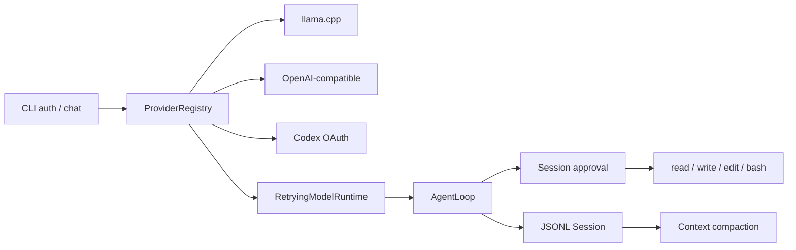

# ai_agent

`ai_agent`는 스트리밍 모델, 승인형 도구 실행, append-only 세션과 context
compaction을 직접 학습하고 확장하기 위한 TypeScript Agent다. 기존 `main`의
llama.cpp runtime을 보존하면서 OpenAI-compatible endpoint와 ChatGPT Codex OAuth를
같은 Model/Agent/Session 계약에 연결한다.

## 지원 기능

- Provider: llama.cpp, OpenAI-compatible chat completions, ChatGPT Codex OAuth
- Agent: retry, abort, 다단계 tool loop, 선택적 `maxToolBatches`
- Tools: workspace 안의 read/write/edit와 제한된 bash
- Approval: write/edit/bash의 once/session/deny 결정
- Session: JSONL replay, branch leaf, approval 기록, context compaction, 부분 turn 복구
- CLI: 인증, Provider 선택, 세션 재개, EOF 정상 종료

## 설치와 검증

```powershell
npm ci
npm run check
```

`check`는 TypeScript 검사, Vitest, build, 실제 CLI EOF 자식 프로세스 스모크와
설치된 패키지의 기본 Bash 실행/프로세스 정리 스모크를 순서대로 실행한다. Windows
Vitest는 helper source와 실행 payload의 normalized semantic manifest도 재검증한다.
Node.js 22 이상이 필요하다.

`npm pack`/`npm publish`의 `prepack`은 Windows PowerShell 5.1 helper provenance
검증 뒤에만 build를 수행한다. 따라서 릴리스 패키지는 Windows에서 생성해야 하며,
다른 OS의 standalone pack/publish는 verifier를 건너뛰지 않고 fail closed한다.

## CLI

```powershell
npm run cli -- --help
npm run cli -- chat --provider llama --model gemma-local
npm run cli -- chat --provider openai-compatible --model gemma3
npm run cli -- auth login
npm run cli -- chat --provider openai-codex
npm run cli -- chat --provider openai-codex --model gpt-5.6-sol
npm run cli -- chat --provider openai-codex --model gpt-5.6-terra
npm run cli -- chat --provider openai-codex --model gpt-5.6-luna
npm run cli -- chat --provider openai-codex --model gpt-5.5
```

`openai-codex`의 기본 모델은 `gpt-5.6-sol`이다. `--session <ID>`로 기존
세션을 다시 열면 세션 헤더에 저장된 모델을 재사용하므로, 이전 기본값인
`gpt-5.5`와 legacy `gpt-5.6` 세션도 별도 `--model` 없이 재개한다. legacy
`gpt-5.6`은 wire 경계에서 Sol 모델로 변환한다. 지원하지 않는 model ID는
network 호출 전에 지원 목록과 함께 거부한다.

새 세션의 모델을 고르려면 `--model <ID>`를 사용한다. write/edit/bash는 실행
전에 승인을 요청하며 session 승인은 JSONL 세션에 기록된다.

llama.cpp 대화는 다음과 같이 시작한다.

```powershell
npm run cli -- chat --provider llama --model gemma-local
# 대화 중 /compact 입력: 현재 활성 문맥을 수동 압축
```

llama.cpp의 input-token endpoint가 없거나 호출에 실패하면 공통 `TokenEstimator`를
사용한다. context overflow는 일반 네트워크 retry와 구분한다. 보이는 text, tool 호출/결과,
또는 durable checkpoint가 생기기 전에는 compact 후 한 번만 다시 요청할 수 있지만, 그 뒤에는
자동 복구도 tool 재실행도 하지 않는다.

### Provider 환경변수

| 변수 | 용도 | 기본값 |
|---|---|---|
| `AI_AGENT_LLAMA_URL` | llama.cpp server | `http://127.0.0.1:8080` |
| `AI_AGENT_OPENAI_BASE_URL` | OpenAI-compatible `/v1` base URL | `http://127.0.0.1:11434/v1` |
| `AI_AGENT_OPENAI_API_KEY` | 호환 endpoint 인증 | 미설정 |
| `AI_AGENT_BASH_PATH` | bash 실행 파일 | `bash` |

OAuth credential은 사용자 credential 파일에 저장하며 access/refresh token을 CLI
상태 출력이나 Provider 오류에 포함하지 않는다.

## 런타임 복구와 Bash 종료 범위

세션은 사용자 메시지, assistant의 tool-call intent, tool result, 최종 assistant
메시지를 append-only JSONL에 차례로 checkpoint한다. 따라서 도구가 실행된 뒤 모델 호출이나
프로세스가 중단되어도 완료된 턴 전체를 기다리지 않고 기록된 지점부터 세션을 다시 열 수
있다. 이는 도구 부작용을 트랜잭션으로 만들거나 rollback하는 기능은 아니다.

결과가 기록되지 않은 tool-call intent를 세션 재개 시 발견하면, 런타임은 해당 호출을
`outcome unknown` 오류 결과로 닫고 workspace 상태를 점검하라고 알린다. 도구를 자동으로
재실행하지 않으므로, 재시도 여부는 사용자가 실제 상태를 확인한 뒤 결정해야 한다.

ChatGPT Codex provider는 `store: false` 후속 요청에 필요한 provider 전용 replay state를
assistant 메시지와 함께 JSONL에 저장한다. 같은 세션을 CLI 재시작 후 재개하거나 compaction
뒤에도 보존된 assistant 메시지를 다시 사용할 때, encrypted reasoning item과 function-call
item ID를 다음 Codex 요청에 replay한다. compaction summary 자체에는 이 opaque state를 넣지
않는다.

### POSIX 세션 writer lease 업그레이드

이 버전은 Linux/macOS의 외부 `flock` 실행 파일 대신 로컬 파일시스템의 atomic directory
lease를 사용한다. 이전 버전과 새 버전의 lock 방식은 서로의 활성 lease를 확인할 수 없으므로
rolling upgrade를 지원하지 않는다. 업그레이드 전에 해당 세션 저장소를 사용하는 이전 버전
프로세스를 모두 종료하고 실제로 quiescent 상태인지 확인해야 한다. 새 버전은 이전 버전이
남긴 regular `.writer.lock` artifact를 활성 `flock` 여부와 관계없이 절대 자동 이동하거나
삭제하지 않고 fail closed한다. 운영자가 quiescent 상태를 확인한 뒤 해당 regular file을
명시적으로 보존 이름으로 옮기거나 삭제하고 다시 시작해야 하며, 그 전에는 writer callback이
실행되지 않는다.

새 lease는 각 owner가 `127.0.0.1`의 임시 TCP listener를 열어 둔 뒤 그 port를 owner record에
기록한다. contender는 외부 `ps`/`flock` helper 없이 Node의 loopback connect만 사용한다.
connect 성공은 owner가 live인 것으로 처리하며, port 재사용도 안전한 false positive라서 복구를
늦출 뿐 lease를 잘못 빼앗지 않는다. 오직 `ECONNREFUSED`만 종료된 owner로 판정하고 timeout이나
다른 오류는 fail closed한다. listener FD는 owner가 paused 상태여도 커널에 남고 프로세스가
종료되어 zombie가 되면 닫히므로 두 상태를 구분할 수 있다. listener 도입 전 record는 PID가
명확히 사라질 때까지 보수적으로 유지한다.

이 liveness 판정은 같은 host/PID namespace의 로컬 저장소를 전제로 한다. 네트워크 공유 또는
서로 다른 PID namespace에서 같은 세션 디렉터리를 동시에 쓰는 구성은 지원하지 않는다. 같은
배포 버전에서는 활성 lease를 시간 경과로 빼앗지 않으며, 소유 프로세스가 종료되면 다음
writer가 남은 lease를 복구한다.

정상 release와 stale recovery는 모두 동일한 token-specific `.reaped-<token>` 비어 있지 않은
tombstone을 남긴다. 이는 이전 owner를 본 뒤 지연된 contender가 새 live owner의 directory를
이동시키는 ABA를 원자적으로 막기 위한 것이므로 자동 삭제하지 않는다. tombstone은 write마다
누적된다. 전체 세션 writer가 quiescent이고 stale observer도 없음을 운영자가 확인한 유지보수
구간에서만 수동으로 정리할 수 있다.

Bash는 timeout, 출력 한도 초과, `AbortSignal`에서 종료를 조정한다.

- Windows에서는 supervisor가 Bash를 suspended 상태로 만들고 `KILL_ON_JOB_CLOSE` Job Object에
  배정한 뒤 실행한다. supervisor가 종료되면 Job Object가 닫히며 그 Job Object가 관리하는
  프로세스를 종료한다. 실행 payload는 저장소의 검토된 C# source에서 Windows PowerShell 5.1로
  생성한다. Windows CI는 source를 다시 컴파일하고 MVID/timestamp만 제외한 PE/COFF/CLR header,
  type/layout, field/RVA, signature, P/Invoke, managed IL, attribute, resource manifest 전체가
  payload와 같은지 검사한다. 런타임은 payload SHA-256을 확인한 뒤 메모리에서 로드하며 command, cwd, environment는
  공유 파일이나 compiler workspace가 아니라 상속된 익명 stdin으로만 전달한다. Windows
  PowerShell 5.1/.NET Framework가 필요하고 WDAC 또는 AppLocker가 PowerShell이나 검증된 helper
  로드를 차단하면 Bash를 시작하지 않고 fail closed한다.
- POSIX에서는 Bash가 생성한 process group에 `SIGTERM`을 보내고 짧은 grace period 뒤에도
  실행 가능한 멤버가 남아 있으면 `SIGKILL`을 보낸다. reaping 전 zombie는 실행 가능한
  멤버로 보지 않으며, `setsid`처럼 그 process group을 이탈한 descendant까지 종료한다고
  보장하지 않는다.

## 통합 구조



설계 근거와 실행 순서는 다음 문서에 있다.

- [Main 기능 보존 통합 설계](./docs/superpowers/specs/2026-08-02-main-feature-integration-design.md)
- [Main 기능 통합 실행 계획](./docs/superpowers/plans/2026-08-02-main-feature-integration.md)
- [기능 보존표](./docs/superpowers/plans/2026-08-02-main-feature-preservation-matrix.md)
