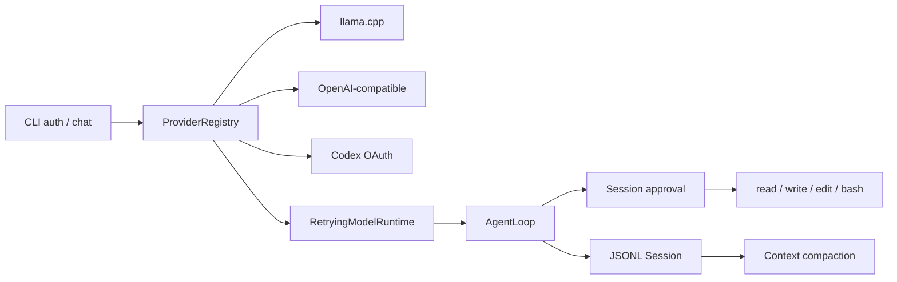

# ai_agent

`ai_agent`는 스트리밍 모델, 승인형 도구 실행, append-only 세션과 context
compaction을 직접 학습하고 확장하기 위한 TypeScript Agent다. 기존 `main`의
llama.cpp runtime을 보존하면서 OpenAI-compatible endpoint와 ChatGPT Codex OAuth를
같은 Model/Agent/Session 계약에 연결한다.

## 지원 기능

- Provider: llama.cpp, OpenAI-compatible chat completions, ChatGPT Codex OAuth
- Agent: retry, abort, 다단계 tool loop, 선택적 `maxToolBatches`
- Tools: workspace 안의 read/write/edit와 제한된 bash
- Approval: write/edit/bash의 once/session/deny 결정
- Session: JSONL replay, branch leaf, approval 기록, context compaction, 부분 turn 복구
- CLI: 인증, Provider 선택, 세션 재개, EOF 정상 종료

## 설치와 검증

```powershell
npm ci
npm run check
```

`check`는 TypeScript 검사, Vitest, build와 실제 CLI EOF 자식 프로세스 스모크를
순서대로 실행한다. Node.js 22 이상이 필요하다.

## CLI

```powershell
npm run cli -- --help
npm run cli -- chat --provider llama --model gemma-local
npm run cli -- chat --provider openai-compatible --model gemma3
npm run cli -- auth login
npm run cli -- chat --provider openai-codex --model gpt-5.5
```

세션을 다시 열려면 `--session <ID>`를 추가한다. write/edit/bash는 실행 전에
승인을 요청하며 session 승인은 JSONL 세션에 기록된다.

### Provider 환경변수

| 변수 | 용도 | 기본값 |
|---|---|---|
| `AI_AGENT_LLAMA_URL` | llama.cpp server | `http://127.0.0.1:8080` |
| `AI_AGENT_OPENAI_BASE_URL` | OpenAI-compatible `/v1` base URL | `http://127.0.0.1:11434/v1` |
| `AI_AGENT_OPENAI_API_KEY` | 호환 endpoint 인증 | 미설정 |
| `AI_AGENT_BASH_PATH` | bash 실행 파일 | `bash` |

OAuth credential은 사용자 credential 파일에 저장하며 access/refresh token을 CLI
상태 출력이나 Provider 오류에 포함하지 않는다.

## 런타임 복구와 Bash 종료 범위

세션은 사용자 메시지, assistant의 tool-call intent, tool result, 최종 assistant
메시지를 append-only JSONL에 차례로 checkpoint한다. 따라서 도구가 실행된 뒤 모델 호출이나
프로세스가 중단되어도 완료된 턴 전체를 기다리지 않고 기록된 지점부터 세션을 다시 열 수
있다. 이는 도구 부작용을 트랜잭션으로 만들거나 rollback하는 기능은 아니다.

결과가 기록되지 않은 tool-call intent를 세션 재개 시 발견하면, 런타임은 해당 호출을
`outcome unknown` 오류 결과로 닫고 workspace 상태를 점검하라고 알린다. 도구를 자동으로
재실행하지 않으므로, 재시도 여부는 사용자가 실제 상태를 확인한 뒤 결정해야 한다.

ChatGPT Codex provider는 `store: false` 후속 요청에 필요한 provider 전용 replay state를
assistant 메시지와 함께 JSONL에 저장한다. 같은 세션을 CLI 재시작 후 재개하거나 compaction
뒤에도 보존된 assistant 메시지를 다시 사용할 때, encrypted reasoning item과 function-call
item ID를 다음 Codex 요청에 replay한다. compaction summary 자체에는 이 opaque state를 넣지
않는다.

Bash는 timeout, 출력 한도 초과, `AbortSignal`에서 종료를 조정한다.

- Windows에서는 supervisor가 Bash를 suspended 상태로 만들고 `KILL_ON_JOB_CLOSE` Job Object에
  배정한 뒤 실행한다. supervisor가 종료되면 Job Object가 닫히며 그 Job Object가 관리하는
  프로세스를 종료한다.
- POSIX에서는 Bash가 생성한 process group에 `SIGTERM`을 보내고 짧은 grace period 뒤에도
  남아 있으면 `SIGKILL`을 보낸다. `setsid`처럼 그 process group을 이탈한 descendant까지
  종료한다고 보장하지 않는다.

## 통합 구조



설계 근거와 실행 순서는 다음 문서에 있다.

- [Main 기능 보존 통합 설계](./docs/superpowers/specs/2026-08-02-main-feature-integration-design.md)
- [Main 기능 통합 실행 계획](./docs/superpowers/plans/2026-08-02-main-feature-integration.md)
- [기능 보존표](./docs/superpowers/plans/2026-08-02-main-feature-preservation-matrix.md)
