# 00. 목표와 범위

## 1. 이 프로젝트의 목적

`pi-clone`은 완성형 코딩 에이전트 제품이 아니라 TypeScript 학습 프로젝트다. 최종 질문은 “모델이 도구를 호출하는 스트리밍 에이전트는 어떤 계약과 상태 전이로 동작하는가?”이다.

학습이 끝났을 때 다음을 코드와 그림 없이도 설명할 수 있어야 한다.

1. 모델 API와 에이전트 루프를 왜 분리하는가?
2. 스트림의 작은 조각을 어떻게 하나의 assistant 메시지로 조립하는가?
3. 모델이 도구를 호출하면 왜 대화가 한 번 더 모델로 돌아가는가?
4. 저장할 메시지와 화면에 보여 줄 이벤트는 왜 다른가?
5. 중단, 재시도, 압축 같은 신뢰성 기능은 어느 경계에 붙어야 하는가?

## 2. 설계 원칙

### 원칙 A: 흐름을 숨기지 않는다

편리한 에이전트 프레임워크를 가져오면 코드는 짧아지지만 학습할 핵심이 사라진다. 모델 스트림 조립, 도구 호출 검증, 루프 종료 조건은 직접 드러낸다.

### 원칙 B: 외부 형식은 경계에서 번역한다

OpenAI-compatible 응답 형식을 Agent Loop 전체에 퍼뜨리지 않는다. Provider가 외부 형식을 내부 `ModelStreamEvent`로 바꾼다. 그래야 나중에 Anthropic을 추가해도 루프를 다시 쓰지 않는다.

### 원칙 C: 기록과 관찰을 구분한다

`Message`는 다음 모델 호출과 세션 복원에 필요하다. `AgentEvent`는 “텍스트 조각이 도착했다”, “도구 실행이 시작됐다”처럼 실시간 관찰에 필요하다. 둘을 섞으면 저장 형식이 UI 요구에 끌려간다.

### 원칙 D: 위험한 기능은 핵심 계약 뒤에 둔다

`write`, `edit`, `bash`는 단순한 도구 예제가 아니다. 그래서 먼저 읽기 전용 `read`로 루프를 검증한 뒤, 공통 workspace 경계와 exact-one edit, shell timeout·출력 상한을 설계하고 추가했다. 승인 정책, OS sandbox, abort는 구현된 네 도구와 구분해 후속 단계에 둔다.

## 3. 첫 코어 마일스톤과 현재 확장

아래 “첫 마일스톤”은 `89d1dfb`까지 완성한 Provider 중립 Agent Core를 뜻한다. 현재 브랜치는 그 코어를 바꾸지 않고, 두 번째 학습 단위로 Pi 방식의 직접 Codex OAuth Provider와 최소 대화 CLI를 추가했다.

여기서 “첫 마일스톤”은 Provider가 OpenAI-compatible 하나뿐이라는 뜻이다. 코어에는 미래 Provider를 위한 추상 경계를 두되, 아직 Anthropic 구현은 만들지 않는다.

```mermaid
flowchart LR
    Goal([학습 목표<br/>도구 호출 루프 이해])

    subgraph P1["1단계 · 지금 설계하고 검증"]
        Contract["공통 계약<br/>Message · Event · Provider"]
        Stream["OpenAI-compatible<br/>스트림 정규화"]
        Loop["순차 Agent Loop<br/>read 도구 · JSONL"]
    end

    subgraph P1B["2단계 · 현재 직접 연결"]
        OAuth["Codex OAuth<br/>저장 · 갱신"]
        Codex["Codex Responses<br/>SSE Provider"]
        CLI["최소 CLI<br/>login · chat"]
    end

    subgraph P2["3단계 · 현재 기본 도구 확장"]
        FileTools["파일 변경 도구<br/>write · edit"]
        Bash["프로세스 도구<br/>bash"]
    end

    subgraph P3["4단계 · 운영 기능"]
        Reliability["신뢰성<br/>abort · retry · compaction"]
        UI["사용자 경험<br/>브라우저 UI"]
        Anthropic["두 번째 Provider<br/>Anthropic"]
    end

    subgraph Out["장기 제외 · 핵심 학습 밖"]
        Extras["TUI · session tree<br/>이미지 · extension · RPC<br/>theme · llama.cpp · orchestrator"]
    end

    Goal --> Contract
    Contract -->|"외부 형식 분리"| Stream
    Stream -->|"첫 수직 흐름"| Loop
    Loop -->|"같은 Provider 계약 재사용"| OAuth
    OAuth --> Codex --> CLI
    CLI -->|"공통 경로 경계"| FileTools
    FileTools -->|"실행 안전성 공유"| Bash
    Bash -->|"관찰 가능한 코어 위에"| Reliability
    Reliability --> UI
    Reliability --> Anthropic
    Goal -.->|"의도적으로 만들지 않음"| Extras

    classDef focus fill:#DBEAFE,stroke:#2563EB,color:#0F172A,stroke-width:2px;
    classDef boundary fill:#EDE9FE,stroke:#7C3AED,color:#0F172A,stroke-width:2px;
    classDef action fill:#DCFCE7,stroke:#16A34A,color:#0F172A,stroke-width:2px;
    classDef deferred fill:#F1F5F9,stroke:#64748B,color:#334155,stroke-width:2px,stroke-dasharray:5 5;
    class Goal,Contract,Stream,Loop focus;
    class OAuth,Codex,CLI action;
    class FileTools,Bash action;
    class Reliability,UI,Anthropic action;
    class Extras deferred;
```

> **그림 읽기:** 첫 단계는 Provider 중립 코어, 두 번째는 실제 ChatGPT Codex 연결, 세 번째는 현재 구현된 네 도구다. 도구 실행이 생겼어도 승인·sandbox·abort 같은 운영 안전성은 별도 후속 단계로 남는다.

### 포함

- TypeScript 기반 단일 프로젝트
- OpenAI-compatible Provider
- 텍스트 및 tool-call 스트리밍 조립
- Provider와 무관한 메시지/이벤트 모델
- 순차 실행 Agent Loop
- 도구 registry와 인자 schema 검증
- `read`, `write`, `edit`, `bash` 네 도구와 source-order batch end-to-end 예제
- 성공과 실패를 모두 `toolResult`로 모델에 반환하는 규칙
- abort 확장을 위한 선택적 타입 seam
- append-only JSONL 세션의 최소 기록 경계
- scripted fake Provider를 이용한 결정론적 테스트 설계

### 현재 두 번째 학습 단위에 추가

- Pi 호환 OpenAI Codex 브라우저 PKCE와 device-code OAuth
- 사용자 홈의 OAuthStore와 만료 token 자동 갱신
- ChatGPT Codex Responses SSE Provider
- `login`, `status`, `logout`, `chat` 최소 CLI
- 직접 Provider와 기존 `read` Agent Loop의 fake HTTP end-to-end 테스트

### 현재 세 번째 학습 단위에 추가

- `WorkspacePaths`를 통한 lexical·realpath·새 파일 부모 경계 공유
- UTF-8 전체 교체 `write`와 exact-one 문자열 교체 `edit`
- workspace `cwd`, timeout, 출력 상한을 가진 승인 없는 `bash`
- 한 assistant의 복수 호출을 source order로 실행한 뒤 Provider를 한 번만 재호출하는 통합 테스트

### 첫 마일스톤에서 제외

| 제외 항목 | 지금 미루는 이유 | 예정 위치 |
|---|---|---|
| 도구 승인·OS sandbox | 현재 요청은 승인 없이 같은 OS 권한으로 실행함 | 권한·격리 정책 문서 |
| shell process tree 종료 보장 | 현재 timeout은 시작한 shell process에 kill을 요청함 | 실행 제어 문서 |
| 브라우저 채팅 UI | CLI로 이벤트 계약을 먼저 검증한 뒤 붙여야 함 | UI 어댑터 문서 |
| abort 실행 제어 | 네트워크와 장기 실행 도구의 공통 취소 정책이 필요함 | 실행 제어 문서 |
| 자동 retry | 어떤 오류를 재시도할지 정책 결정이 필요함 | 신뢰성 문서 |
| context compaction | 손실성 변환과 원본 보존 규칙이 필요함 | 컨텍스트 관리 문서 |
| Anthropic Provider | 첫 Provider 계약을 검증한 뒤 두 번째 구현으로 일반성을 시험함 | Provider 확장 문서 |

### 장기적으로 명시적으로 제외

- TUI와 keybinding 체계
- session tree, fork, clone
- 이미지 입력/출력
- skills와 prompt template
- extension API
- RPC/SDK
- 패키지 관리자와 theme
- llama.cpp
- orchestrator와 sub-agent

이 항목들은 작은 Agent Loop를 이해하는 데 필수적이지 않다. 필요해 보이더라도 핵심 학습 목표가 끝나기 전에는 범위를 넓히지 않는다.

## 4. 완료 기준

첫 마일스톤은 기능 개수보다 설명 가능한 불변식으로 판단한다.

- 같은 scripted stream을 넣으면 항상 같은 메시지와 이벤트가 나온다.
- Agent Loop는 OpenAI SDK 타입을 import하지 않는다.
- 불완전한 tool-call JSON은 스트리밍 중 실행되지 않는다.
- 알 수 없는 도구나 잘못된 인자는 프로세스를 깨지 않고 실패 `toolResult`가 된다.
- 모델이 도구를 요청하지 않으면 한 번의 turn에서 종료한다.
- 모델이 도구를 요청하면 결과를 추가한 다음 turn을 정확히 한 번 더 시작한다.
- 첫 구현은 abort를 발생시키거나 처리하지 않고 선택적 타입 seam만 남긴다.
- JSONL 원본은 나중에 compaction을 추가하더라도 덮어쓰지 않는다.

## 5. 작은 시나리오

사용자가 “`package.json`의 이름을 알려줘”라고 묻는다.

1. Agent Loop가 user 메시지를 추가한다.
2. Provider가 tool call `read({"path":"package.json"})`을 스트리밍한다.
3. 루프는 스트림이 끝난 뒤 이름과 JSON 인자를 검증한다.
4. `read` 결과를 `toolResult` 메시지로 추가한다.
5. 같은 Provider를 새 대화 문맥으로 다시 호출한다.
6. Provider가 “프로젝트 이름은 …입니다”라는 텍스트를 보낸다.
7. 루프는 도구 호출이 없으므로 종료한다.

이 한 사례에 Provider 번역, 메시지 조립, 도구 검증, 반복, 종료 조건이 모두 들어 있다. 첫 구현은 이 사례를 완전히 설명하고 테스트하는 데 집중한다.

## 6. Pi에서 가져오는 관점

공개 Pi는 [통합 모델 API](https://github.com/earendil-works/pi/tree/main/packages/ai), [상태와 도구 실행을 가진 Agent Core](https://github.com/earendil-works/pi/tree/main/packages/agent), [세션과 사용자 인터페이스를 담당하는 Coding Agent](https://github.com/earendil-works/pi/tree/main/packages/coding-agent)를 나눈다.

이 프로젝트는 그 분리의 이유를 학습하되, 모노레포와 풍부한 확장 기능은 복제하지 않는다. 하나의 TypeScript 패키지 안에서도 책임 경계는 유지할 수 있다.
