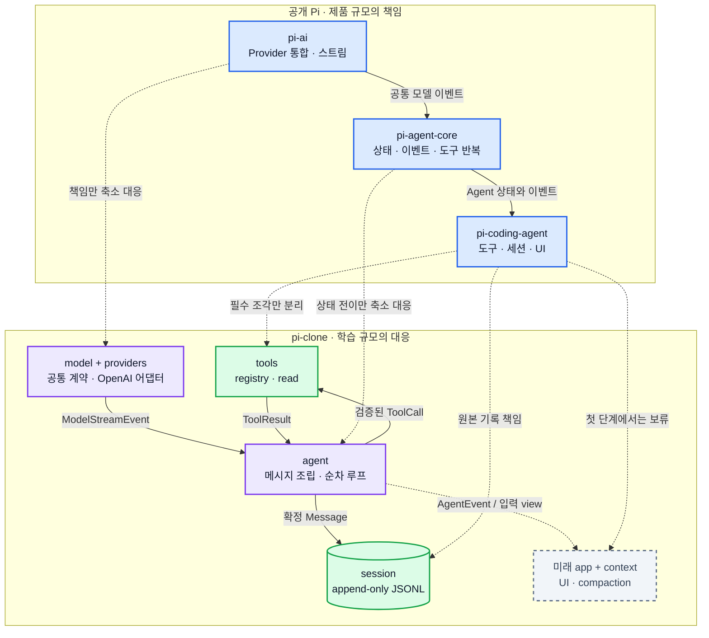

# 01. Pi 참조 지도

## 1. 참조 방법

공개 Pi는 실제 제품이므로 Provider 수, UI, 확장, 세션 기능이 크다. `pi-clone`은 파일을 따라 복사하지 않고 다음 세 가지 질문만 참조한다.

1. 어떤 책임을 서로 분리했는가?
2. 경계 사이에는 어떤 종류의 값이 이동하는가?
3. 작은 clone에서 어떤 기능을 버려도 핵심 루프가 남는가?

참조 저장소는 [earendil-works/pi](https://github.com/earendil-works/pi)다. 예전 `badlogic/pi-mono` 주소도 현재 이 저장소로 연결된다.

## 2. 책임 대응표

| 공개 Pi의 개념 | Pi에서 맡는 역할 | pi-clone에서의 대응 | 축소 방식 |
|---|---|---|---|
| [`pi-ai`](https://github.com/earendil-works/pi/tree/main/packages/ai) | 여러 모델 Provider를 공통 호출/스트림 모델로 제공 | `core/contracts.ts`와 `providers/` | Provider 하나만 구현하고 공통 계약은 유지 |
| [`pi-agent-core`](https://github.com/earendil-works/pi/tree/main/packages/agent) | 메시지 상태, 이벤트, 도구 호출 반복 | `agent/` | 순차 도구 실행과 핵심 이벤트만 유지 |
| [`pi-coding-agent`](https://github.com/earendil-works/pi/tree/main/packages/coding-agent) | 코딩 도구, 세션, compaction, 상호작용 UI | `tools/`, `session/`, 미래 `app/` | 네 기본 도구와 최소 JSONL까지만 구현 |
| Pi built-in tools | 파일/프로세스 작업 | `Tool` 계약과 registry | `read/write/edit/bash`의 작은 공통 부분만 구현 |
| Pi event flow | 스트림과 도구 실행을 UI가 관찰 | `AgentEvent` | 학습에 필요한 시작/증분/종료 이벤트만 |
| Pi compaction | 오래된 문맥을 요약해 모델 입력을 줄임 | 미래 `context/` | 첫 단계에서는 인터페이스 자리만 설명 |



> **그림 읽기:** 점선은 소스 복사가 아니라 책임의 대응을 뜻한다. Pi의 세 패키지는 clone에서 다섯 책임으로 작게 풀리며, 실제 실행 흐름은 `Provider → Agent ↔ Tool`, 기록 흐름은 `Agent → Session`으로 분리된다.

## 3. 그대로 복제하지 않는 이유

### 패키지 수가 학습 단위보다 크다

Pi의 패키지 분리는 배포와 재사용에도 유리하다. 이 프로젝트의 초기 목적은 배포가 아니라 흐름 이해다. 따라서 npm workspace를 여러 개 만드는 대신 한 패키지 안에서 폴더와 TypeScript 타입으로 경계를 표현한다.

### Provider 기능의 폭이 필요하지 않다

Pi는 여러 회사의 API, 인증, reasoning 형식, 모델 카탈로그를 다룬다. clone에서 이를 먼저 따라가면 Agent Loop보다 호환성 예외를 공부하게 된다. 첫 Provider는 OpenAI-compatible 하나로 제한한다.

### 확장 API는 핵심 흐름을 간접화한다

Pi의 확장성과 사용자 정의 기능은 제품으로서 중요하다. 하지만 처음부터 hook과 plugin을 넣으면 “누가 상태를 바꾸는가”가 불분명해진다. clone은 명시적 함수 호출로 시작한다.

## 4. 가장 중요한 Pi 개념 세 가지

### 4.1 Provider보다 위에 있는 공통 메시지

Agent Loop가 Provider별 wire format을 모르면, 모델을 바꾸는 작업은 어댑터 교체가 된다. 이 원리는 [Pi의 통합 모델 API 패키지](https://github.com/earendil-works/pi/tree/main/packages/ai)에서 직접 확인할 수 있다.

clone의 작은 예:

```text
OpenAI chunk
  → OpenAICompatibleProvider
  → { type: "text_delta", delta: "안녕" }
  → Agent Loop
```

Agent Loop는 첫 줄의 SDK 타입을 알 필요가 없다.

### 4.2 도구 결과도 대화의 일부

모델이 `read`를 요청했다고 해서 프로그램이 곧바로 최종 답을 얻는 것은 아니다. 도구 결과를 모델이 읽고 자연어 답을 만들도록 다시 호출해야 한다. [Pi Agent Core](https://github.com/earendil-works/pi/tree/main/packages/agent)의 tool-call event flow가 이 반복을 드러낸다.

clone에서는 다음 순서를 불변식으로 둔다.

```text
assistant(toolCall) → toolResult → assistant(final text)
```

### 4.3 세션 원본과 모델 입력 view의 분리

Pi의 [compaction 개념](https://github.com/earendil-works/pi/blob/main/packages/coding-agent/docs/compaction.md)은 오래된 기록을 요약하더라도 전체 세션 기록 자체와 현재 모델에 넣는 문맥이 같을 필요는 없음을 보여 준다.

clone의 첫 단계에서는 compaction을 구현하지 않지만, 다음 구분은 처음부터 지킨다.

- 세션 저장: 실제로 일어난 메시지와 중요한 상태 변경의 append-only 기록
- 모델 입력: 현재 요청에서 Provider에 전달할 메시지 배열

나중에 compaction은 모델 입력을 만드는 단계만 바꾸고 JSONL 원본은 보존한다.

## 5. 한 시나리오를 두 구조에 대응시키기

“`README.md` 첫 줄을 읽어줘”라는 요청을 생각해 보자.

| 단계 | Pi 개념 | pi-clone 개념 |
|---|---|---|
| 요청을 Provider 형식으로 변환 | `pi-ai` | `OpenAICompatibleProvider` |
| text/tool-call chunk 수신 | 모델 stream event | `ModelStreamEvent` |
| assistant 메시지 완성 | Agent state update | `AssistantMessageAssembler` |
| `read` 호출 검증과 실행 | agent tool execution | `ToolRegistry.executeBatch` |
| 실행 상태 알림 | agent events | `AgentEvent` |
| 결과를 넣고 다시 호출 | agent loop continuation | `Agent.prompt`의 두 turn |
| 기록 추가 | coding-agent session | `JsonlSessionStore.append` |

이 대응표는 구현 파일을 복사하기 위한 것이 아니라, 책임을 놓치지 않기 위한 체크리스트다.

## 6. 참조 시 주의할 점

- Pi의 현재 구현 세부사항은 변할 수 있다. 이 문서에서는 공개 패키지의 책임 경계만 안정적인 참조로 사용한다.
- clone 타입 이름이 Pi와 같을 필요는 없다. 이름보다 의존 방향이 중요하다.
- Pi에 있는 기능이라고 해서 clone에 필요한 것은 아니다.
- 두 번째 Provider를 추가하기 전까지 Provider 추상화가 완벽하다고 가정하지 않는다. 첫 계약은 작게 두고 실제 차이가 생길 때 확장한다.
