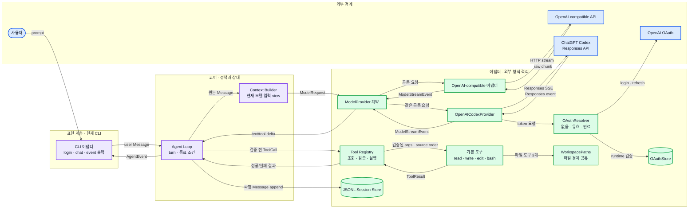

# 02. 아키텍처

## 1. 한 문장 구조

`pi-clone`은 **외부 모델 API를 번역하는 Provider**, **대화와 도구 호출을 반복하는 Agent Loop**, **실제 작업을 수행하는 Tool**, **기록을 남기는 Session Store**, **이벤트를 소비하는 App**으로 나뉜다.

핵심 규칙은 안쪽 계층이 바깥쪽의 구체 기술을 모르게 하는 것이다.

## 2. 의존 방향과 데이터 흐름



> **그림 읽기:** 오른쪽으로 나가는 화살표는 요청과 실행, 왼쪽으로 돌아오는 화살표는 stream과 결과다. Agent는 외부 API나 파일 구현을 직접 알지 않고 공통 계약만 호출한다.

화살표는 주된 호출 또는 데이터 이동을 뜻한다. 중요한 점은 다음과 같다.

- Agent Loop는 외부 API가 아니라 Provider 계약만 본다.
- 도구 구현은 모델 SDK를 모른다.
- App은 Agent Event를 소비하지만 Agent의 상태 규칙을 결정하지 않는다.
- Session Store는 루프를 실행하지 않고 받은 기록을 저장한다.

현재 App은 최소 CLI다. 브라우저 UI는 없지만 `login/status/logout/chat` 명령이 사용자 입력과 AgentEvent 소비자 역할을 실제로 수행한다.

## 3. 현재 모듈 경계

첫 수직 슬라이스에서 확정된 현재 구조와 미래 확장 위치는 다음과 같다.

```text
src/
  core/                     공통 계약과 assistant message assembler
  auth/                     OAuth 계약, 저장, login, refresh
  providers/                scripted, OpenAI-compatible, Codex Responses 번역
  agent/                    Agent Loop와 AgentEvent 발행
  tools/                    registry, 공통 경로 경계, read/write/edit/bash
  session/                  JSONL append/replay
  cli/                      인증 명령, callback, 대화, runtime 조립
  cli.ts                    실행 진입점

미래 확장 위치
  context/                  compaction 정책
  app/                      브라우저 채팅 UI
```

폴더의 목적은 파일을 많이 만드는 것이 아니라, “변경 이유”를 분리하는 것이다.

| 모듈 | 바뀌는 이유 |
|---|---|
| `core/` | 공통 메시지, 이벤트 또는 Provider 계약이 바뀜 |
| `providers/` | API 호환 규칙, stream parser 또는 scripted fake가 바뀜 |
| `auth/` | OAuth 프로토콜, credential 저장 또는 갱신 규칙이 바뀜 |
| `agent/` | turn 상태 전이와 종료 조건이 바뀜 |
| `tools/` | 도구 schema 또는 실행 정책이 바뀜 |
| `session/` | 기록 형식과 복원 규칙이 바뀜 |
| `cli/` | 명령, 터미널 입력 또는 이벤트 표시가 바뀜 |
| `context/` | 모델 입력 예산과 compaction 정책이 바뀜 |
| `app/` | 입력/출력 표현 방식이 바뀜 |

한 파일이 두 가지 이유로 자주 바뀐다면 경계가 섞였다는 신호다.

## 4. 주요 계약

### 4.1 `ModelProvider`

입력: 공통 `ModelRequest`와 미래 abort를 위한 선택적 `AbortSignal` seam

출력: 비동기 `ModelStreamEvent`

외부 SDK의 chunk, error, finish reason을 내부 이벤트로 번역한다. 자세한 계약은 [04 - Provider 계약](./04-provider-contract.md)에 있다.

### 4.2 `Agent`

입력: user 메시지

출력: `AgentEvent` stream 또는 subscriber callback

Provider를 호출하고 assistant 메시지를 조립한다. tool call이 있으면 registry에 실행을 맡기고 결과를 문맥에 추가한 뒤 다시 Provider를 호출한다.

### 4.3 `ToolRegistry`

입력: 완성된 tool call

출력: 성공 또는 실패 `ToolResult`

도구 이름 조회, schema 검증, 실행, 오류 정규화를 한곳에서 수행한다. 모델이 만든 인자를 신뢰하지 않는 경계다.

### 4.4 `SessionStore`

입력: 기록 가능한 session record

출력: append 완료 또는 load된 record stream

첫 단계에서는 JSONL을 append하고 순서대로 읽는 최소 기능만 둔다. Agent Loop가 파일 형식이나 경로 정책을 직접 알지 않게 한다.

### 4.5 `App`

입력: 사용자 행동

출력: Agent 호출과 이벤트 렌더링

첫 코어 단계에는 없었지만 현재 최소 CLI가 이 역할을 구현한다. 이후 브라우저 채팅 UI가 생겨도 Provider나 도구를 직접 호출하지 않고 Agent를 통해서만 동작한다.

## 5. end-to-end 예제

사용자가 “`package.json`을 읽고 scripts 개수를 알려줘”라고 요청한다.

1. Agent가 user 메시지를 상태와 세션에 추가한다.
2. Agent가 공통 메시지 배열을 Provider에 넘긴다.
3. 선택한 Provider는 OpenAI-compatible Chat request 또는 Codex Responses request로 변환한다.
4. API stream의 tool-call 인자 조각들이 공통 이벤트로 번역된다.
5. Agent의 assembler가 조각을 하나의 assistant tool call로 완성한다.
6. Tool Registry가 이름과 인자를 검증한 뒤 `read`를 실행한다.
7. Agent가 tool result를 메시지와 세션에 추가한다.
8. Agent가 갱신된 문맥으로 Provider를 다시 호출한다.
9. 최종 text delta를 이벤트로 내보내고 assistant 메시지를 완성한다.
10. 도구 호출이 더 없으므로 Agent가 종료한다.

각 단계가 다른 모듈에 있는 이유는 실패의 종류가 다르기 때문이다. 4번은 API 호환 문제, 6번은 신뢰 경계 문제, 8-10번은 루프 상태 문제다.

## 6. 첫 마일스톤의 의도적 단순화

- 도구는 source order대로 순차 실행한다.
- 실제로 제공하는 도구는 `read` 하나다.
- App UI 대신 이벤트를 수집하는 테스트 subscriber를 사용한다.
- retry는 하지 않고 Provider와 저장소 오류를 명시적으로 위로 전달한다.
- compaction은 하지 않고 전체 메시지를 Provider에 전달한다.
- JSONL은 append-only이며 session tree는 없다.

이 단순화는 임시 편법이 아니라 핵심 계약을 관찰하기 위한 실험 조건이다.

## 7. Pi와의 관계

공개 [Pi 저장소의 루트 설명](https://github.com/earendil-works/pi)은 `pi-ai → pi-agent-core → pi-coding-agent`라는 층을 명시한다. `pi-clone`은 이를 여러 배포 패키지가 아닌 한 프로젝트 안의 모듈 의존 방향으로 재해석한다. 따라서 “구조는 참고하지만 규모는 복제하지 않는다”가 이 문서의 핵심 선택이다.
