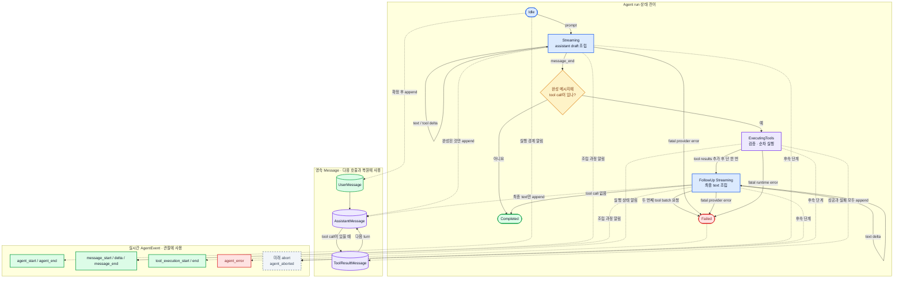

# 03. 메시지와 이벤트 모델

## 1. 왜 둘을 나누는가

에이전트에는 서로 다른 두 종류의 사실이 있다.

- **Message**: 대화 문맥에 남아 다음 모델 호출과 세션 복원에 쓰이는 사실
- **Agent Event**: 지금 무엇이 진행 중인지 소비자에게 알려 주는 순간적인 사실

예를 들어 `"안"`과 `"녕"`이라는 두 text delta는 화면에는 즉시 필요하지만, 세션을 복원할 때는 완성된 `"안녕"` assistant 메시지만 있어도 된다. delta를 전부 저장 형식의 중심으로 삼으면 UI 전송 단위가 세션 계약이 되어 버린다.

공개 [Pi Agent Core](https://github.com/earendil-works/pi/tree/main/packages/agent)도 message 상태와 스트리밍 event flow를 구분한다. clone은 이 관점을 더 작은 타입 집합으로 표현한다.

## 2. 최소 Message 모델

첫 마일스톤에서 필요한 역할은 세 가지다.

```ts
type Message =
  | UserMessage
  | AssistantMessage
  | ToolResultMessage;
```

### `UserMessage`

사용자 입력이다. 최소 필드는 `id`, `role: "user"`, `content`, `createdAt`이다.

### `AssistantMessage`

모델의 한 번의 응답이다. 텍스트와 tool call을 함께 가질 수 있다. 스트리밍 중에는 mutable builder가 조립하지만, Agent 상태에 확정해서 넣을 때는 완성된 값이어야 한다.

### `ToolResultMessage`

특정 `toolCallId`에 대한 실행 결과다. 성공과 실패를 모두 표현한다. 실패도 모델이 다음 행동을 결정할 수 있는 대화 정보이므로 예외만 던지고 사라지게 하지 않는다.

## 3. Tool Call 모델

모델 stream에서 tool call은 여러 조각으로 올 수 있다.

```text
이름: "read"
인자 조각 1: {"pa
인자 조각 2: th":"package
인자 조각 3: .json"}
```

따라서 다음 두 상태를 구분한다.

1. `ToolCallDraft`: 인자 문자열이 아직 불완전한 stream 조립 상태
2. `ToolCall`: stream 종료 후 JSON parse와 schema 검증 대상으로 넘길 완성 상태

중요한 불변식은 **draft를 실행하지 않는다**는 것이다. JSON 조각이 우연히 중간에 parse된다고 해도 종료 이벤트 전에는 완성으로 간주하지 않는다.

## 4. 최소 Agent Event 모델

이벤트는 UI를 미리 설계하기 위한 것이 아니라 코어의 진행을 관찰하기 위한 것이다.

| 이벤트 | 의미 | 영속 저장 여부 |
|---|---|---|
| `agent_start` | 한 사용자 요청의 실행 시작 | 보통 저장하지 않음 |
| `turn_start` | Provider 호출 한 번의 시작 | 필요하면 진단 record |
| `message_start` | 메시지 조립 시작 | 저장하지 않음 |
| `text_delta` | 새 텍스트 조각 도착 | 저장하지 않음 |
| `tool_call_delta` | tool call 인자 조각 도착 | 저장하지 않음 |
| `message_end` | 완성된 메시지 확정 | Message를 저장 |
| `tool_execution_start` | 검증을 통과한 도구 실행 시작 | 보통 저장하지 않음 |
| `tool_execution_end` | 도구 결과 확정 | ToolResult를 저장 |
| `turn_end` | 한 Provider 응답과 후속 도구 처리 종료 | 필요하면 진단 record |
| `agent_end` | 더 이상 tool call이 없어 전체 실행 종료 | 보통 저장하지 않음 |
| `agent_error` | 요청이 정상적으로 계속될 수 없는 오류 | 오류 record 선택 |

“무엇을 JSONL에 저장할지”는 Session Store 설계에서 더 좁혀야 한다. 여기서는 이벤트 전체를 무조건 저장하지 않는다는 원칙만 확정한다.

## 5. 상태 전이



> **그림 읽기:** 실선은 현재 run의 상태 전이, 점선은 각 상태가 확정 Message나 관찰 Event를 만드는 관계다. delta는 Event로 즉시 보이지만, 영속 Message에는 완성된 assistant만 들어간다. abort 상태와 이벤트는 후속 단계다.

tool 인자 오류나 알 수 없는 tool 이름은 일반적으로 `Failed`로 바로 가지 않는다. 실패 `ToolResultMessage`를 만든 뒤 `FollowUp`으로 가서 모델이 오류를 설명할 기회를 준다. 첫 수직 슬라이스는 여기서 두 번째 tool batch를 허용하지 않으므로, 도구 인자를 고쳐 다시 실행하려면 새 사용자 prompt가 필요하다. 인증 실패나 follow-up의 추가 tool call처럼 계속할 수 없는 경우는 `Failed`다.

## 6. 작은 예제

사용자가 `README.md` 첫 줄을 요청했다고 하자.

```text
Message:
  user("README.md 첫 줄을 알려줘")

Events:
  agent_start
  turn_start
  message_start(assistant)
  tool_call_delta(...)
  message_end(assistant with read call)
  tool_execution_start(read)
  tool_execution_end(success)

Messages appended:
  assistant(toolCall=read)
  toolResult("...첫 줄...")

Events:
  turn_start
  message_start(assistant)
  text_delta("첫")
  text_delta(" 줄은 ...")
  message_end(assistant)
  agent_end
```

이 예에서 이벤트는 많지만 세션 문맥에 필요한 새 메시지는 assistant, tool result, assistant 세 개다.

## 7. ID와 순서 규칙

- 모든 확정 Message는 session 안에서 고유한 `id`를 가진다.
- Tool Call은 고유 `toolCallId`를 가진다.
- Tool Result는 반드시 기존 `toolCallId` 하나를 참조한다.
- 첫 단계의 도구 실행과 Tool Result 추가는 assistant가 요청한 순서를 따른다.
- 이벤트 subscriber가 느리더라도 메시지 순서를 바꾸면 안 된다.
- timestamp는 관찰과 진단용이지 논리 순서의 유일한 근거가 아니다. JSONL append 순서와 명시적 ID 관계가 우선이다.

## 8. 미래 기능이 붙는 자리

- UI는 `AgentEvent`를 소비해 delta와 도구 상태를 렌더링한다.
- JSONL Session Store는 확정 Message와 필요한 session record를 append한다.
- retry는 새 turn을 무조건 만드는 대신, 실패한 Provider attempt의 경계를 별도 진단 이벤트로 표현해야 한다.
- abort는 `agent_aborted`와 부분 draft 처리 규칙을 함께 정의한 뒤 추가한다.
- compaction은 저장된 Message를 지우지 않고 Provider에 넘길 message view를 만든다.
- 현재 write/bash도 시작·종료 이벤트만 낸다. 실시간 shell 출력이 필요해지면 `tool_execution_update` 같은 별도 이벤트를 추가하되, 확정 Message와 섞지 않는다.
