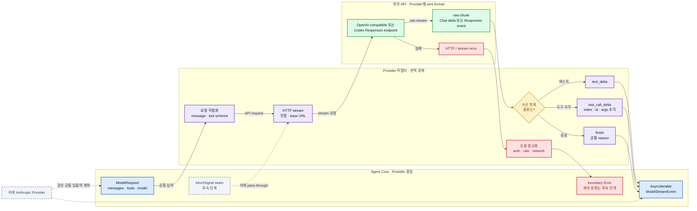

# 04. Provider 계약

## 1. Provider의 역할

Provider는 “모델을 호출하는 모든 것”이 아니다. 더 정확히는 다음 두 형식 사이의 번역 경계다.

```text
pi-clone 공통 요청/이벤트 ↔ 특정 모델 API 요청/chunk
```



> **그림 읽기:** 요청은 왼쪽에서 오른쪽으로 직렬화되고, stream은 오른쪽에서 왼쪽의 공통 이벤트로 정규화된다. Agent는 raw chunk와 HTTP 오류를 보지 않으며, 미래 Anthropic 어댑터도 같은 공통 입출력에 연결된다.

첫 코어 구현은 OpenAI-compatible API 하나로 계약을 검증했다. 현재 두 번째 구현은 같은 `ModelProvider` 뒤에 `OpenAICodexProvider`를 추가했다. 두 구현의 base URL, 인증, message 직렬화, stream event가 달라도 Agent Loop는 바뀌지 않는 것이 추상 경계의 실제 검증이다.

공개 Pi의 [`pi-ai`](https://github.com/earendil-works/pi/tree/main/packages/ai)는 여러 Provider를 통합 모델 API 뒤에 둔다. clone은 그 책임 분리와 Codex OAuth/Responses의 최소 직접 흐름만 가져오고, 전체 모델 카탈로그와 수많은 Provider 예외는 가져오지 않는다.

## 2. 최소 계약

설명용 TypeScript 형태는 다음과 같다.

```ts
interface ModelProvider {
  stream(
    request: ModelRequest,
    options?: { signal?: AbortSignal },
  ): AsyncIterable<ModelStreamEvent>;
}
```

선택적 `signal`은 미래 확장 seam이다. 현재 `OpenAICodexProvider`는 전달받은
signal을 인증 해석과 HTTP 요청에 넘긴다. 최초의 `OpenAICompatibleProvider`는 아직
이 값을 사용하지 않으며, Agent와 CLI도 run 전체를 취소하는 signal을 생성하지 않는다.
따라서 지금 보장하는 것은 **Codex 어댑터 내부의 전달 경로**이지, 사용자 취소가
Provider와 Tool 전체를 한꺼번에 멈추는 완성된 abort 기능이 아니다.

`ModelRequest`는 최소한 다음을 가진다.

```ts
interface ModelRequest {
  model: string;
  messages: readonly Message[];
  tools: readonly ToolDefinition[];
}
```

Provider는 Agent 상태 전체를 받지 않는다. Provider가 알아야 할 것은 이번 모델 호출에 필요한 직렬화 가능한 문맥뿐이다.

## 3. 공통 Stream Event

첫 마일스톤에 필요한 이벤트는 작게 유지한다.

```ts
type ModelStreamEvent =
  | { type: "text_delta"; delta: string }
  | {
      type: "tool_call_delta";
      index: number;
      id?: string;
      name?: string;
      argumentsDelta?: string;
    }
  | { type: "finish"; reason: "stop" | "tool_calls" | "length" | "other" };
```

오류는 정상 stream event로 위장하지 않는다. 첫 수직 슬라이스의 Provider는 명시적인 boundary `Error`를 throw한다. 세부 error code와 `ProviderError` 타입은 retry 정책과 함께 후속 단계에서 추가한다.

### 왜 `tool_call_delta`에 `index`가 필요한가

한 assistant 응답이 여러 tool call을 동시에 만들 수 있고, 각 호출의 인자 조각이 나뉘어 올 수 있다. `index`는 어느 draft에 조각을 붙일지 식별한다. 첫 단계에서는 완성된 호출을 순차 실행하지만, 스트림 조립은 복수 호출을 잃지 않아야 한다.

## 4. Provider 안에서 해야 하는 일

- 공통 `Message`를 OpenAI-compatible message 형식으로 직렬화
- Tool definition을 API의 function/tool schema로 직렬화
- 인증과 base URL 적용
- streaming 요청 시작
- text delta와 tool-call delta 번역
- provider finish reason을 공통 reason으로 정규화
- HTTP와 malformed stream 오류를 명시적인 boundary 오류로 변환
- 후속 단계에서 `AbortSignal`을 실제 네트워크 요청에 전달

## 5. Provider 밖에 있어야 하는 일

- Agent turn 횟수 결정
- tool 이름 조회와 인자 schema 검증
- tool 실행
- assistant 메시지의 session 저장
- retry 횟수와 backoff 정책
- context compaction
- UI 렌더링

후속 단계에서 HTTP 429를 `rate_limit` 오류로 분류하는 것은 Provider 책임이다. 그것을 2초 후 다시 호출할지는 미래 retry 정책의 책임이다.

## 6. Tool Call 조립 시나리오

OpenAI-compatible stream이 다음 정보를 보낸다고 하자.

```text
chunk 1: index=0, id=call_1, name=read, arguments="{\"pa"
chunk 2: index=0, arguments="th\":\"README.md\"}"
finish: tool_calls
```

Provider는 두 chunk를 각각 `tool_call_delta`로 번역한다. 인자 문자열을 합치고 JSON으로 parse하는 책임은 Agent 쪽 message assembler에 둔다.

왜 Provider가 JSON을 완성하지 않는가? Provider는 transport chunk를 번역하는 데 집중하고, “assistant 메시지가 언제 완성되는가”라는 상태 규칙은 Agent가 소유해야 하기 때문이다. 이렇게 하면 scripted fake Provider도 같은 조립 경로를 테스트할 수 있다.

## 7. OpenAI-compatible이 뜻하는 범위

“OpenAI-compatible”은 모든 서버가 완전히 같다는 보장이 아니다. 첫 구현에서는 다음 최소 가정을 문서화해야 한다.

- chat-style message 입력을 받는다.
- streaming delta를 제공한다.
- function/tool definition을 받을 수 있다.
- tool call의 이름과 JSON 인자를 streaming할 수 있다.
- API key와 base URL을 설정할 수 있다.

특정 서버가 tool streaming을 지원하지 않으면 첫 마일스톤 호환 대상이 아니다. 호환성 예외를 추측해서 일반화하지 말고, 실제 대상 서버가 생길 때 contract test를 추가한다.

## 8. 미래 Abort와 오류/retry의 경계

### Abort

첫 수직 슬라이스는 abort를 생성하거나 처리하지 않는다. `ProviderCallOptions.signal`은 타입 seam으로만 존재한다. 후속 단계에서는 Agent가 만든 하나의 `AbortSignal`을 Provider와 실행 중 도구에 전달하고, 사용자가 중단한 요청을 오류나 자동 retry와 구분해야 한다.

### 오류 분류

최소 분류 예시는 다음과 같다.

- `authentication`
- `rate_limit`
- `network`
- `invalid_request`
- `malformed_response`
- `context_length`
- `unknown`

첫 단계에서는 Provider boundary에서 명시적인 오류를 던지지만 세부 code 분류와 자동 retry는 하지 않는다. 오류가 발생한 위치와 원인을 관찰할 수 있어야 다음 단계에서 안전한 정책을 설계할 수 있다.

### 미래 retry

retry는 Provider 구현 안의 숨은 반복으로 넣지 않는다. 그래야 Agent Event와 테스트가 실제 attempt 수를 알 수 있다. 미래 `RetryPolicy`가 분류된 오류를 보고 재시도 여부와 지연을 결정하도록 둔다.

## 9. 미래 Anthropic 어댑터

Anthropic Provider를 추가할 때 Agent Loop는 바뀌지 않아야 한다. 대신 다음 차이가 Provider 안에서 흡수되어야 한다.

- request message/content block 직렬화
- tool-use/tool-result 표현
- stream event 이름과 순서
- stop reason
- 인증 header

두 번째 Provider를 실제로 추가할 때 공통 계약에 맞지 않는 차이가 발견되면, 구체 Provider의 개념을 그대로 타입에 추가하기 전에 Agent가 정말 알아야 하는 의미인지 먼저 판단한다.

## 10. 테스트 관점

Provider contract test는 외부 네트워크와 Agent Loop 테스트를 분리한다.

1. fixture OpenAI chunks를 넣으면 예상 공통 event가 나오는지 검사
2. SSE 줄이 transport chunk 중간에서 나뉘어도 event가 보존되는지 검사
3. malformed chunk가 명시적인 boundary 오류가 되는지 검사
4. tool-call delta의 index, id, name, arguments 조각이 보존되는지 검사

Agent Loop 테스트는 이 어댑터 대신 scripted fake Provider가 공통 이벤트를 직접 내보내게 한다. 이 분리 덕분에 모델 비용과 네트워크 변동 없이 상태 전이를 검증할 수 있다.
