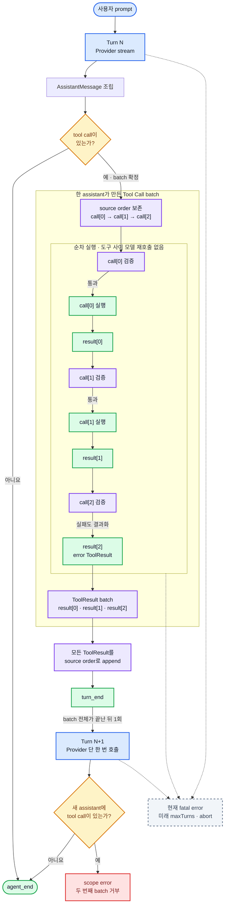

# 05. Agent Loop

## 1. Agent Loop가 핵심인 이유

일반 채팅은 모델을 한 번 호출하고 끝날 수 있다. 도구를 쓰는 에이전트는 모델이 “무엇을 해야 하는지” 결정한 뒤, 프로그램이 그 작업을 실행하고, 모델이 결과를 읽어 최종 답을 만들어야 한다.

따라서 핵심은 무한히 자율적인 시스템이 아니라 다음의 통제된 두 turn 흐름이다.

```text
모델 호출 → assistant 완성 → tool call이 있으면 실행 → 결과 추가 → 모델 1회 재호출 → 최종 text
```

공개 [Pi Agent Core](https://github.com/earendil-works/pi/tree/main/packages/agent)는 turn, message, tool execution event를 통해 이 반복을 드러낸다. clone은 같은 개념을 최소 상태 기계로 학습한다.

## 2. 용어

- **agent run**: 사용자 prompt 하나를 받아 최대 두 번의 Provider turn으로 최종 text를 만드는 전체 작업
- **turn**: Provider를 한 번 호출하고 그 assistant 응답에 속한 도구를 처리하는 단위
- **attempt**: 미래 retry가 들어왔을 때 같은 turn의 Provider 요청을 다시 시도하는 단위

첫 단계에는 retry가 없으므로 turn마다 attempt가 하나다. 용어를 미리 구분하면 나중에 retry가 대화 turn을 잘못 늘리는 일을 막을 수 있다.

## 3. 한 run의 절차

1. `prompt`가 user 입력을 받아 메시지를 생성한다.
2. user 메시지를 세션에 append하고, 성공한 뒤 Agent 상태에 추가한다.
3. `agent_start`를 emit한다.
4. 새 turn을 시작하고 `turn_start`를 emit한다.
5. 현재 메시지로 `ModelRequest`를 만든다.
6. Provider stream을 순회하며 assistant draft를 조립하고 delta event를 emit한다.
7. finish 후 assistant 메시지를 검증하고 확정한다.
8. assistant 메시지를 세션에 append하고, 성공한 뒤 상태에 추가해 `message_end`를 emit한다.
9. tool call이 없으면 `turn_end`, `agent_end` 후 종료한다.
10. tool call이 있으면 각 호출을 source order대로 처리한다.
11. 이름 조회, JSON parse, schema 검증, 실행 결과를 모두 `ToolResult`로 정규화한다.
12. Tool Result 메시지를 각각 세션에 append하고, 성공한 뒤 상태에 추가한다.
13. `turn_end` 후 Provider를 단 한 번 더 호출하며, follow-up 응답은 tool call 없는 최종 text여야 한다.



> **그림 읽기:** assistant가 여러 도구를 한 번에 요청해도 call마다 모델을 다시 부르지 않는다. batch를 source order대로 검증·실행하고 모든 Tool Result를 같은 순서로 append한 뒤, 다음 turn의 Provider를 정확히 한 번 호출한다.

## 4. 왜 도구 검증 실패도 루프 안에 남기는가

모델이 `reed`처럼 없는 도구를 호출하거나 `read({})`처럼 필수 경로를 빼먹을 수 있다. 이때 전체 run을 예외로 끝내면 모델이 스스로 수정할 기회가 없다.

권장 동작은 실패를 구조화된 Tool Result로 만드는 것이다.

```text
assistant: call read({})
toolResult:
  ok: false
  error:
    code: "invalid_arguments"
    message: "path is required"
assistant: "path가 빠져 읽지 못했습니다. 경로를 지정해 다시 요청해 주세요."
```

첫 수직 슬라이스의 follow-up은 최종 text만 허용하므로 같은 run에서 수정된 도구를 다시 호출하지 않는다. Provider 인증 오류, 세션 저장소 손상, follow-up의 추가 tool call처럼 정상적으로 계속할 수 없는 경우는 run을 실패시킨다.

## 5. Tool Registry 경계

Agent Loop가 각 도구의 세부사항을 알기 시작하면 도구가 늘 때마다 루프가 바뀐다. Registry는 다음 순서를 캡슐화한다.

1. tool 이름 조회
2. raw arguments JSON parse
3. schema validation
4. 반환값을 공통 `ToolResult`로 변환
5. 예상 가능한 실행 오류를 실패 결과로 정규화

현재 Registry에는 `read`, `write`, `edit`, `bash`가 같은 `Tool` 계약으로 등록된다. Registry는 이름·JSON·도구별 인자를 검증하고 source order만 보존하며, workspace 경계나 exact-one 교체, shell 제한 같은 의미는 각 도구에 맡긴다.

## 6. 종료 조건과 방어 한계

정상 종료 조건은 assistant 메시지에 tool call이 없는 것이다.

첫 수직 슬라이스에서 즉시 run을 실패시키는 조건은 다음과 같다.

- fatal Provider error: 인증, malformed response 등으로 계속할 수 없음
- fatal storage error: 확정 메시지 기록을 보장할 수 없음

`maxTurns`와 `AbortSignal`은 후속 실행 제어 단계에서 추가한다. 그때 `maxTurns` 도달은 조용한 성공이 아니라 명시적 오류가 되어야 한다.

## 7. 미래 Abort의 의미

첫 수직 슬라이스는 abort를 구현하지 않는다. 아래 항목은 후속 실행 제어 단계가 지켜야 할 계약이다. abort는 “현재 네트워크 요청만 끊기”가 아니라 agent run 전체를 더 이상 진행하지 않게 하는 신호다.

- Provider가 streaming 중이면 네트워크 요청에 전달한다.
- Tool이 실행 중이면 같은 신호를 전달한다.
- abort 후 새 turn을 시작하지 않는다.
- 부분 assistant draft를 완성 메시지처럼 세션에 저장하지 않는다.
- 이미 확정되어 append된 메시지는 되돌리지 않는다.
- 최종 이벤트는 `agent_aborted`다.

현재 네 도구와 Agent Loop는 이 신호를 생성하거나 전달하지 않는다. `bash`의 자체 timeout은 한 command의 시간 제한일 뿐, 사용자 취소를 Provider와 전체 run에 전파하는 Abort 계약을 대신하지 않는다.

## 8. Session Store와의 접점

Agent Loop는 JSONL 문자열을 직접 만들지 않는다. 확정된 사실을 Session Store에 전달한다.

첫 단계에서 필요한 record 예시는 다음과 같다.

```text
session_started
message_appended(user)
message_appended(assistant with tool call)
message_appended(tool result)
message_appended(assistant final)
run_finished
```

append 순서는 Agent 상태에 메시지를 확정하는 순서와 같아야 한다. 구현은 `append 성공 → in-memory context 반영` 순서를 지켜, 기록 실패한 메시지가 다음 Provider 요청에 섞이지 않게 한다. 세션 복원은 record를 순서대로 replay해 메시지 배열을 재구성한다.

미래 compaction은 별도 record를 추가할 수 있지만 과거 message record를 삭제하거나 덮어쓰지 않는다. Agent가 Provider 요청을 만들기 직전에 `ContextBuilder`가 원본 메시지에서 축약된 view를 만드는 위치가 적절하다.

## 9. 전체 시나리오

scripted fake Provider에 두 개의 응답을 준비한다.

### 첫 번째 Provider 응답

```text
tool_call_delta: read({"path":"package.json"})
finish: tool_calls
```

### 도구 결과

```text
{"name":"pi-clone","scripts":{"test":"vitest"}}
```

### 두 번째 Provider 응답

```text
text_delta: "scripts는 "
text_delta: "1개입니다."
finish: stop
```

예상 결과:

- Provider 호출 횟수: 2
- Tool 실행 횟수: 1
- 확정 메시지 순서: user → assistant(tool call) → tool result → assistant(text)
- text delta 이벤트: 2
- agent 종료: 성공

이 테스트 하나가 메시지 조립, 도구 실행, 결과 재주입, 반복, 종료를 함께 검증한다.

## 10. 첫 단계 테스트 목록

1. 텍스트만 응답하면 Provider를 한 번 호출하고 종료한다.
2. tool call 하나면 도구 실행 후 Provider를 다시 호출한다.
3. 복수 tool call은 source order대로 실행한다.
4. JSON 인자가 여러 delta로 나뉘어도 종료 후 한 번만 실행한다.
5. 알 수 없는 도구는 실패 Tool Result가 된다.
6. schema가 틀리면 도구 본체를 호출하지 않는다.
7. subscriber가 받은 이벤트 순서가 메시지 상태 전이와 맞는다.
8. JSONL replay 결과가 run 종료 시 메시지 배열과 같다.

## 11. 이후 확장 순서

네 도구까지 위 테스트를 통과했다. 다음 확장은 아래 순서가 적절하다.

1. 실행 제어: `maxTurns`, Provider/Tool abort 전달, `agent_aborted`
2. 권한·격리: 도구별 승인, sandbox, shell process tree 종료 정책
3. retry: Provider 오류 분류 기반 정책과 attempt 이벤트
4. context compaction: 원본 JSONL 보존과 Provider 입력 view 분리
5. 브라우저 채팅 UI: CLI에서 검증한 `AgentEvent` 렌더링과 사용자 abort
6. Anthropic Provider: 공통 계약의 실제 일반성 검증

이 순서는 기능의 화려함보다 경계가 실제로 유지되는지를 먼저 검증한다.
