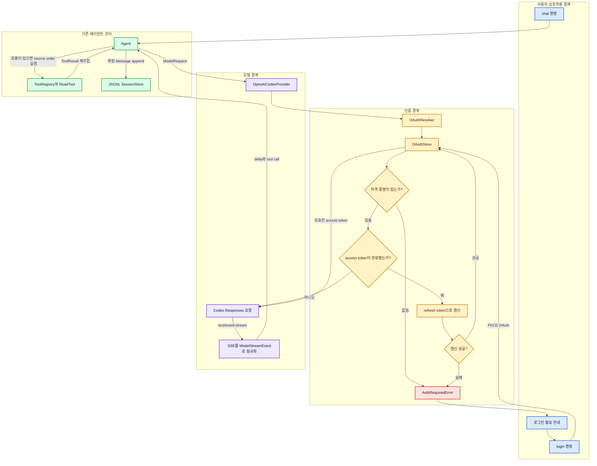

# 직접 Codex OAuth Provider 설계

이 문서는 `codex exec`를 자식 프로세스로 실행하는 우회 구조가 아니라, Pi처럼 OAuth 자격 증명과 모델 요청을 애플리케이션이 직접 관리하는 경계를 설명한다. 목표는 인증 코드를 크게 만드는 것이 아니라, **인증·저장·Provider·사용자 상호작용이 서로의 책임을 침범하지 않는 최소 구조**를 학습하는 것이다.

## 먼저 고정할 동작

`OpenAICodexProvider`가 요청을 시작할 때 저장된 자격 증명이 없다면 브라우저를 임의로 열지 않는다. 대신 `AuthRequiredError`를 발생시키고, 사용자와 상호작용할 책임이 있는 CLI가 다음 행동을 안내한다.

```text
인증 정보가 없습니다.
먼저 로그인하세요:

  npm run cli -- login
```

이 구분이 필요한 이유는 Provider가 터미널, GUI, 서버 등 어떤 환경에서도 재사용될 수 있어야 하기 때문이다. 서버에서 Provider를 호출했는데 갑자기 브라우저가 열리면 자동화와 테스트가 모두 불안정해진다.



> **그림 읽기:** `Provider → OAuthResolver`는 인증을 *요청*하지만 로그인 화면을 직접 소유하지 않는다. 자격 증명이 없거나 갱신할 수 없을 때만 타입이 있는 오류를 위로 전달하고, CLI가 사용자에게 `login` 명령을 안내한다.

## 책임 경계

### `OpenAICodexProvider`

- 기존 `ModelProvider` 계약을 구현한다.
- `ModelRequest`를 Codex Responses 요청으로 번역한다.
- 응답 SSE를 `text_delta`, `tool_call_delta`, `finish`로 정규화한다.
- `store: false` 후속 요청에 필요한 암호화 reasoning과 function item id를 같은
  Provider 인스턴스 안에서 잠시 보존한다.
- access token 문자열을 직접 저장하거나 refresh하지 않는다.

작은 예: 모델이 `read` 도구를 두 번 호출하면 Provider는 두 호출을 내부 `tool_call_delta`로만 번역한다. 실제 파일 접근 순서와 성공·실패 처리는 기존 `ToolRegistry`가 맡는다.

다음 사용자 질문이나 도구 결과를 보낼 때는 앞 응답의 opaque reasoning item도 함께
재전송한다. 도구가 있었다면 function-call item id도 보존한다. 이것은 내용을 해석해
세션 Message로 바꾸는 기능이 아니라, Responses 프로토콜의 assistant turn 연속성을
Provider가 보존하는 기능이다. 현재는 compaction이 없는 context의 메시지 위치와
assistant text·tool call id를 함께 확인해 같은 문자열의 과거 turn과 혼동하지 않는다.
보존 범위는 살아 있는 Provider 인스턴스뿐이므로 프로세스 재시작 뒤 resume은 아직
지원하지 않는다.

### `OAuthResolver`

- 현재 자격 증명을 읽는다.
- 자격 증명이 없으면 `AuthRequiredError`를 발생시킨다.
- 아직 유효하면 그대로 돌려준다.
- 만료됐다면 저장소 잠금 안에서 값을 다시 읽고 필요한 경우에만 한 번 갱신한다.
- 갱신 실패나 refresh token 부재도 `AuthRequiredError`로 정규화한다.

잠금 안에서 다시 읽는 이유는 CLI 두 개가 동시에 시작됐을 때 둘 다 같은 refresh token을 사용하지 않게 하기 위해서다. 먼저 갱신한 프로세스가 새 토큰을 저장했다면 두 번째 프로세스는 그 값을 재사용한다.

### `OAuthStore`

- Provider별 OAuth 자격 증명을 런타임 검증 후 읽고 쓴다.
- 기본 파일은 저장소 밖 사용자 홈의 `.pi-clone/auth.json`이다.
- 파일 생성 시 가능한 플랫폼에서 소유자만 읽고 쓸 수 있는 `0600` 권한을 요청한다.
- lock heartbeat가 살아 있는 동안에는 다른 프로세스가 잠금을 빼앗지 않고, 중단된
  프로세스가 남긴 오래된 lock만 lease 만료 뒤 회수한다.
- 테스트에서는 실제 홈 디렉터리를 건드리지 않는 메모리 저장소를 사용한다.

Windows의 POSIX mode는 완전한 ACL 보장이 아니다. 첫 학습 단계에서는 사용자 프로필 아래에 저장하고 비밀을 로그에 출력하지 않는 경계를 지킨다. Windows ACL 강화는 별도 보안 단계로 남긴다.

### `OpenAICodexOAuth`

- PKCE verifier/challenge와 `state`를 만든다.
- 브라우저 callback 또는 사용자가 붙여 넣은 redirect URL에서 code와 state를 검증한다.
- code를 access token과 refresh token으로 교환한다.
- access token JWT에서 ChatGPT account id를 읽는다.
- refresh token으로 새 자격 증명을 발급한다.

OAuth client id는 비밀번호가 아니라 공개 클라이언트 식별자다. 반대로 access token, refresh token, authorization code는 절대 주석·로그·세션 JSONL에 남기지 않는다.

### CLI

- `login`: 로그인 URL을 열거나 출력하고 완료된 자격 증명을 저장한다.
- `status`: 토큰 원문 없이 로그인 여부와 만료 상태만 보여준다.
- `logout`: 저장된 자격 증명을 삭제한다.
- `chat`: Provider의 `AuthRequiredError`를 사용자 안내 문장으로 바꾼다.

## 직접 연결 프로토콜

Pi의 현재 OpenAI Codex Provider는 ChatGPT Codex Responses 경계를 사용한다.

- 기본 URL: `https://chatgpt.com/backend-api`
- 응답 경로: `/codex/responses`
- 인증: `Authorization: Bearer <access token>`
- 계정 선택: `chatgpt-account-id: <account id>`
- 스트림: `Accept: text/event-stream`
- 요청 본문 핵심: `model`, `instructions`, `input`, `tools`, `stream: true`, `store: false`

이 경로는 일반 OpenAI Platform API의 공개 안정 계약이 아니다. 따라서 URL·헤더·payload 변환을 Provider 한 곳에 격리하고, 코어 메시지 타입에 ChatGPT 전용 필드를 넣지 않는다. 프로토콜이 바뀌더라도 Provider와 해당 테스트만 수정하는 것이 목표다.

## 의도적으로 미루는 기능

- Responses WebSocket 연결 재사용과 캐시
- 스트림 재시도와 backoff
- 요청 압축
- abort 전파
- context compaction
- write/edit/bash 도구
- 멀티 Provider 선택 UI

이 기능들은 현재 책임 경계에 추가할 수 있지만, OAuth와 직접 SSE 흐름을 이해하는 첫 단계에는 필요하지 않다.

## Pi와의 관계

참고한 Pi 개념은 OAuth credential, refresh resolution, Codex Responses Provider, coding-agent auth storage다. 파일이나 패키지 구조를 복사하지 않고 이 프로젝트의 기존 작은 계약에 맞춰 다시 설계한다.

- [Pi OpenAI Codex OAuth](https://github.com/earendil-works/pi/blob/main/packages/ai/src/auth/oauth/openai-codex.ts)
- [Pi OAuth resolution](https://github.com/earendil-works/pi/blob/main/packages/ai/src/auth/resolve.ts)
- [Pi OpenAI Codex Provider](https://github.com/earendil-works/pi/blob/main/packages/ai/src/providers/openai-codex.ts)
- [Pi Codex Responses API](https://github.com/earendil-works/pi/blob/main/packages/ai/src/api/openai-codex-responses.ts)
