# 직접 OAuth Provider TDD 구현 계획

이 문서는 [06 - 직접 Codex OAuth Provider 설계](./06-direct-codex-oauth.md)를 작은 RED→GREEN 단위로 구현하기 위한 작업 순서다. 각 단계는 이전 커밋과 비교했을 때 새 책임 하나만 드러나도록 구성한다.

## 테스트가 이끄는 전체 순서

```mermaid
flowchart TD
    Start(["89d1dfb<br/>기존 Agent 수직 슬라이스"])

    subgraph AUTH_CORE["1 · 인증의 언어"]
        R1["RED<br/>PKCE와 credential 검증 테스트"]
        G1["GREEN<br/>OAuth 타입·PKCE·JWT claim"]
    end

    subgraph STORE["2 · 저장과 동시성"]
        R2["RED<br/>없음·저장·삭제·동시 갱신 테스트"]
        G2["GREEN<br/>Memory/File OAuthStore"]
    end

    subgraph LOGIN["3 · 로그인과 갱신"]
        R3["RED<br/>URL·state·code 교환 테스트"]
        G3["GREEN<br/>브라우저 OAuth 로그인"]
        R4["RED<br/>만료·중복 refresh 테스트"]
        G4["GREEN<br/>OAuthResolver"]
    end

    subgraph PROVIDER["4 · 모델 연결"]
        R5["RED<br/>인증 없음·요청 변환·SSE 테스트"]
        G5["GREEN<br/>OpenAICodexProvider"]
    end

    subgraph CLI["5 · 사용자 경험"]
        R6["RED<br/>login/status/logout/chat 테스트"]
        G6["GREEN<br/>대화형 CLI"]
    end

    subgraph VERIFY["6 · 통합 검증"]
        E2E["기존 Agent + ReadTool<br/>직접 Provider fake HTTP E2E"]
        Audit["전체 test · typecheck · build<br/>비밀·diff·커밋 이력 점검"]
    end

    Start --> R1 -->|"예상 실패 확인"| G1
    G1 --> R2 -->|"예상 실패 확인"| G2
    G2 --> R3 -->|"예상 실패 확인"| G3
    G3 --> R4 -->|"예상 실패 확인"| G4
    G4 --> R5 -->|"예상 실패 확인"| G5
    G5 --> R6 -->|"예상 실패 확인"| G6
    G6 --> E2E --> Audit

    classDef base fill:#E2E8F0,stroke:#475569,color:#0F172A,stroke-width:2px;
    classDef red fill:#FEE2E2,stroke:#DC2626,color:#450A0A,stroke-width:2px;
    classDef green fill:#DCFCE7,stroke:#16A34A,color:#052E16,stroke-width:2px;
    classDef verify fill:#DBEAFE,stroke:#2563EB,color:#172554,stroke-width:2px;
    class Start base;
    class R1,R2,R3,R4,R5,R6 red;
    class G1,G2,G3,G4,G5,G6 green;
    class E2E,Audit verify;
```

> **그림 읽기:** 빨간 노드는 아직 존재하지 않는 행동을 테스트로 요구한다. 해당 테스트가 기능 부재 때문에 실패하는 것을 확인한 뒤에만 초록 노드의 제품 코드를 작성한다.

## 공통 TDD 규칙

1. 원하는 공개 API를 사용하는 가장 작은 테스트를 먼저 작성한다.
2. 해당 테스트 파일만 실행해 기능 부재 때문에 실패하는지 확인한다.
3. 통과에 필요한 최소 제품 코드를 작성한다.
4. 같은 테스트와 관련 기존 테스트를 실행한다.
5. 한국어 학습 주석과 이름을 정리하되 동작은 추가하지 않는다.
6. `git diff --check`와 관련 검증이 성공한 상태에서 한 의미 단위로 커밋한다.

테스트에서 `fetch`, 시계, 난수, 브라우저 열기, 사용자 입력, 홈 경로를 주입한다. 실제 토큰이나 네트워크가 없어도 모든 자동 테스트가 결정론적으로 실행되어야 한다.

## 1. OAuth 공통 계약과 PKCE

예정 파일:

- `src/auth/oauth-contracts.ts`
- `src/auth/pkce.ts`
- `src/auth/oauth-contracts.test.ts`
- `src/auth/pkce.test.ts`

먼저 실패시킬 행동:

- OAuth credential은 `accessToken`, `refreshToken`, `expiresAt`, `accountId`가 모두 있어야 한다.
- `expiresAt`은 유한한 epoch milliseconds여야 한다.
- PKCE challenge는 verifier의 SHA-256 base64url 값이어야 한다.
- access token JWT에 account id claim이 없으면 명시적으로 거부한다.

주석 초점: OAuth client id와 비밀 token의 차이, 외부 JSON을 TypeScript 타입만으로 신뢰하면 안 되는 이유.

## 2. OAuthStore

예정 파일:

- `src/auth/oauth-store.ts`
- `src/auth/memory-oauth-store.ts`
- `src/auth/file-oauth-store.ts`
- 대응 테스트

먼저 실패시킬 행동:

- credential이 없으면 `undefined`를 반환한다.
- 저장 후 다시 읽으면 같은 검증된 값이 나온다.
- 삭제 후에는 값이 없다.
- 손상된 JSON과 잘못된 credential 구조는 파일 위치를 포함한 오류가 된다.
- `modify`는 잠금 안에서 최신 값을 다시 읽고 갱신 결과를 저장한다.
- 파일과 상위 디렉터리를 만들 때 민감한 권한을 요청한다.

주석 초점: 단순 `read → refresh → write`가 두 프로세스에서 토큰을 잃을 수 있는 이유와, 테스트용 메모리 저장소를 제품 코드의 별도 구현으로 두는 이유.

## 3. 브라우저 OAuth 로그인

예정 파일:

- `src/auth/openai-codex-oauth.ts`
- `src/auth/openai-codex-oauth.test.ts`

먼저 실패시킬 행동:

- authorize URL에 client id, redirect URI, scope, PKCE challenge, state가 포함된다.
- callback state가 다르면 token endpoint를 호출하지 않는다.
- authorization code를 token endpoint에 올바른 form body로 교환한다.
- token 응답 필드가 빠지면 비밀값을 노출하지 않는 오류가 된다.
- callback을 받을 수 없으면 사용자가 붙여 넣은 redirect URL도 같은 검증 경계를 통과한다.

첫 CLI는 브라우저 자동 열기 실패 시 URL을 출력하고 callback 또는 붙여 넣기 입력을 기다린다. 구현 커밋에서는 브라우저 PKCE를 먼저 완성한 뒤 같은 OAuth 경계에 headless device authorization도 추가했다.

## 4. 만료 확인과 자동 refresh

예정 파일:

- `src/auth/oauth-resolver.ts`
- `src/auth/oauth-resolver.test.ts`

먼저 실패시킬 행동:

- credential이 없으면 `AuthRequiredError("missing")`가 된다.
- 만료 전이면 token endpoint를 호출하지 않는다.
- 만료됐다면 refresh 후 새 credential을 저장하고 반환한다.
- 잠금을 얻은 뒤 다른 호출이 이미 갱신했다면 두 번째 refresh를 생략한다.
- refresh 실패 또는 refresh token 부재는 `AuthRequiredError("refresh_failed")`가 된다.

주석 초점: Provider가 로그인 UI를 열지 않는 이유와, 잠금 안의 이중 확인이 필요한 실제 경쟁 상황.

## 5. `OpenAICodexProvider`

예정 파일:

- `src/providers/openai-codex-provider.ts`
- `src/providers/openai-codex-provider.test.ts`

먼저 실패시킬 행동:

- 요청 전에 Resolver를 호출하고 인증이 없으면 네트워크 요청을 보내지 않는다.
- Authorization과 account id 헤더를 구성한다.
- 기존 `Message`와 `ToolDefinition`을 Responses `input`과 `tools`로 변환한다.
- text delta를 `ModelStreamEvent.text_delta`로 변환한다.
- function call의 id, 이름, arguments delta를 기존 assembler가 조립할 수 있게 변환한다.
- 완료 이벤트를 기존 `finish` 이유로 변환한다.
- HTTP 오류와 잘못된 SSE payload에 token·response body 전체를 노출하지 않는 오류를 만든다.

주석 초점: ChatGPT 전용 payload가 코어 계약으로 새지 않아야 하는 이유와, 외부 event를 런타임 검사한 뒤 내부 event로 바꾸는 순서.

## 6. CLI와 기존 Agent 통합

예정 파일:

- `src/cli/main.ts`
- `src/cli/commands.ts`
- `src/cli/commands.test.ts`
- `src/cli.ts`

먼저 실패시킬 행동:

- `status`는 token 원문 없이 로그인 여부만 출력한다.
- `login`은 OAuth 성공 결과를 Store에 저장한다.
- `logout`은 credential을 삭제한다.
- `chat`은 credential이 없을 때 로그인 안내와 명령을 출력한다.
- 인증이 있으면 기존 Agent, ReadTool, JSONL SessionStore를 조합한다.
- fake HTTP 스트림에서 `read` 호출 후 정확히 한 번 후속 모델 요청을 보내고 최종 답을 출력한다.

주석 초점: CLI가 조립 루트인 이유, Provider 오류를 사용자 문장으로 바꾸는 위치, stdin을 OAuth callback과 대화 프롬프트가 동시에 점유하면 안 되는 이유.

## 커밋 학습 순서

| 순서 | 커밋 의미 | 비교 질문 |
|---|---|---|
| 1 | `docs(auth)` 직접 OAuth 책임 경계 | “Provider가 왜 로그인 UI를 열지 않는가?” |
| 2 | `docs(plan)` RED→GREEN 구현 지도 | “어떤 실패가 다음 제품 코드를 요구하는가?” |
| 3 | `feat(auth-core)` credential·PKCE 계약 | “외부 token 응답을 어디서 검증하는가?” |
| 4 | `feat(auth-store)` 잠금 가능한 저장소 | “두 프로세스의 refresh 충돌을 어떻게 막는가?” |
| 5 | `feat(auth-login)` 브라우저 OAuth | “state와 PKCE가 어떤 공격을 막는가?” |
| 6 | `feat(auth-refresh)` 자동 갱신 | “없음·유효·만료 상태를 누가 구분하는가?” |
| 7 | `feat(provider-codex)` 직접 SSE Provider | “ChatGPT 전용 구조가 어디에서 끝나는가?” |
| 8 | `feat(cli)` login/status/logout/chat | “사용자 안내와 모델 통신이 왜 분리되는가?” |
| 9 | `docs(provider)` 코드와 학습 문서 동기화 | “문서 흐름을 실제 파일에서 추적할 수 있는가?” |

각 구현 커밋 본문에는 의도, 새 계약, 아직 지원하지 않는 행동, 실행한 검증을 기록한다. 실제 결함이 통합 검증에서 발견되면 재현 RED 테스트와 최소 수정만 별도 `fix` 커밋으로 남긴다.
