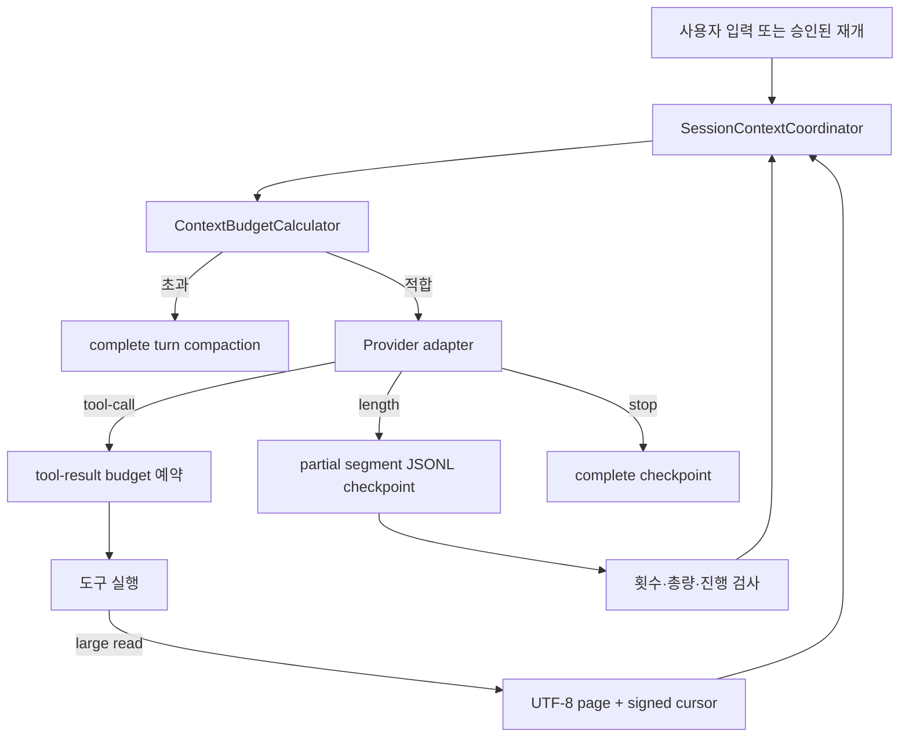

# 토큰 한도 복원력

이 문서는 세 Provider 경로를 유지하면서 입력 context 초과, 큰 파일 입력, 모델 출력 한도를 공통 계층에서 처리하는 계약을 설명한다.



## Context 예산과 compaction

모든 일반 모델 요청과 continuation 요청은 Provider 호출 전에 같은 계산을 거친다.

```text
safetyMarginTokens = clamp(ceil(contextWindow * 0.02), 256, 2048)
requestedMaxOutputTokens = request.maxOutputTokens ?? model.maxOutputTokens
inputBudget = contextWindow - requestedMaxOutputTokens - safetyMarginTokens
remainingInputTokens = inputBudget - estimatedInputTokens
```

추정 입력에는 model/request system prompt, message, tool schema, continuation instruction과 metadata가 모두 포함된다. Provider 기본 지침도 model metadata로 공통 estimator에 노출되며 adapter 내부의 숨은 budget 입력으로 두지 않는다. 입력이 초과하면 `SessionContextCoordinator`가 append-only JSONL의 active projection을 기준으로 오래된 complete turn만 compaction한다. 현재 tool-call/result 묶음은 요약하지 않으며, 한 번에 요약 요청에 들어가지 않는 과거 turn은 complete-turn 경계에서 여러 batch로 나눈다.

ChatGPT Codex backend는 `max_output_tokens` request field를 거부하므로 Codex adapter는
이 값을 wire에 보내지 않는다. `Model.maxOutputTokens`와 request override는 삭제하지 않고
공통 input reservation, tool-result budget, continuation 총량 제한에만 사용한다.
llama.cpp와 OpenAI-compatible adapter는 각각의 기존 output-limit wire field를 유지한다.

새 user message는 journal에 append하기 전에 같은 coordinator가 pending input으로 preflight한다. summarizer 실패·abort·최종 fit 실패 시 user message는 남지 않는다. coordinator는 caller message와 durable session projection이 정확히 같지 않으면 조용히 덮어쓰지 않고 요청을 거부한다.

`CompactionSettings.reserveTokens`는 이전 호출부 호환성을 위해 남아 있지만 입력 예산 공식에는 사용하지 않는다. `keepRecentTokens`는 최근 turn 선택 정책일 뿐 출력 reserve가 아니다.

도구 실행 전에는 최소 128 result token을 예약한다. 확보할 수 없으면 도구를 실행하지 않고 해당 call ID에 matched error result를 남긴다. result 상한은 단순 byte 비율이 아니라 실제 estimator로 완성된 `ToolResultMessage` wrapper를 시뮬레이션하며, 잘린 결과를 붙인 다음 모델 요청도 `assertFits`를 만족해야 한다.

## ReadTool paging

`read` 입력은 둘 중 정확히 하나다.

```json
{ "path": "docs/large.txt" }
```

```json
{ "cursor": "opaque-signed-value" }
```

작은 UTF-8 파일은 이전과 같이 raw text만 반환한다. 큰 파일이나 현재 tool-result budget보다 큰 파일은 실제 page text 뒤에 footer 하나를 붙인다.

```text
<actual page content>

<read-page>{"version":1,"path":"docs/large.txt","startByte":0,"endByte":4096,"totalBytes":9000,"nextCursor":"opaque"}</read-page>
```

page 전체는 configured 64 KiB 상한, token-derived byte budget, 현재 tool-result budget 중 가장 작은 값 안에 들어간다. byte offset은 마지막 complete UTF-8 code point에서만 전진하므로 한글·emoji·긴 단일 행도 page를 합치면 원본과 같다.

cursor는 workspace root hash, 정규화 상대 경로, realpath hash, byte offset, `dev/ino/size/mtimeNs/ctimeNs`, 만료 시각을 담고 HMAC-SHA256으로 서명된다. 32-byte key는 실제 첫 paging 또는 cursor decode 시에만 `sessions/.read-cursor-key`에 exclusive create로 저장한다. 작은 raw read와 잘못된 path는 key를 만들지 않으며 `read` 도구로 그 key 자체를 읽을 수 없다. 기본 만료는 24시간이다.

오류는 fail-closed다.

- `Invalid read cursor`: 형식, 서명, root, path 또는 request state 불일치
- `Expired read cursor`: cursor 만료
- `Stale read cursor`: 파일 identity 또는 realpath 변경
- invalid UTF-8, workspace 밖 symlink/junction, 읽기 전후 mutation, abort도 content를 반환하지 않는다.

Phase 1에서 paging되는 것은 `ReadTool` 파일 content뿐이다. Bash와 다른 도구의 초과 출력은 명시적인 “truncated; discarded content is not recoverable” marker와 함께 제한된다. 전체 Bash 출력이 필요하면 workspace 파일로 redirect한 뒤 `read` cursor로 읽어야 한다.

## 출력 continuation

공통 기본 정책은 다음과 같다.

- 자동 continuation 최대 3회
- logical output 총량 최대 `4 * model.maxOutputTokens`
- overlap 비교 window 최대 1024 Unicode code point
- `done:length`만 자동 continuation 시작

각 `length` segment는 다음 네트워크 호출 전에 `status: "partial"`로 JSONL에 append된다. 다음 요청은 fake user message를 저장하지 않고 request-only `ModelRequest.continuation`을 사용한다. Provider adapter가 같은 `CONTINUATION_INSTRUCTION`을 wire에만 추가한다.

첫 continuation prefix는 직전 logical output tail과 비교한다. 가장 긴 suffix/prefix overlap을 제거하고 novel text만 UI와 JSONL에 전달한다. 최대 continuation 수, 총 output allowance, 빈 novel segment, 반복 tail 또는 진행 없음이 감지되면 partial checkpoint를 보존한 채 명시적 error로 끝난다. cap/repetition을 소진한 마지막 segment는 `resumeAllowed:false`로 저장되며 재시작 후 Provider 호출 전에 다시 검증되므로 abandon만 가능하다.

`length`와 incomplete tool-call fragment가 함께 오면 tool은 실행되지 않는다. 보이는 text와 Provider state는 non-resumable partial로 checkpoint되고 fail-closed error가 발생한다. stream error/abort 뒤 보이는 text도 `resumeAllowed:false`로 보존한다.

JSONL version은 계속 2이며 새 record type은 없다. assistant message의 optional field만 추가된다.

```json
{
  "type": "message",
  "id": "synthetic-entry",
  "parentId": "synthetic-parent",
  "timestamp": "2026-08-11T00:00:00.000Z",
  "message": {
    "role": "assistant",
    "content": "partial answer",
    "toolCalls": [],
    "providerState": {
      "provider": "openai-codex",
      "value": {
        "reasoningItems": [{
          "type": "reasoning",
          "id": "rs_synthetic",
          "summary": [],
          "encrypted_content": "synthetic-encrypted-content"
        }],
        "functionItemIds": {}
      }
    },
    "continuation": {
      "logicalMessageId": "logical-synthetic",
      "segmentIndex": 0,
      "status": "partial",
      "resumeAllowed": true,
      "tailHash": "aaaaaaaaaaaaaaaaaaaaaaaaaaaaaaaaaaaaaaaaaaaaaaaaaaaaaaaaaaaaaaaa",
      "estimatedTotalOutputTokens": 42
    }
  }
}
```

`Session.buildActiveMessages()`는 Provider replay를 위해 raw segment와 opaque `providerState`를 유지한다. `buildDisplayMessages()`만 인접한 같은 logical ID의 segment를 하나의 assistant 출력으로 합친다. empty abandoned tombstone은 active replay에서 제외되지만 append-only journal에는 남는다.

재시작 시 pending partial을 자동으로 재개하지 않는다. CLI는 resume/abandon을 묻는다. `resumeAllowed:false`이면 abandon만 허용한다. abandon은 기존 partial content를 삭제하지 않고 다음 index의 empty tombstone을 append한다.

## Provider wire matrix

| Provider | continuation wire | 보존 사항 |
|---|---|---|
| llama.cpp | checkpointed assistant 뒤 wire-only user instruction | `/v1/chat/completions`, `max_tokens` |
| OpenAI-compatible / Ollama | checkpointed assistant 뒤 wire-only user instruction | 기존 `/chat/completions` 경로 |
| OpenAI Codex | Responses input 마지막 user item | encrypted reasoning, function item ID, `store:false` |

AgentLoop와 context/session 정책에는 Provider ID 분기가 없다. adapter는 공통 request marker를 검증하고 wire 형식으로 번역만 한다.

## 검증

자동 acceptance는 credential, 네트워크, Ollama 또는 llama.cpp server를 요구하지 않는다.

```powershell
$env:CI = 'true' # Windows에서는 repository 설정이 test file을 직렬화한다.
npm run check
```

선택적인 live smoke는 자동 acceptance와 분리한다.

```powershell
# Ollama
$env:AI_AGENT_OPENAI_BASE_URL = 'http://127.0.0.1:11434/v1'
npm run cli -- chat --provider openai-compatible --model gemma4:latest

# llama.cpp
$env:AI_AGENT_LLAMA_URL = 'http://127.0.0.1:8080'
npm run cli -- chat --provider llama --model gemma

# ChatGPT Codex OAuth (기본 Sol)
npm run cli -- chat --provider openai-codex

# 명시적인 5.6 tier
npm run cli -- chat --provider openai-codex --model gpt-5.6-terra
```

Codex OAuth/network live 호출도 수동 검증만 수행한다. 현재 명시 지원 model ID는
`gpt-5.6-sol`, `gpt-5.6-terra`, `gpt-5.6-luna`, `gpt-5.5`이며 기존 session용
`gpt-5.6` alias는 Sol로 번역한다.
