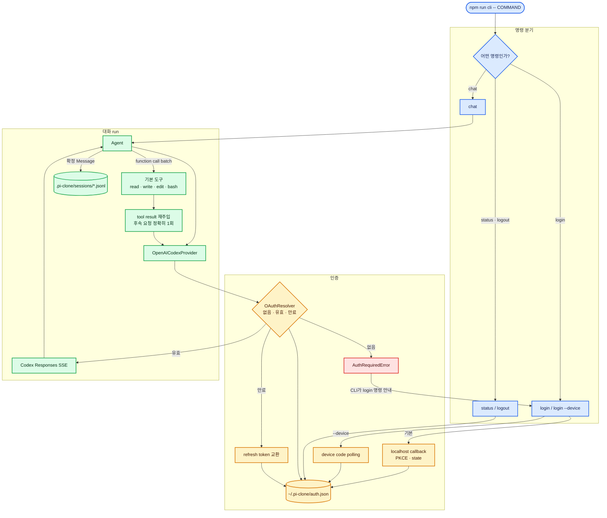

# 직접 OAuth CLI 실행과 추적

이 문서는 구현된 CLI를 실행하면서 `CLI → OAuth → Provider → Agent → Tool → Session` 경계를 코드와 함께 추적하는 안내서다.

## 실행 흐름



> **그림 읽기:** `chat`은 credential이 없을 때 `login`을 자동 실행하지 않는다. Provider에서 올라온 `AuthRequiredError`를 CLI가 안내로 바꾼다. 로그인 완료 후 새 `chat` 명령을 시작하면 같은 Agent Core가 직접 Codex Responses와 연결된다.

## 1. 설치와 검증

```powershell
npm install
npm run check
```

`npm run check`는 TypeScript 검사, Vitest, 배포 build를 실행한 뒤 실제 CLI 자식
프로세스의 stdin pipe를 닫아 EOF가 종료 코드 `0`으로 정리되는지 검사한다. Windows의
`< NUL`은 실행기 환경에 따라 콘솔 debugger status를 노출할 수 있어 자동 검증에는
사용하지 않는다.

## 2. 로그인 상태 확인

```powershell
npm run cli -- status
```

처음에는 `로그인되지 않았습니다.`가 정상이다. status는 account id와 만료 시각만 보여 주며 access/refresh token은 출력하지 않는다.

## 3. 로그인

기본 브라우저 PKCE:

```powershell
npm run cli -- login
```

headless 또는 localhost callback을 쓰기 어려운 환경:

```powershell
npm run cli -- login --device
```

브라우저 방식은 먼저 `localhost:1455` callback 서버를 연 뒤 인증 URL을 실행한다. 브라우저를 열 수 없으면 URL을 터미널에 표시한다. callback을 받지 못하면 redirect URL 붙여 넣기로 전환할 수 있다.

credential 기본 위치:

```text
~/.pi-clone/auth.json
```

이 파일은 Git 저장소 밖에 있으며 token을 포함한다. 공유하거나 커밋하면 안 된다. 파일 구현은 생성 시 `0600`을 요청하지만 Windows에서는 POSIX mode만으로 완전한 ACL을 보장하지 않는다.

## 4. 대화

```powershell
npm run cli -- chat
```

모델과 세션 파일을 명시할 수도 있다.

```powershell
npm run cli -- chat --model gpt-5.5 --session .pi-clone/sessions/study.jsonl
```

기본 모델도 최신 Pi의 `openai-codex` 기본값과 같은 `gpt-5.5`다. 이전 기본값이었던
`gpt-5.1-codex-mini`는 ChatGPT OAuth 계정에서 지원되지 않아 요청 시 HTTP 400이
발생한다. 계정이나 시점에 따라 모델 지원 범위가 달라지면 `--model` 또는
`PI_CLONE_MODEL`로 명시적으로 바꿀 수 있다.

```powershell
$env:PI_CLONE_MODEL = "gpt-5.5"
npm run cli -- chat
```

Provider는 알려진 unsupported-model 응답만 안전한 로컬 안내로 바꾸며, 서버 오류
본문 전체와 token은 출력하지 않는다. 참고한 현재 계약은 Pi의
[`defaultModelPerProvider`](https://github.com/earendil-works/pi/blob/main/packages/coding-agent/src/core/model-resolver.ts)와
OpenAI Codex의 [ChatGPT 계정 5.1 mini 지원 오류](https://github.com/openai/codex/issues/18293)다.

현재 작업 디렉터리가 네 도구의 workspace다. 모델은 `read`, `write`, `edit`, `bash`를 한 응답에서 하나 이상 호출할 수 있고, Registry는 source order대로 모두 실행한 뒤 결과를 한 번 재주입해 최종 답을 받는다. `/exit`로 종료한다. 이 단계에는 승인창이나 sandbox가 없으므로 신뢰하는 workspace에서 실행해야 한다.
파이프 입력이 끝나거나 터미널 stdin이 닫혀도 현재 질문을 정리하고 정상 종료한다.

기본 세션 위치:

```text
<현재 프로젝트>/.pi-clone/sessions/<timestamp>-<uuid>.jsonl
```

`.pi-clone/`은 `.gitignore`에 포함된다. 현재 CLI는 새 세션 기록과 명시한 세션 파일 append를 지원하지만 replay를 대화 context로 복원하는 resume UI는 아직 구현하지 않는다.

## 5. 로그아웃

```powershell
npm run cli -- logout
```

저장된 `openai-codex` credential만 삭제한다. 기존 JSONL 대화 기록은 인증 정보가 아니므로 그대로 남는다.

## 코드 추적 순서

1. `src/cli/cli-application.ts`: argv가 auth와 chat으로 갈리는 지점
2. `src/cli/auth-commands.ts`: 로그인 UI와 Store 연결
3. `src/auth/oauth-resolver.ts`: 없음·유효·만료 분기
4. `src/providers/openai-codex-provider.ts`: Responses 요청과 SSE 번역
5. `src/cli/node-cli-io.ts`: 대화 입력과 stdin EOF 정리
6. `src/cli/runtime.ts`: 기존 Agent·네 기본 도구·JSONL 조립
7. `src/agent/agent.ts`: tool result 뒤 정확히 한 번 후속 호출

실제 token을 사용하지 않고 전체 흐름을 공부하려면 `src/cli/runtime.test.ts`부터 읽는 것이 가장 짧다.
