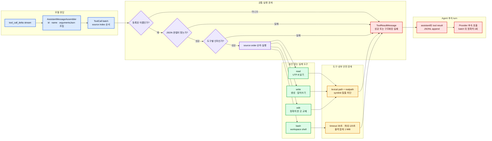

# 네 가지 기본 도구 설계와 구현

이 문서는 첫 수직 슬라이스의 `read` 하나를 Pi 스타일의 기본 도구 네 개
`read / write / edit / bash`로 확장한 책임 경계를 설명한다. 구현은
`src/tools/`의 네 Tool class와 공통 `WorkspacePaths`, `src/cli/runtime.ts`에서 확인한다. 사용 전 승인창이나
명령 allowlist는 두지 않는다. 네 도구는 현재 `pi-clone` 프로세스와 같은 운영체제
권한으로 실행되므로, 이 단계의 안전 경계는 **workspace 제한, 입력 검증, 실행 시간과
출력 크기 제한**이다.

## 전체 흐름



> **그림 읽기:** Registry는 네 도구의 공통 입구지만 각 도구의 의미를 알지 않는다.
> 이름과 JSON 문법을 확인한 뒤 도구의 `parse()`에 의미 검증을 맡기고, 실제 부작용은
> source order대로 하나씩 실행한다. 실패도 다음 호출을 없애는 예외가 아니라 모델이
> 읽을 `ToolResultMessage`가 된다.

## 공통 ToolCall 검증

Provider stream에서 조립된 내부 호출은 다음 최소 형태를 유지한다.

```ts
interface ToolCall {
  id: string;
  name: string;
  argumentsJson: string;
}
```

`AssistantMessageAssembler`는 source index별 조각을 모으고 `id`와 `name` 누락을
거부한다. `ToolRegistry`는 등록된 이름을 찾고 `argumentsJson`을 `unknown`으로
parse한다. 마지막으로 각 Tool의 `parse()`가 자기 입력 규칙을 검증한다. JSON이
유효하다는 사실만으로 안전한 인자가 되는 것은 아니다.

한 batch 안의 호출은 배열 순서대로 실행한다. 앞 도구가 실패해도 뒤 도구는 계속
실행하며, 결과 배열 역시 원래 호출 순서를 유지한다. 이렇게 해야 모델이 각
`toolCallId`와 결과를 안정적으로 대응할 수 있다.

## 공통 workspace 경계

파일 도구 세 개는 같은 경로 정책을 공유한다.

1. `resolve(root, requestedPath)`와 `relative`로 `..` 및 workspace 밖 절대경로의 lexical 탈출을 차단한다. workspace 안을 가리키는 절대경로는 허용한다.
2. 존재하는 대상은 `realpath`로 symlink와 junction을 해석한 뒤 실제 root 안인지 본다.
3. 새 파일은 가장 가까운 기존 부모의 `realpath`를 먼저 검사하고 나서만 디렉터리를 만든다.
4. 디렉터리 생성 후 실제 부모 경로를 한 번 더 확인한다.

이 경계는 일반적인 경로 실수와 정적인 symlink 탈출을 막는다. 검사 직후 다른
프로세스가 경로를 바꾸는 운영체제 수준 TOCTOU까지 완전히 제거하는 sandbox는 아니다.
더 강한 격리가 필요하면 별도 container 또는 OS sandbox가 필요하다.

## `read`

입력은 `{ path: string }`이다. 기존 구현처럼 UTF-8 텍스트 파일을 읽으며 디렉터리,
없는 파일, workspace 밖 실제 경로는 실행 실패가 된다. 읽기는 파일 내용을 바꾸지 않는다.

## `write`

입력은 `{ path: string, content: string }`이다.

- 부모 디렉터리가 없으면 workspace 경계를 확인한 뒤 생성한다.
- 대상이 없으면 새 UTF-8 파일을 만든다.
- 대상이 일반 파일이면 전체 내용을 덮어쓴다.
- 대상이 외부를 가리키는 symlink이거나 디렉터리면 거부한다.

작은 예: `{ "path": "notes/summary.md", "content": "# 요약" }`은 `notes`
디렉터리를 만들고 파일을 기록한다. 같은 호출을 새 content로 다시 실행하면 기존 파일을
덮어쓴다.

## `edit`

입력은 `{ path: string, oldText: string, newText: string }`이다.

- `oldText`는 빈 문자열일 수 없다.
- 파일 안에 정확히 한 번 나타날 때만 교체한다.
- 0번이면 “대상을 찾지 못함”, 2번 이상이면 “교체 위치가 모호함”으로 실패한다.
- 경로 검증과 최종 쓰기는 `write`와 같은 workspace 경계를 사용한다.

정확히 한 곳만 바꾸는 이유는 모델이 의도하지 않은 여러 위치를 조용히 변경하지 않게
하기 위해서다. 여러 곳을 바꾸려면 더 긴 문맥을 포함한 고유한 `oldText`로 다시 호출한다.

## `bash`

입력은 `{ command: string, timeoutMs?: number }`이다.

- 빈 command를 거부한다.
- 현재 workspace를 `cwd`로 하여 운영체제 기본 shell에서 실행한다.
- 기본 timeout은 30초이고 사용자가 지정할 수 있는 최대값은 120초다.
- stdout과 stderr 합계가 1 MiB를 넘으면 실행을 중단하고 실패 결과를 만든다.
- exit code가 0이 아니면 stdout, stderr, exit code를 포함한 실패 결과를 만든다.
- 승인창, 명령 allowlist, 별도 sandbox는 두지 않는다.

Windows에서는 시스템 shell, Unix 계열에서는 기본 `/bin/sh` 계열이 사용된다. 따라서
명령 문법은 운영체제에 따라 다를 수 있다. 이 clone은 shell 문법을 번역하지 않는다.

## 오류와 기록

이름 없음, JSON 오류, 인자 오류, 실행 오류는 모두 기존 오류 코드로 정규화한다.

- `unknown_tool`
- `invalid_json`
- `invalid_arguments`
- `execution_error`

Agent는 완성된 assistant 메시지를 먼저 JSONL에 append하고, 각 도구 결과도 실행
순서대로 `message_appended` record로 append한다. 모든 결과가 성공적으로 기록된 뒤에만
Provider를 정확히 한 번 더 호출한다. 실시간 stdout 조각이나 도구 진행률은 이번
Session 원본에 저장하지 않는다.

## 테스트 계약

- 공통: schema와 `parse()`가 일치하며 잘못된 입력은 실행 전에 거부된다.
- 경로: `..`, workspace 밖 절대 경로, 외부 symlink, symlink 부모를 차단한다.
- write: 새 파일, 부모 생성, 기존 파일 덮어쓰기를 검증한다.
- edit: 정확히 한 곳 교체, 0회, 복수회, 빈 `oldText`를 검증한다.
- bash: stdout/stderr, non-zero exit, timeout, cwd, 출력 상한을 검증한다.
- Registry: 네 Tool definition을 Provider에 노출하고 source order 실행을 유지한다.
- Agent E2E: 한 assistant가 여러 도구를 호출해도 결과를 모두 기록한 뒤 Provider 후속
  호출이 정확히 한 번만 일어난다.

## 의도적으로 미루는 기능

- 도구별 사용자 승인과 permission policy
- container, VM, seccomp 같은 OS sandbox
- shell process 전체 tree의 강제 종료 보장
- streaming stdout/stderr AgentEvent
- write diff preview와 undo
- patch 또는 line-range 기반 고급 edit
- Agent run 전체 AbortSignal 전파
