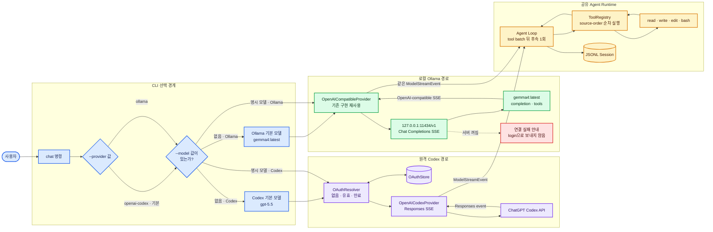

# 로컬 Ollama Gemma 연결 설계

이 문서는 기존 `OpenAICompatibleProvider`를 재사용해 로컬 Ollama의
`gemma4:latest`를 같은 Agent Loop에 연결하는 방법을 고정한다. 새 Ollama 전용
stream parser를 만들지 않는 것이 핵심이다. Ollama가 제공하는 OpenAI Chat Completions
호환 경계에서 외부 형식을 이미 번역할 수 있기 때문이다.

## 목표

사용자는 기존 Codex OAuth 대화와 로컬 Ollama 대화를 CLI에서 명시적으로 선택한다.

```powershell
npm run cli -- chat --provider openai-codex
npm run cli -- chat --provider ollama
npm run cli -- chat --provider ollama --model gemma4:latest
```

`--provider`를 생략하면 기존 동작을 보존하기 위해 `openai-codex`를 사용한다. Ollama는
OAuthStore나 login 명령을 거치지 않고 `http://127.0.0.1:11434/v1/chat/completions`로
직접 요청한다.

## 전체 책임 흐름



> **그림 읽기:** CLI까지만 Provider를 구분한다. Codex는 OAuth와 Responses 형식을,
> Ollama는 인증 없는 Chat Completions 형식을 사용하지만, 두 경로 모두
> `ModelStreamEvent`가 된 뒤에는 같은 Agent·도구·세션으로 합쳐진다.

## 기존 Provider를 재사용하는 이유

`OpenAICompatibleProvider`는 OpenAI 회사의 API key 사용 여부를 결정하는 클래스가
아니다. `messages`, `tools`, `stream: true`를 Chat Completions 형식으로 보내고
`choices[].delta` SSE를 내부 이벤트로 바꾸는 프로토콜 어댑터다. Ollama는
`/v1/chat/completions`에서 이 형식의 streaming과 tools를 제공하므로 새 parser는 같은
검증 코드를 복제할 뿐이다.

Ollama에만 필요한 값은 composition root에서 주입한다.

- Provider id: `ollama`
- 기본 base URL: `http://127.0.0.1:11434/v1`
- 기본 model: `gemma4:latest`
- API key: 없음
- transport: Node의 `fetch`

## CLI와 설정 계약

지원 Provider 값은 `openai-codex`, `ollama` 두 개다. 다른 문자열은 Agent를 만들기 전에
사용법 오류가 된다. 모델 결정 우선순위는 다음과 같다.

1. `--model`
2. Provider별 환경변수
3. Provider별 기본값

Codex는 기존 `PI_CLONE_MODEL`과 `gpt-5.5`를 유지한다. Ollama는
`PI_CLONE_OLLAMA_MODEL`과 `gemma4:latest`를 사용한다. Ollama 주소는
`PI_CLONE_OLLAMA_URL`로 바꿀 수 있고, 값은 `/v1`까지 포함한 base URL로 정의한다.

세션 경로와 workspace 선택은 Provider와 무관하다. 같은 CLI process에서 고른 Provider
하나로 Agent 하나를 만들며, 한 대화 중간에 Provider를 바꾸지는 않는다.

## Runtime 조립

현재 Codex용 `createAgentRuntime()` 안에는 Provider 생성과 공통 Agent 조립이 함께 있다.
구현 단계에서는 네 도구와 JSONL을 조립하는 내부 공통 함수를 분리한다.

- 기존 Codex wrapper는 `OpenAICodexProvider`를 만든 뒤 공통 조립 함수에 전달한다.
- Ollama wrapper는 기존 `OpenAICompatibleProvider`를 만든 뒤 같은 함수에 전달한다.
- `Agent`, `ToolRegistry`, `WorkspacePaths`, `JsonlSessionStore`의 동작은 바꾸지 않는다.

이 분리는 Provider 선택 때문에 도구 등록 코드를 복제하지 않게 한다. 공개 API의 기존
`createAgentRuntime()` 의미는 Codex wrapper로 보존해 현재 사용자 코드를 깨지 않는다.

## 오류 처리

Ollama 연결에는 OAuth가 없으므로 연결 실패를 `AuthRequiredError`로 바꾸지 않는다.
주입한 transport가 네트워크 연결에 실패하면 URL과 `ollama serve` 확인 방법을 포함한
로컬 서버 오류로 정규화한다. HTTP 4xx/5xx와 malformed SSE는 기존
`OpenAICompatibleProvider` 오류 경계를 그대로 사용한다.

모델이 tool call을 만들지 않거나 원하는 답을 내지 않는 것은 transport 오류가 아니다.
Agent는 받은 text/tool-call만 기존 규칙으로 처리한다. tool batch 뒤 두 번째 tool batch를
거부하는 현재 수직 슬라이스의 상한도 유지한다.

## 테스트와 학습 커밋

구현은 다음 RED→GREEN 순서를 사용한다.

1. 문서: 이 설계와 구현 계획
2. CLI: `--provider`, Provider별 기본 모델, 잘못된 값 거부
3. Runtime: 공통 조립 경계와 Codex 회귀 테스트
4. Ollama: `/v1/chat/completions`, Authorization 없음, Gemma 기본 모델
5. E2E: Ollama fake stream의 tool call → 네 도구 → 한 번의 후속 요청
6. 사용법: CLI 문서와 실제 로컬 `gemma4:latest` smoke

자동 테스트는 injected fetch로 요청 URL·body·stream을 결정론적으로 검증한다. 마지막
로컬 smoke만 현재 설치된 Ollama를 사용하며, 자동 테스트의 통과 조건을 모델 문장 자체에
의존시키지 않는다.

## 이번 단계에서 하지 않는 것

- Ollama 자동 설치, `ollama serve` 자동 실행, model pull
- model 목록 UI와 자동 model 선택
- Ollama native `/api/chat` 전용 parser
- thinking/reasoning 표시와 제어 옵션
- 대화 중 Provider 전환 또는 서로 다른 Provider 간 session resume
- 원격 Ollama 인증·TLS 설정

이 기능들은 OpenAI-compatible 재사용이 실제 Gemma tool loop에서 확인된 뒤 별도 계약으로
추가한다.

## 참고

- [Ollama OpenAI compatibility](https://docs.ollama.com/api/openai-compatibility)
- [Ollama tool calling](https://docs.ollama.com/capabilities/tool-calling)
