# Local Ollama Gemma Implementation Plan

> **For agentic workers:** REQUIRED SUB-SKILL: Use superpowers:subagent-driven-development (recommended) or superpowers:executing-plans to implement this plan task-by-task. Steps use checkbox (`- [ ]`) syntax for tracking.

**Goal:** 기존 `OpenAICompatibleProvider`를 재사용해 `chat --provider ollama`로 로컬 `gemma4:latest`와 네 기본 도구를 실행한다.

**Architecture:** CLI는 `openai-codex`와 `ollama`를 명시적으로 선택하고 Provider별 기본 모델을 결정한다. 기존 Codex runtime wrapper는 보존하며, OpenAI-compatible wrapper가 같은 Agent·ToolRegistry·JSONL 조립 함수에 Provider만 바꿔 전달한다. Ollama 전용 stream parser는 만들지 않고 연결 오류를 설명하는 transport wrapper만 composition root에 둔다.

**Tech Stack:** TypeScript 7, Node.js 22 fetch, Vitest 4, Ollama OpenAI-compatible `/v1/chat/completions`, 기존 Agent와 read/write/edit/bash.

## Global Constraints

- `--provider` 기본값은 기존 동작과 같은 `openai-codex`다.
- 지원 Provider 문자열은 정확히 `openai-codex`, `ollama` 두 개다.
- Ollama 기본 URL은 `http://127.0.0.1:11434/v1`, 기본 모델은 `gemma4:latest`다.
- Ollama는 OAuthStore, login, Authorization header를 사용하지 않는다.
- `OpenAICompatibleProvider`의 Chat Completions serializer와 SSE parser를 그대로 재사용한다.
- Agent의 네 도구, source-order 순차 batch, JSONL append, batch 뒤 Provider 후속 호출 1회 계약은 바꾸지 않는다.
- Ollama 자동 설치, serve, pull, model 목록 UI, native `/api/chat`, thinking 제어는 구현하지 않는다.
- 제품 동작은 명확한 RED를 먼저 확인하고 최소 구현으로 GREEN을 만든다.
- 각 Task는 관련 테스트와 typecheck가 통과한 상태에서 별도 학습 커밋으로 끝낸다.
- 기존 사용자 파일 `test.md`는 수정·삭제·stage하지 않는다.

## 파일 책임 지도

- `src/cli/chat-command.ts`: Provider 문자열 parse, Provider별 기본 모델, `ChatAgentRequest` 전달.
- `src/cli/runtime.ts`: 기존 Codex wrapper와 새 OpenAI-compatible wrapper가 공유하는 Agent 조립.
- `src/cli/ollama-transport.ts`: fetch 연결 실패만 Ollama 로컬 서버 안내로 번역.
- `src/cli/main.ts`: 환경변수, 기본값, 실제 Provider runtime 선택.
- `src/cli/cli-application.ts`: `--provider`가 포함된 help.
- `scripts/smoke-cli-eof.mjs`: Codex와 Ollama 두 CLI 조립 경로의 stdin EOF 검증.
- `docs/08-cli-usage.md`: 실제 Ollama 명령과 오류 해결법.
- `docs/README.md`: 학습 순서와 커밋 지도.

```mermaid
flowchart LR
    Plan["설계 승인<br/>docs/11"]
    CLI["Task 1<br/>CLI Provider 계약"]
    Runtime["Task 2<br/>공통 Runtime 조립"]
    Ollama["Task 3<br/>Ollama transport · main"]
    Docs["Task 4<br/>사용법 · live smoke"]
    Audit["Task 5<br/>전체 검증 · PR"]

    Plan -->|"RED: provider 전달 안 됨"| CLI
    CLI -->|"RED: compatible runtime 없음"| Runtime
    Runtime -->|"RED: main 분기·연결 안내 없음"| Ollama
    Ollama -->|"실제 gemma4 확인"| Docs
    Docs -->|"fresh verification"| Audit

    classDef done fill:#DBEAFE,stroke:#2563EB,color:#172554,stroke-width:2px;
    classDef task fill:#DCFCE7,stroke:#16A34A,color:#052E16,stroke-width:2px;
    classDef finish fill:#FEF3C7,stroke:#D97706,color:#451A03,stroke-width:2px;
    class Plan done;
    class CLI,Runtime,Ollama,Docs task;
    class Audit finish;
```



> **그림 읽기:** 각 Task는 앞 단계의 공개 타입만 소비한다. CLI는 Provider 선택만 알고,
> Runtime은 Provider 구현을 받아 공통 Agent를 조립하며, Ollama 연결 세부사항은 마지막
> composition root에서만 추가한다.

---

### Task 1: CLI Provider 선택 계약

**Files:**
- Modify: `src/cli/chat-command.ts`
- Modify: `src/cli/chat-command.test.ts`
- Modify: `src/cli/cli-application.ts`
- Modify: `src/cli/cli-application.test.ts`

**Interfaces:**
- Produces: `ChatProvider = "openai-codex" | "ollama"`
- Produces: `ChatAgentRequest = { provider: ChatProvider; model: string; sessionPath?: string }`
- Produces: `ChatCommandDependencies.defaultProvider`와 `defaultModels`
- Preserves: `--model`, `--session`, AgentEvent 출력, AuthRequiredError 안내.

- [ ] **Step 1: Provider 선택과 기본 모델 RED 테스트 작성**

`src/cli/chat-command.test.ts`에 Agent 요청을 수집하는 테스트를 추가한다.

```ts
it("selects ollama and its default model explicitly", async () => {
  const requests: ChatAgentRequest[] = [];
  const deps = dependencies(["/exit"], [], idleAgent(), requests);

  await runChatCommand(["chat", "--provider", "ollama"], deps);

  expect(requests).toEqual([{
    provider: "ollama",
    model: "gemma4:latest",
  }]);
});

it("keeps openai-codex as the default and lets --model win", async () => {
  const requests: ChatAgentRequest[] = [];
  const deps = dependencies(["/exit"], [], idleAgent(), requests);

  await runChatCommand(["chat", "--model", "custom"], deps);

  expect(requests[0]).toMatchObject({ provider: "openai-codex", model: "custom" });
});

it("rejects an unknown provider before creating an Agent", async () => {
  const requests: ChatAgentRequest[] = [];
  const deps = dependencies([], [], idleAgent(), requests);

  await expect(runChatCommand(["chat", "--provider", "unknown"], deps))
    .rejects.toThrow("Unknown chat provider: unknown");
  expect(requests).toEqual([]);
});
```

`src/cli/cli-application.test.ts`는 help에 아래 문자열이 있는지 확인한다.

```ts
expect(output.join("\n")).toContain("--provider openai-codex|ollama");
```

- [ ] **Step 2: RED 확인**

Run: `npm test -- src/cli/chat-command.test.ts src/cli/cli-application.test.ts`

Expected: `ChatAgentRequest.provider`, `defaultModels`, `--provider`가 없어 compile 또는 assertion 실패.

- [ ] **Step 3: 최소 CLI 계약 구현**

`src/cli/chat-command.ts`에 정확한 union과 parse를 추가한다.

```ts
export type ChatProvider = "openai-codex" | "ollama";

export interface ChatAgentRequest {
  readonly provider: ChatProvider;
  readonly model: string;
  readonly sessionPath?: string;
}

export interface ChatCommandDependencies {
  readonly io: ChatIo;
  readonly defaultProvider: ChatProvider;
  readonly defaultModels: Readonly<Record<ChatProvider, string>>;
  createAgent(request: ChatAgentRequest): Promise<ChatAgent>;
}

function parseProvider(value: string | undefined, fallback: ChatProvider): ChatProvider {
  const provider = value ?? fallback;
  if (provider === "openai-codex" || provider === "ollama") return provider;
  throw new Error(`Unknown chat provider: ${provider}`);
}
```

`runChatCommand()`는 Provider를 먼저 정하고 그 Provider의 기본 모델을 선택한다.

```ts
const provider = parseProvider(optionValue(args, "--provider"), dependencies.defaultProvider);
const model = optionValue(args, "--model") ?? dependencies.defaultModels[provider];
```

시작 안내에도 `provider=${provider}`를 포함하고 help는 다음 형식으로 바꾼다.

```text
npm run cli -- chat [--provider openai-codex|ollama] [--model MODEL] [--session FILE]
```

- [ ] **Step 4: GREEN 확인**

Run: `npm test -- src/cli/chat-command.test.ts src/cli/cli-application.test.ts`

Run: `npm run typecheck`

Expected: Provider 기본값·명시 선택·잘못된 값·기존 chat 테스트 전부 통과.

- [ ] **Step 5: 커밋**

```powershell
git add src/cli/chat-command.ts src/cli/chat-command.test.ts src/cli/cli-application.ts src/cli/cli-application.test.ts
git commit -m "feat(cli): 대화 Provider 선택 계약 추가" -m "openai-codex 기본 동작을 보존하면서 ollama를 명시적으로 선택하고 Provider별 기본 모델을 전달한다. 잘못된 Provider는 Agent 생성 전에 거부한다."
```

---

### Task 2: OpenAI-compatible Agent Runtime

**Files:**
- Modify: `src/cli/runtime.ts`
- Create: `src/cli/openai-compatible-runtime.test.ts`
- Modify: `src/index.ts`

**Interfaces:**
- Consumes: 기존 `ModelProvider`, `OpenAICompatibleProvider`, 네 Tool class, `JsonlSessionStore`.
- Produces: `OpenAICompatibleAgentRuntimeOptions`.
- Produces: `createOpenAICompatibleAgentRuntime(options): Promise<Agent>`.
- Preserves: 기존 `createAgentRuntime(options)` Codex API와 모든 Codex runtime 테스트.

- [ ] **Step 1: compatible runtime tool-loop RED 테스트 작성**

`src/cli/openai-compatible-runtime.test.ts`는 두 개의 fake Chat Completions SSE 응답을
준비한다. 첫 응답은 `read` tool call, 둘째 응답은 최종 text다.

```ts
const agent = await createOpenAICompatibleAgentRuntime({
  workspace,
  sessionPath,
  sessionId: "ollama-session",
  model: "gemma4:latest",
  baseUrl: "http://127.0.0.1:11434/v1",
  fetch: async (input, init) => {
    requests.push(new Request(input, init));
    return responses.shift() ?? Promise.reject(new Error("unexpected request"));
  },
  createMessageId: deterministicMessageIds(),
  createToolResultId: () => "result-1",
  now: () => "2026-08-02T00:00:00.000Z",
});

const messages = await agent.prompt("a.txt를 읽어");

expect(requests).toHaveLength(2);
expect(requests[0]?.url).toBe("http://127.0.0.1:11434/v1/chat/completions");
expect(requests[0]?.headers.get("authorization")).toBeNull();
expect(messages.map((message) => message.role)).toEqual([
  "user", "assistant", "tool", "assistant",
]);
```

첫 request body의 model과 tool 이름을 검사한다.

```ts
const firstBody = await requests[0]?.json() as {
  model?: string;
  tools?: Array<{ function?: { name?: string } }>;
};
expect(firstBody.model).toBe("gemma4:latest");
expect(firstBody.tools?.map((tool) => tool.function?.name)).toEqual([
  "read", "write", "edit", "bash",
]);
```

- [ ] **Step 2: RED 확인**

Run: `npm test -- src/cli/openai-compatible-runtime.test.ts`

Expected: `createOpenAICompatibleAgentRuntime` export가 없어 compile 실패.

- [ ] **Step 3: 공통 Agent 조립 함수 추출**

`src/cli/runtime.ts`에서 Provider 이후의 조립을 private 함수로 분리한다.

```ts
interface SharedAgentRuntimeOptions {
  readonly workspace: string;
  readonly sessionPath: string;
  readonly sessionId?: string;
  readonly model: string;
  readonly createMessageId?: (kind: MessageIdKind) => string;
  readonly createToolResultId?: () => string;
  readonly now?: () => string;
}

async function assembleAgentRuntime(
  options: SharedAgentRuntimeOptions,
  provider: ModelProvider,
): Promise<Agent> {
  await mkdir(dirname(options.sessionPath), { recursive: true });
  const tools = new ToolRegistry([
    new ReadTool(options.workspace),
    new WriteTool(options.workspace),
    new EditTool(options.workspace),
    new BashTool(options.workspace),
  ], registryOptions(options));
  return new Agent({
    sessionId: options.sessionId ?? randomUUID(),
    model: options.model,
    provider,
    tools,
    session: new JsonlSessionStore(options.sessionPath),
    ...agentClockOptions(options),
  });
}
```

기존 `createAgentRuntime()`는 `OpenAICodexProvider`를 만든 뒤 이 함수를 호출한다.

- [ ] **Step 4: OpenAI-compatible wrapper 구현**

```ts
export interface OpenAICompatibleAgentRuntimeOptions extends SharedAgentRuntimeOptions {
  readonly baseUrl: string;
  readonly apiKey?: string;
  readonly fetch?: typeof fetch;
}

export async function createOpenAICompatibleAgentRuntime(
  options: OpenAICompatibleAgentRuntimeOptions,
): Promise<Agent> {
  const provider = new OpenAICompatibleProvider({
    baseUrl: options.baseUrl,
    fetch: options.fetch ?? globalThis.fetch,
    ...(options.apiKey === undefined ? {} : { apiKey: options.apiKey }),
  });
  return assembleAgentRuntime(options, provider);
}
```

`src/index.ts`에서 새 함수와 options 타입을 export한다.

- [ ] **Step 5: GREEN과 Codex 회귀 확인**

Run: `npm test -- src/cli/openai-compatible-runtime.test.ts src/cli/runtime.test.ts`

Run: `npm run typecheck`

Expected: compatible tool loop와 기존 Codex runtime 테스트 전부 통과.

- [ ] **Step 6: 커밋**

```powershell
git add src/cli/runtime.ts src/cli/openai-compatible-runtime.test.ts src/index.ts
git commit -m "feat(runtime): OpenAI-compatible Agent 조립 경계 추가" -m "기존 Codex wrapper를 보존하면서 compatible Provider도 같은 네 도구와 JSONL Runtime을 사용하게 한다. fake Ollama stream으로 tool-result 재주입과 후속 호출 1회를 검증한다."
```

---

### Task 3: Ollama transport와 실제 CLI 조립

**Files:**
- Create: `src/cli/ollama-transport.ts`
- Create: `src/cli/ollama-transport.test.ts`
- Modify: `src/cli/main.ts`
- Modify: `src/cli/main.test.ts`
- Modify: `scripts/smoke-cli-eof.mjs`

**Interfaces:**
- Consumes: `ChatAgentRequest.provider`와 `createOpenAICompatibleAgentRuntime()`.
- Produces: `DEFAULT_OLLAMA_MODEL = "gemma4:latest"`.
- Produces: `DEFAULT_OLLAMA_URL = "http://127.0.0.1:11434/v1"`.
- Produces: `createOllamaFetch(baseUrl, fetchImpl): typeof fetch`.

- [ ] **Step 1: Ollama 연결 실패 RED 테스트 작성**

```ts
it("translates only transport rejection into an Ollama startup hint", async () => {
  const fetchImpl = createOllamaFetch(
    "http://127.0.0.1:11434/v1",
    async () => { throw new TypeError("connect refused"); },
  );

  await expect(fetchImpl(new Request(
    "http://127.0.0.1:11434/v1/chat/completions",
  ))).rejects.toThrow(
    "Ollama 서버에 연결할 수 없습니다: http://127.0.0.1:11434/v1 · ollama serve를 확인하세요.",
  );
});

it("passes HTTP responses through for Provider status handling", async () => {
  const response = new Response("model missing", { status: 404 });
  const fetchImpl = createOllamaFetch("http://local/v1", async () => response);
  await expect(fetchImpl(new Request("http://local/v1/chat/completions")))
    .resolves.toBe(response);
});
```

`src/cli/main.test.ts`에는 두 기본 상수를 검사한다.

```ts
expect(DEFAULT_OLLAMA_MODEL).toBe("gemma4:latest");
expect(DEFAULT_OLLAMA_URL).toBe("http://127.0.0.1:11434/v1");
```

- [ ] **Step 2: RED 확인**

Run: `npm test -- src/cli/ollama-transport.test.ts src/cli/main.test.ts`

Expected: 새 module과 상수 export가 없어 실패.

- [ ] **Step 3: 최소 transport wrapper 구현**

```ts
export function createOllamaFetch(baseUrl: string, fetchImpl: typeof fetch): typeof fetch {
  return async (input, init) => {
    try {
      return await fetchImpl(input, init);
    } catch {
      throw new Error(
        `Ollama 서버에 연결할 수 없습니다: ${baseUrl} · ollama serve를 확인하세요.`,
      );
    }
  };
}
```

HTTP response는 그대로 반환해 기존 Provider가 status와 body를 처리하게 한다.

- [ ] **Step 4: main의 Provider별 composition 구현**

`src/cli/main.ts`에 상수와 Provider별 기본값을 추가한다.

```ts
export const DEFAULT_CODEX_MODEL = "gpt-5.5";
export const DEFAULT_OLLAMA_MODEL = "gemma4:latest";
export const DEFAULT_OLLAMA_URL = "http://127.0.0.1:11434/v1";

defaultProvider: "openai-codex",
defaultModels: {
  "openai-codex": env.PI_CLONE_MODEL ?? DEFAULT_CODEX_MODEL,
  ollama: env.PI_CLONE_OLLAMA_MODEL ?? DEFAULT_OLLAMA_MODEL,
},
```

`createAgent`는 Provider별 wrapper만 선택하고 공통 workspace/session 계산은 한 번만 한다.

```ts
if (request.provider === "ollama") {
  const baseUrl = env.PI_CLONE_OLLAMA_URL ?? DEFAULT_OLLAMA_URL;
  return createOpenAICompatibleAgentRuntime({
    workspace,
    sessionPath,
    model: request.model,
    baseUrl,
    fetch: createOllamaFetch(baseUrl, globalThis.fetch),
  });
}
return createAgentRuntime({
  workspace,
  sessionPath,
  model: request.model,
  resolver,
  instructions: "You are a careful coding assistant. Use tools when workspace work is needed.",
});
```

- [ ] **Step 5: 두 Provider EOF smoke로 composition 검증**

`scripts/smoke-cli-eof.mjs`에서 provider를 `openai-codex`, `ollama`로 바꿔 같은 자식 CLI
검사를 두 번 실행한다. EOF 전에는 Provider HTTP 요청이 없으므로 Ollama 설치 여부와
무관하게 main 조립과 정상 종료만 검증한다.

Run: `npm test -- src/cli/ollama-transport.test.ts src/cli/main.test.ts`

Run: `npm run build && npm run smoke:cli-eof`

Run: `npm run typecheck`

Expected: transport 2개, 기본값, Codex/Ollama EOF 두 경로 모두 통과.

- [ ] **Step 6: 커밋**

```powershell
git add src/cli/ollama-transport.ts src/cli/ollama-transport.test.ts src/cli/main.ts src/cli/main.test.ts scripts/smoke-cli-eof.mjs
git commit -m "feat(ollama): 로컬 Gemma CLI 조립 추가" -m "Ollama 기본 URL과 모델을 정의하고 OAuth 없이 compatible Runtime을 선택한다. 연결 거부는 ollama serve 안내로 바꾸며 Codex 기본 경로를 유지한다."
```

---

### Task 4: 사용법 문서와 실제 Gemma smoke

**Files:**
- Modify: `docs/08-cli-usage.md`
- Modify: `docs/11-local-ollama-gemma.md`
- Modify: `docs/README.md`
- Modify: `docs/12-local-ollama-gemma-implementation-plan.md`

**Interfaces:**
- Documents: `chat --provider ollama`, 환경변수, 서버 시작, 보안 경계.
- Verifies: 현재 설치된 `gemma4:latest`가 text와 tool-call path를 실제로 응답.

- [ ] **Step 1: CLI 실행 예제와 오류 해결 추가**

`docs/08-cli-usage.md`에 다음 명령을 추가한다.

```powershell
ollama list
npm run cli -- chat --provider ollama
npm run cli -- chat --provider ollama --model gemma4:latest
```

환경변수는 아래처럼 설명한다.

```powershell
$env:PI_CLONE_OLLAMA_URL = "http://127.0.0.1:11434/v1"
$env:PI_CLONE_OLLAMA_MODEL = "gemma4:latest"
```

승인 UI와 sandbox가 없고 로컬 모델도 같은 `bash` OS 권한을 쓸 수 있음을 명시한다.

- [ ] **Step 2: 문서와 구현 명칭 검사**

Run: docs 전체 fence 짝수, Mermaid 문서당 1개, 한국어 포함, 상대 링크 존재 검사.

Expected: 모든 `docs/*.md` 통과, `TBD`/`TODO` 없음.

- [ ] **Step 3: 로컬 Ollama text smoke**

Run:

```powershell
Invoke-RestMethod http://127.0.0.1:11434/api/tags
npm run cli -- chat --provider ollama --model gemma4:latest
```

입력은 “도구를 사용하지 말고 OK만 답해”로 실행한다. 성공 기준은 CLI가
OpenAI-compatible SSE를 끝까지 읽고 오류 없이 prompt로 돌아오는 것이다. 답변 문장
정확성은 자동 pass 조건으로 쓰지 않는다.

- [ ] **Step 4: 로컬 Ollama tool smoke**

임시 workspace에 UTF-8 파일 하나를 만들고 “read 도구로 파일을 읽어 첫 줄을 알려줘”를
입력한다. 성공 기준은 CLI에 `[tool 시작] read`, `[tool 완료] read`가 순서대로 표시되고
Provider follow-up 뒤 최종 text가 도착하는 것이다. 사용자의 `test.md`를 test fixture로
수정하지 않는다.

- [ ] **Step 5: 커밋**

```powershell
git add docs/08-cli-usage.md docs/11-local-ollama-gemma.md docs/README.md docs/12-local-ollama-gemma-implementation-plan.md
git commit -m "docs(ollama): 로컬 Gemma 실행과 학습 순서 추가" -m "Ollama 시작 확인, provider 선택, 환경변수, text/tool smoke와 승인 없는 도구 경계를 실제 구현에 맞춰 설명한다."
```

---

### Task 5: 전체 감사와 Draft PR 갱신

**Files:**
- No product file changes expected.
- Modify only if verification finds a reproducible defect; then add the smallest failing test first.

**Interfaces:**
- Verifies: 전체 tests, typecheck, build, 두 Provider CLI EOF, package contents, docs, Git history.
- Preserves: 사용자 `test.md`와 범위 밖 working-tree 변경.

- [ ] **Step 1: 전체 검증**

Run: `npm run check`

Expected: typecheck, 전체 Vitest, build, Codex/Ollama CLI EOF smoke exit 0.

Run: `npm audit --audit-level=high`

Expected: high 이상 취약점 0.

Run: `npm pack --dry-run --json`

Expected: 새 CLI/runtime export가 build 산출물에 포함되고 credential/session/user file은 없음.

- [ ] **Step 2: 독립 코드 리뷰**

Review range: `04bb8be..HEAD`.

검사 질문:

1. Ollama가 OAuthStore나 Authorization header를 거치는가?
2. OpenAI-compatible parsing을 복제했는가?
3. Codex 기본 CLI 동작이 유지되는가?
4. Provider 선택 뒤 Agent·네 도구·JSONL이 같은가?
5. 연결 실패와 HTTP/malformed 오류 경계가 섞였는가?

Critical/Important finding은 TDD 수정 커밋 후 전체 검증을 다시 실행한다.

- [ ] **Step 3: Git과 원격 검증**

Run: `git diff --check`

Run: `git status --short`

Run: `git log --oneline 04bb8be..HEAD`

Expected: 사용자 소유 파일만 unstaged로 남고 구현/문서 변경은 의미 단위 커밋으로 분리.

- [ ] **Step 4: push와 Draft PR #2 갱신**

Run: `git push origin codex/pi-oauth-provider`

PR 본문에 Ollama 명령, Gemma 기본값, 재사용한 Provider, 실제 local smoke 결과와 최종
테스트 수를 추가한다. `gh pr view 2`에서 local/remote head, Draft/Open, check 상태를
검증한다. force push와 main merge는 하지 않는다.
