# Pi Clone 학습 문서

이 폴더는 코드를 만들기 전에 “작은 Pi 스타일 에이전트가 왜 이런 경계로 나뉘는가”를 이해하기 위한 설계 노트다. 목표는 Pi 전체를 복제하는 것이 아니라, 모델 스트림과 도구 실행이 이어지는 최소 구조를 직접 설명하고 구현할 수 있게 되는 것이다.

## 권장 읽기 순서

1. [00 - 목표와 범위](./00-goals-and-scope.md)
   - 무엇을 만들고 무엇을 의도적으로 만들지 않는지 정한다.
2. [01 - Pi 참조 지도](./01-pi-reference-map.md)
   - 공개 Pi의 큰 책임 경계를 이 프로젝트의 작은 모듈에 대응시킨다.
3. [02 - 아키텍처](./02-architecture.md)
   - 의존 방향과 한 번의 요청이 흐르는 경로를 본다.
4. [03 - 메시지와 이벤트 모델](./03-message-event-model.md)
   - 저장되는 대화와 화면에 전달되는 실시간 사건을 구분한다.
5. [04 - Provider 계약](./04-provider-contract.md)
   - OpenAI-compatible API를 에이전트 코어에서 분리하는 이유를 배운다.
6. [05 - Agent Loop](./05-agent-loop.md)
   - 모델 호출, 도구 실행, 다음 모델 호출이 반복되는 핵심 루프를 따라간다.
7. [06 - 직접 Codex OAuth Provider](./06-direct-codex-oauth.md)
   - 로그인 필요 분기, 토큰 저장·갱신, 직접 Responses 연결의 책임을 구분한다.
8. [07 - 직접 OAuth Provider TDD 계획](./07-direct-oauth-tdd-plan.md)
   - 인증부터 CLI까지 어떤 실패 테스트가 다음 구현을 요구하는지 따라간다.
9. [08 - 직접 OAuth CLI 실행과 추적](./08-cli-usage.md)
   - 실제 명령, 파일 위치, 로그인 필요 분기와 코드 추적 순서를 확인한다.
10. [09 - 네 가지 기본 도구](./09-four-tools.md)
   - 승인 없는 read/write/edit/bash의 실행·경로·오류 경계를 설계한다.
11. [10 - 네 가지 도구 구현 계획](./10-four-tools-implementation-plan.md)
   - 공통 경로 경계부터 Runtime 통합까지 TDD와 커밋 순서를 고정한다.
12. [11 - 로컬 Ollama Gemma 연결](./11-local-ollama-gemma.md)
   - 기존 OpenAI-compatible Provider를 로컬 Gemma에 재사용하는 선택 경계를 설계한다.
13. [12 - 로컬 Ollama Gemma 구현 계획](./12-local-ollama-gemma-implementation-plan.md)
   - CLI 선택부터 compatible Runtime, live smoke, PR까지 RED→GREEN 순서를 고정한다.

문서는 순서대로 읽도록 작성했지만, 구현 중에는 03-05를 계약 사전처럼 다시 보는 방식이 좋다.

```mermaid
flowchart LR
    Start([학습 시작])

    subgraph F["1단계 · 방향 잡기"]
        D0["00 목표와 범위<br/>무엇을 만들까?"]
        D1["01 Pi 참조 지도<br/>무엇을 참고할까?"]
    end

    subgraph B["2단계 · 경계 이해"]
        D2["02 아키텍처<br/>책임은 어디에 둘까?"]
        D3["03 메시지와 이벤트<br/>무엇을 기록하고 알릴까?"]
        D4["04 Provider 계약<br/>외부 API를 어떻게 숨길까?"]
    end

    subgraph R["3단계 · 실행 이해"]
        D5["05 Agent Loop<br/>언제 실행하고 반복할까?"]
        Check{"수직 흐름을<br/>설명할 수 있나?"}
    end

    Start --> D0
    D0 -->|"범위 확정"| D1
    D1 -->|"책임 대응"| D2
    D2 -->|"공통 타입"| D3
    D3 -->|"스트림 경계"| D4
    D4 -->|"실행 계약"| D5
    D5 -->|"직접 인증 추가"| D6["06 Codex OAuth<br/>누가 로그인하고 갱신할까?"]
    D6 -->|"구현 순서"| D7["07 OAuth TDD 계획<br/>무엇부터 실패시킬까?"]
    D7 -->|"직접 실행"| D8["08 CLI 실행<br/>어디서 흐름을 확인할까?"]
    D8 -->|"도구 경계"| D9["09 네 가지 기본 도구<br/>무엇을 어디까지 실행할까?"]
    D9 -->|"TDD 순서"| D10["10 도구 구현 계획<br/>어떤 실패부터 고칠까?"]
    D10 -->|"로컬 Provider 재사용"| D11["11 Ollama Gemma<br/>호환 Provider를 어떻게 재사용할까?"]
    D11 -->|"구현 순서"| D12["12 Ollama TDD 계획<br/>어떤 실패부터 고칠까?"]
    D12 --> Check
    Check -->|"아니요 · 필요한 문서로 복귀"| D2
    Check -->|"예 · 구현 설계로 이동"| Next([첫 수직 슬라이스])

    classDef focus fill:#DBEAFE,stroke:#2563EB,color:#0F172A,stroke-width:2px;
    classDef boundary fill:#EDE9FE,stroke:#7C3AED,color:#0F172A,stroke-width:2px;
    classDef action fill:#DCFCE7,stroke:#16A34A,color:#0F172A,stroke-width:2px;
    classDef decision fill:#FEF3C7,stroke:#D97706,color:#78350F,stroke-width:2px;
    class Start,D0,D1 focus;
    class D2,D3,D4 boundary;
    class D5,D6,D7,D8,D9,D10,D11,D12,Next action;
    class Check decision;
```

> **그림 읽기:** 앞 문서는 뒤 문서의 전제다. 05까지 읽은 뒤 전체 수직 흐름을 설명하기 어렵다면, 코드로 넘어가기보다 막힌 책임 경계의 문서로 돌아간다.

## Commit learning map

각 커밋은 이전 단계와 비교해서 한 가지 책임이 새로 보이도록 구성한다. 해시는 작업이 끝난 뒤 `git log`에서 확인하고, 아래 의미 단위와 커밋 제목을 기준으로 따라가면 된다.

| 순서 | 커밋 목적 | 추가되는 핵심 계약 | 새로 가능해지는 행동 | 이전 단계와 비교할 질문 |
|---|---|---|---|---|
| 1. `docs` | 구현 전에 학습 범위와 흐름을 고정 | Provider, Agent Loop, Tool, Session의 책임 경계 | 코드를 읽기 전에 전체 요청 흐름을 설명 | “왜 이 책임들을 한 파일에 넣지 않는가?” |
| 2. `chore` | 최소 TypeScript/Vitest 실행 환경 마련 | build, typecheck, test 명령과 Node runtime 경계 | 빈 프로젝트가 재현 가능한 검증 단위를 가짐 | “제품 기능 없이도 어떤 개발 계약이 생겼는가?” |
| 3. `feat(core)` | Provider와 도구가 공유할 언어 정의 | Message, ToolCall, ToolResult, AgentEvent | 후속 모듈이 같은 타입으로 대화 | “외부 API 타입이 코어에 새어 들어왔는가?” |
| 3.5. `chore(types)` | 실제 Node 모듈을 타입 검사에 연결 | 명시적 Node ambient type 경계 | `node:*` 기반 Tool과 Session도 공통 typecheck에 참여 | “실행 환경 타입은 왜 암묵적으로 두지 않는가?” |
| 4. `feat(provider)` | 외부 stream을 공통 이벤트로 번역 | `ModelProvider`, scripted fake, OpenAI-compatible adapter | 네트워크 없이 결정론적 stream을 재생하고 raw chunk를 정규화 | “Provider를 바꿔도 Agent가 유지되는 이유는?” |
| 5. `feat(tools)` | 모델 입력을 신뢰하지 않는 실행 경계 추가 | Tool schema, registry, read-only 실행 결과 | 여러 tool call을 source order로 검증·순차 실행 | “검증 실패가 왜 프로세스 예외가 아니라 ToolResult인가?” |
| 6. `feat(session)` | 확정 사실을 append-only로 기록 | Session record, JSONL append/replay | 메시지 순서를 파일에 보존하고 다시 읽음 | “실시간 delta 전체가 세션 원본일 필요가 없는 이유는?” |
| 7. `feat(loop)` | 앞 계약을 하나의 수직 흐름으로 결합 | turn 반복, event subscription, tool-result reinjection | 사용자 입력부터 최종 답변까지 end-to-end 실행 | “도구 batch 뒤 Provider가 정확히 한 번만 다시 호출되는가?” |
| 8. `fix(loop)` | 후속 응답의 종료 조건을 명시 | follow-up은 최종 text만 허용 | 세 번째 Provider turn 없이 잘못된 두 번째 tool batch를 거부 | “작은 slice의 반복 상한은 어디서 보장되는가?” |
| 9. `fix(provider)` | 외부 stream 경계를 강화 | SSE event framing, chunk runtime validation | multiline/CRLF SSE를 읽고 잘못된 payload를 차단 | “유효한 JSON이 곧 유효한 내부 이벤트인가?” |
| 10. `fix(loop)` | 저장 상태와 메모리 context를 일치 | persist-then-commit 순서 | append 실패 메시지가 다음 요청에 섞이지 않음 | “기록 실패 뒤 replay와 현재 context가 같은가?” |
| 11. `fix(session)` | replay 반환 타입을 runtime에서도 보장 | SessionRecord 구조 검증 | 문법만 맞는 손상 JSONL을 줄 번호와 함께 거부 | “TypeScript 타입은 파일 입력도 자동 보장하는가?” |
| 12. `test(audit)` | 보안 경계와 관찰 순서를 회귀 테스트로 고정 | realpath containment, 전체 AgentEvent sequence | symlink 탈출과 이벤트 순서 회귀를 빠르게 탐지 | “정상 결과뿐 아니라 경계와 순서도 검증하는가?” |
| 13. `docs(audit)` | 학습 지도와 실제 구현 배치를 동기화 | `core/`, `providers/`, `Message` 명칭 | 문서에서 찾은 책임을 현재 소스에서 바로 추적 | “설계 지도와 실제 파일 경로가 일치하는가?” |

### 직접 Codex OAuth 확장 커밋

| 커밋 | 추가되는 책임 | 새로 가능해지는 행동 | 비교 질문 |
|---|---|---|---|
| `7983c7e` | 직접 OAuth 설계 | login 필요 분기와 책임을 그림으로 설명 | “Provider가 왜 브라우저를 직접 열지 않는가?” |
| `cb976ac` | TDD 순서 | 인증부터 CLI까지 RED 조건을 추적 | “다음 제품 코드를 요구한 실패는 무엇인가?” |
| `7b2322d` | credential·PKCE | 외부 token 구조와 PKCE를 검증 | “client id와 비밀 token은 어떻게 다른가?” |
| `4488c90` | OAuthStore | 잠금 아래 credential 변경 | “동시 refresh가 왜 get/set 두 호출이면 안 되는가?” |
| `9084ff6` | 실제 JWT claim 수정 | Pi와 같은 중첩 account id 읽기 | “원문 대조가 어떤 잘못된 가정을 잡았는가?” |
| `539d409` | browser/device OAuth | CLI 위임 없이 token 직접 발급 | “state와 verifier는 어느 시점에 검사되는가?” |
| `7941a10` | 자동 refresh | 없음·유효·만료 상태 분리 | “로그인 UI와 갱신 정책은 왜 다른 계층인가?” |
| `9b7b9b6` | Codex Responses Provider | OAuth token으로 직접 SSE 요청 | “ChatGPT 전용 wire format은 어디에서 끝나는가?” |
| `ec4fd29` | 인증 CLI | login/status/logout 실행 | “callback 서버를 왜 브라우저보다 먼저 여는가?” |
| `58c4124` | 대화 CLI | 기존 Agent와 직접 Provider E2E | “ReadTool 뒤 Provider가 정확히 몇 번 다시 호출되는가?” |
| `8737fd0` | build 청소 | 이전 브랜치 산출물 제거 | “소스가 없어져도 dist에 코드가 남을 수 있는가?” |
| `b1c6104` | callback state 검증 | 잘못된 callback이 정상 로그인을 소비하지 않음 | “state는 교환 직전만 검사하면 충분한가?” |
| `9e885a6` | Responses 연속성 | reasoning·function identity 재전송과 terminal 강제 | “`store: false` 후속 요청은 무엇을 되돌려 보내야 하는가?” |
| `80b721f` | 인증 런타임 보강 | 비밀 차단·loopback·EOF·lock lease | “정상 경로 밖의 종료와 경쟁도 계약으로 검증했는가?” |
| `389a385` | 연속 대화 replay | text-only assistant turn의 reasoning 재전송 | “도구가 없는 다음 질문도 이전 reasoning을 이어받는가?” |
| `68abf07` | replay 순서 안정화 | reasoning 없는 turn도 빈 순서 표식으로 보존 | “같은 답변 문자열이 반복돼도 reasoning이 제 turn에 남는가?” |
| `93703ef` | replay identity 강화 | context 위치와 메시지 모양을 함께 확인 | “과거 이력의 같은 문자열과 새 turn을 어떻게 구분하는가?” |
| `fix(cli-check)` | EOF smoke 안정화 | stdin pipe 종료를 실제 자식 CLI로 검증 | “앱 종료 코드와 콘솔 실행기 상태를 어떻게 구분하는가?” |
| `e8dfdf8` | 지원 모델 갱신 | Pi와 같은 `gpt-5.5` 기본값·안전한 400 안내 | “Provider 오류를 진단 가능하게 하면서 무엇을 숨겨야 하는가?” |
| `a7d7c6d` | lockfile 동기화 | CLI bin 메타데이터 고정 | “package와 lock의 실행 파일 계약이 같은가?” |

### 네 가지 기본 도구 확장 커밋

| 커밋 | 추가되는 책임 | 새로 가능해지는 행동 | 비교 질문 |
|---|---|---|---|
| `28062ba` | 네 도구 설계 | 승인 없는 실행 범위와 공통 안전 경계를 먼저 설명 | “권한 질문을 빼도 반드시 남겨야 할 제한은 무엇인가?” |
| `9c2b3a1` | TDD 구현 순서 | 경로 경계부터 Runtime까지 작은 RED→GREEN 단위로 추적 | “다음 제품 코드를 요구한 실패 테스트는 무엇인가?” |
| `29cc10f` | `WorkspacePaths` | read/write/edit가 lexical·realpath 경계를 공유 | “새 파일은 아직 realpath가 없는데 부모를 어떻게 검사하는가?” |
| `46f840d` | `WriteTool` | 부모 생성 후 UTF-8 파일을 만들거나 전체 교체 | “append를 제공하지 않아 결과가 어떻게 단순해지는가?” |
| `48f9dc7` | `EditTool` | `oldText`가 정확히 한 번일 때만 부분 교체 | “0개와 복수 일치가 왜 모두 실패인가?” |
| `4c7227c` | `BashTool` | workspace shell 실행과 timeout·출력 상한 | “승인 없는 실행에서 이 제한이 막는 것과 못 막는 것은?” |
| `c8a8c8a` | Runtime 통합 | 네 도구를 source order로 실행하고 결과를 한 번 재주입 | “세 호출 사이에 Provider가 다시 불리지 않는가?” |

### 코드 주석을 읽는 방법

각 구현 커밋은 그 단계에서 처음 등장한 책임 바로 옆에 한국어 학습 주석을 함께 둔다. 주석은 문법을 한국어로 다시 읽는 대신, **왜 이 경계가 필요한지**, **어떤 실패를 막는지**, **다음 단계가 어디에 연결되는지**를 설명한다. 따라서 커밋을 순서대로 checkout하거나 GitHub의 **Commits → Browse files at this point**를 사용하면 코드와 설명이 같은 시점에 나타난다.

## 이 문서 세트가 다루는 첫 설계 단위

첫 코어 설계 단위는 다음 수직 흐름이다.

> 사용자 입력 → Provider 스트림 → assistant 메시지 조립 → 필요하면 `read/write/edit/bash` batch 실행 → tool result 추가 → 다음 모델 1회 호출 → 최종 답변

그 위에 현재 브랜치는 `OpenAICodexProvider`를 두 번째 어댑터로 추가했다. OAuth credential이 없으면 `AuthRequiredError`를 발생시키고 CLI가 login 명령을 안내하며, credential이 있으면 ChatGPT Codex Responses SSE를 같은 `ModelStreamEvent`로 번역한다. 향후 Anthropic 어댑터도 이 계약 뒤에 추가한다.

현재 네 도구와 최소 CLI·직접 OAuth는 구현됐다. 다만 승인 UI, OS sandbox, 브라우저 UI, abort 실행 제어, 자동 retry, context compaction은 아직 넣지 않는다. 핵심 루프도 여러 호출을 한 batch로 순차 실행할 수 있지만, 그 batch 뒤에는 Provider를 정확히 한 번만 더 호출하고 두 번째 tool batch는 거부한다.

## 문서에서 쓰는 핵심 용어

- **Provider**: 특정 모델 API 요청과 스트림을 공통 이벤트로 번역하는 어댑터
- **Agent Loop**: 모델 응답에 도구 호출이 있으면 실행 결과를 대화에 추가하고 다시 모델을 부르는 반복 구조
- **Message**: 다음 모델 호출이나 세션 복원에 필요한 대화 기록
- **Agent Event**: 스트리밍 표시, 진행 상태 관찰, 저장 트리거에 쓰는 순간적인 사건
- **Tool Call**: 모델이 이름과 인자로 요청한 작업
- **Tool Result**: 도구 실행 성공 또는 실패를 모델이 다시 읽을 수 있게 만든 메시지

## 공개 Pi와의 관계

참조 대상은 공개 [Pi Agent Harness 저장소](https://github.com/earendil-works/pi)다. Pi의 `pi-ai`, `pi-agent-core`, `pi-coding-agent`가 분리한 책임을 학습 재료로 사용하지만, 패키지 구조나 소스 구현을 그대로 옮기지 않는다. 이 프로젝트는 같은 질문을 더 작은 코드로 탐구한다.
