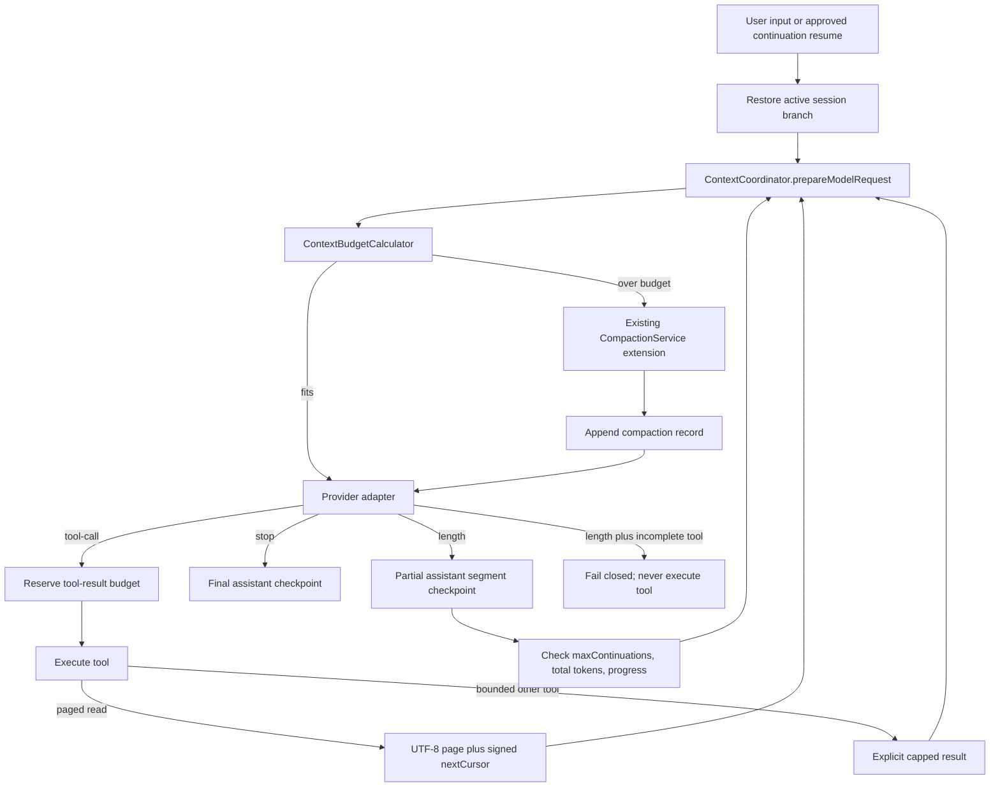

# Token Limit Resilience Implementation Plan

> **For agentic workers:** REQUIRED SUB-SKILL: Use superpowers:subagent-driven-development (recommended) or superpowers:executing-plans to implement this plan task-by-task. Steps use checkbox (`- [ ]`) syntax for tracking.

**Goal:** Preserve all three Provider paths while adding provider-neutral context budgeting, cursor-based file input paging, and bounded output continuation without losing append-only session history or Codex replay state.

**Architecture:** A common `ContextCoordinator` prepares every model request and reserves tool-result space using one `ContextBudgetCalculator`; it extends the existing `CompactionService` instead of replacing it. `ReadTool` pages UTF-8 files with a signed, file-bound cursor, while `AgentLoop` drives continuation through an explicit `ModelRequest.continuation` contract and persists each generated segment through the existing assistant-message journal.

**Tech Stack:** TypeScript 7, Node.js 22.12+, TypeBox, Vitest, append-only JSONL, OpenAI-compatible Chat Completions, OpenAI Responses/Codex SSE, llama.cpp SSE.

## Global Constraints

- Implementation base is the latest `shellnaut/main`; this audit used `shellnaut/main@134e94c8765277f6bcf8e4168a32b5c7fb109325` on 2026-08-10.
- Keep `LlamaProvider`, `OpenAICompatibleProvider` (the Ollama route), and `OpenAICodexProvider` as separate Provider paths.
- Put compaction, paging budgets, and continuation policy in common Agent, ChatSession, context, session, and tool contracts; never branch on a Provider name in `AgentLoop`.
- Preserve append-only JSONL, active-branch projection, replay, retry, abort, approval, tool execution, and `providerState` behavior.
- Do not require network access, credentials, a local Ollama server, or a local llama.cpp server in automated tests.
- Phase 1 pages `ReadTool` file content only. Bash and arbitrary tool output are bounded with an explicit truncation/error marker; they are not stored for later paging in this plan.
- Every loop has an explicit cap: file page bytes/tokens, cursor expiry, model steps, tool batches, continuation count, and total output tokens.
- Production implementation begins only after the user approves this document.

---

## 1. Audit result and baseline

### Repository and worktree state

- The primary checkout is `codex/pi-clone-import@3b1977b` and contains user-owned changes: modified `src/providers/openai-compatible-provider.ts`, untracked `.vscode/`, and untracked `test.md`.
- Those files were not changed or staged. The audit read `shellnaut/main` from a temporary snapshot and writes only this plan in the already-existing clean `codex/main-feature-integration` worktree.
- `AGENTS.md` is not present in the repository.
- Implementation should use a new `codex/token-limit-resilience` branch from the then-current `shellnaut/main`; do not continue implementation on the import checkout or on the old integration branch.

### Verified baseline

After the local security program stopped blocking child-process creation, the exact command below passed on the latest-main snapshot:

```powershell
npm ci
npm run check
```

Verified result:

- 32 test files passed.
- 203 tests passed and 5 were skipped.
- Typecheck, build, packaged-dist smoke, and Windows CLI EOF smoke passed.
- The earlier `spawn EPERM` and lock timeouts were environmental and disappeared after the security program was disabled.

### Already implemented and retained

| Area | Current evidence | Keep unchanged unless an extension below names it |
|---|---|---|
| Provider matrix | `src/model/provider-matrix.test.ts` registers `llama`, `openai-compatible`, and `openai-codex` together | Keep all three paths and the matrix test |
| Stop-reason contract | `src/model/types.ts` defines `stop`, `length`, and `tool-call` | Extend the request contract; do not add Provider IDs to Agent policy |
| llama.cpp output limit | `src/providers/llama/provider.ts` sends `max_tokens` and maps `finish_reason: length` | Add deterministic contract coverage and incomplete-tool fail-closed behavior |
| Ollama route | `OpenAICompatibleProvider` targets `/chat/completions`, so base URL `/v1` reaches Ollama `/v1/chat/completions` | Do not add an Ollama-specific Provider |
| Codex output limit | `OpenAICodexProvider` sends `max_output_tokens` and maps `response.incomplete/max_output_tokens` to `done:length` | Preserve encrypted reasoning/function-item replay across segments |
| Append-only assistant checkpoint | `AgentLoop` emits `message-checkpoint`; `ChatSession` appends it before resuming the loop | Reuse it for partial and final continuation segments |
| Provider replay state | `AssistantMessage.providerState`, JSONL parsing, and Codex serialization preserve encrypted reasoning and function item IDs | Never copy the state into a human-readable compaction summary |
| Existing compaction | `CompactionService` incrementally summarizes newly evicted complete turns, retains recent turns, and rejects an over-budget summary result | Replace only budget calculation and missing safety/coordination pieces |
| Active context projection | `Session.buildActiveMessages()` projects latest summary plus kept branch messages without rewriting older records | Continue treating the JSONL path as source of truth |
| Tool-call recovery | `Session.recoverInterruptedToolCalls()` appends unknown-outcome tool results | Keep recovery before accepting a new user turn |
| Read security boundary | `WorkspacePaths.existingFile()` enforces lexical plus realpath containment for symlink/junction escape | Make paged reads use this shared boundary |
| Read limit | `ReadTool` rejects files over 64 KiB | Replace the rejection with bounded pages; preserve raw output for small files |
| Bash limit | `BashTool` captures at most 64 KiB per stream and reports truncation | Do not pretend this is paging; advise redirect-to-file then paged read |
| Retry | `RetryingModelRuntime` retries only before a meaningful delta/tool call | Preserve this rule so retry cannot duplicate visible partial text |

### Missing or insufficient

1. `CompactionService.prepare()` computes `contextWindow - reserveTokens`; it does not separately subtract requested output tokens and estimator safety margin.
2. Normal model calls are not budget-checked before every Agent step. Compaction occurs only before the initial user message, not after tool results or before continuation.
3. The estimator omits `systemPrompt` and continuation control data from request size.
4. Compaction selection relies on turn grouping but does not explicitly validate pending tool-call/result pairs before summarizing a turn.
5. A summarizer request can itself exceed its input budget because all evicted turns are serialized into one request.
6. `ReadTool` has no cursor, stale-file detection, UTF-8 boundary logic, page expiry, or token-aware page size.
7. `AgentLoop` checkpoints a `length` response and then returns `done:length`; it does not continue.
8. OpenAI-compatible and llama.cpp tests do not contract-test `done:length`; llama.cpp can attempt to complete pending tool-call fragments at `[DONE]` even when the finish reason is `length`.
9. Session records cannot distinguish an ordinary assistant message from a partial/final continuation segment.
10. There is no maximum continuation count, total-output cap, overlap removal, empty/repeated-progress detection, or restart policy.

## 2. Design approaches

### Common orchestration placement

#### Approach 1 — ChatSession-only outer loop

`ChatSession` would repeatedly call `AgentLoop`, compact between calls, and append a synthetic user message for continuation.

- Advantage: minimal change to `AgentLoop`.
- Disadvantage: `ChatSession` cannot safely intervene between an assistant tool call, tool execution, tool-result injection, and the next Provider call without duplicating AgentLoop state.
- Disadvantage: continuation becomes indistinguishable from a real user message and pollutes JSONL/replay.
- Decision: reject.

#### Approach 2 — Provider-neutral ContextCoordinator plus Agent continuation state (recommended)

`AgentLoop` remains the model/tool state machine but calls an injected `ContextCoordinator` before every Provider request and before reserving tool-result space. Continuation is a common state machine driven only by `done:length`; Providers translate `ModelRequest.continuation` to their own wire format.

- Advantage: one policy path for llama.cpp, Ollama, and Codex.
- Advantage: compaction can run before the first call, after a tool result, and before each continuation without breaking tool-call ordering.
- Advantage: Provider-specific reasoning state remains inside assistant messages and Provider adapters.
- Cost: `AgentLoop`, ChatSession persistence, and context events need coordinated changes.
- Decision: implement.

#### Approach 3 — Provider-native continuation/compaction

Each Provider would own prompts, repeated calls, and context trimming.

- Advantage: adapters can use backend-specific features.
- Disadvantage: three policy implementations drift, Agent replay becomes Provider-dependent, and `AgentLoop` cannot enforce common caps.
- Decision: reject. Backend-specific request encoding is allowed only behind the common request contract.

### Input paging alternatives

| Approach | Complexity | Restart recovery | UTF-8/file-change safety | Session cost | Decision |
|---|---:|---|---|---|---|
| A. `startLine/maxLines` or `offset/limit` on ReadTool | Low | Caller must reconstruct offsets; line edits silently shift pages | Line mode handles most UTF-8, but a single huge line breaks the budget and offsets can be reused on another file | Each page body only | Reject: cannot satisfy opaque, tamper-proof, stale cursor and huge-line requirements |
| B. Signed opaque cursor on ReadTool | Medium | Persisted workspace cursor key lets a cursor survive restart until expiry | Byte offset is advanced only at a valid UTF-8 boundary; signed file identity detects reuse and mutation | Each page and cursor are ordinary tool-result messages | Recommend for phase 1 |
| C. Global `PagedContentStore` plus `read_page` | High | Strong if blobs/indexes are durable and garbage-collected | Works for files and arbitrary outputs but adds encryption, quotas, TTL, crash cleanup, and secret redaction questions | JSONL stores handles; a second durable blob store stores full output | Defer to phase 2 for Bash/arbitrary tool output |

Phase 1 therefore pages only ReadTool content. Bash remains capped and explicit. A user who needs the full command output must redirect it to a workspace file, then use the paged `read` tool. The implementation must not claim that truncated Bash output is recoverable.

## 3. Recommended architecture and data flow



### Context budget contract

Create `src/context/budget.ts` with these public types and exact default policy:

```ts
export interface ContextBudgetSettings {
  readonly safetyMarginRatio: number;      // default 0.02
  readonly minSafetyMarginTokens: number;  // default 256
  readonly maxSafetyMarginTokens: number;  // default 2048
  readonly minToolResultTokens: number;    // default 128
}

export interface ContextBudget {
  readonly requestedMaxOutputTokens: number;
  readonly safetyMarginTokens: number;
  readonly inputBudget: number;
  readonly estimatedInputTokens: number;
  readonly remainingInputTokens: number;
}

export interface ToolResultBudget {
  readonly maxBytes: number;
  readonly maxTokens: number;
}

export class ContextBudgetCalculator {
  calculate(request: ModelRequest): ContextBudget;
  assertFits(request: ModelRequest): ContextBudget;
  calculateToolResultBudget(request: ModelRequest): ToolResultBudget;
}
```

The calculator uses:

```text
safetyMarginTokens = clamp(
  ceil(model.contextWindow * 0.02),
  256,
  2048
)

requestedMaxOutputTokens =
  request.maxOutputTokens ?? request.model.maxOutputTokens

inputBudget =
  model.contextWindow
  - requestedMaxOutputTokens
  - safetyMarginTokens
```

`calculate()` throws if any budget term is invalid or requested output plus safety margin consumes the context window; an ordinary over-budget input is represented by a negative `remainingInputTokens` so the coordinator can attempt compaction. `assertFits()` throws when `remainingInputTokens < 0` and is used only after compaction or when no Session-backed coordinator exists. `TokenEstimator.estimateRequest()` must include `systemPrompt`, messages, tools, and the exact shared continuation instruction represented by `continuation` metadata. The heuristic remains Provider-neutral; the separate safety margin absorbs tokenizer error.

### Context coordination contract

Create `src/context/coordinator.ts` and `src/session/session-context-coordinator.ts`:

```ts
export type ContextCoordinatorEvent =
  | { readonly type: "compaction-start"; readonly tokensBefore: number }
  | {
      readonly type: "compaction-done";
      readonly tokensBefore: number;
      readonly tokensAfter: number;
    }
  | {
      readonly type: "model-input-ready";
      readonly request: ModelRequest;
      readonly budget: ContextBudget;
    }
  | {
      readonly type: "tool-result-budget-ready";
      readonly budget: ToolResultBudget;
    };

export interface ContextCoordinator {
  prepareModelRequest(
    request: ModelRequest,
    options?: { readonly signal?: AbortSignal },
  ): AsyncIterable<ContextCoordinatorEvent>;

  reserveToolResult(
    request: ModelRequest,
    options?: { readonly signal?: AbortSignal },
  ): AsyncIterable<ContextCoordinatorEvent>;
}
```

`SessionContextCoordinator` owns `Session`, the existing `CompactionService`, and `ContextBudgetCalculator`. It may append a compaction record, but it never appends or rewrites ordinary history itself. It returns a request built from `Session.buildActiveMessages()` and asserts that its non-compacted tail equals AgentLoop's checkpointed working tail.

Before tool execution, `reserveToolResult()` may compact only old complete turns. It keeps the current user turn and its pending assistant tool call in the active view. If fewer than 128 tokens remain after compaction, AgentLoop does not execute the tool; it appends a matched error tool result so the call/result invariant remains valid.

### Compaction extensions

Retain the current summary prompts, `CompactionEntry`, incremental previous-summary behavior, and append-before-active-view switch. Make these focused changes:

1. Replace `reserveTokens` with the `ContextBudgetCalculator` result; `keepRecentTokens` remains a selection policy, not an output reserve.
2. Add `complete: boolean` and `pendingToolCallIds` to internal `CompactionTurn` construction. Never place an incomplete turn in `turnsToSummarize`.
3. Validate that every summarized assistant tool call has exactly one later tool result in the same turn and no tool result points outside the turn.
4. Partition `turnsToSummarize` into the largest complete-turn batches that fit the summarizer input budget. Each later batch receives the immediately previous summary and only the next batch of evicted turns.
5. Fail explicitly when one complete turn cannot fit a summarizer request or when the final summary plus kept turns exceeds the normal input budget.
6. Continue omitting `providerState` and continuation metadata from the human-readable summary serialization. The original assistant records remain on the branch and retain replay state.
7. On abort or summarizer error, append no compaction record and leave the pending user message unappended.

### Read paging contract

Extend `read` input as an exclusive union:

```ts
export type ReadInput =
  | { readonly path: string }
  | { readonly cursor: string };

export interface ReadPageMetadata {
  readonly version: 1;
  readonly path: string;
  readonly startByte: number;
  readonly endByte: number;
  readonly totalBytes: number;
  readonly nextCursor?: string;
}
```

Small files that fit both byte and token budgets continue returning their raw text. A paged result returns actual decoded content followed by one machine-readable footer:

```text
<actual page content>

<read-page>{"version":1,"path":"...","startByte":0,"endByte":4096,"totalBytes":9000,"nextCursor":"..."}</read-page>
```

The next call supplies only `cursor`; supplying both `path` and `cursor` fails schema validation. The cursor payload contains version, workspace-root hash, normalized relative path, realpath hash, byte offset, file identity (`dev`, `ino`, `size`, `mtimeNs`, `ctimeNs`), and expiry. It is base64url encoded and HMAC-SHA256 signed with a 32-byte key stored at `sessions/.read-cursor-key` using exclusive creation. Default expiry is 24 hours.

```ts
export interface ReadCursorPayload {
  readonly version: 1;
  readonly rootHash: string;
  readonly relativePath: string;
  readonly realPathHash: string;
  readonly offsetBytes: number;
  readonly file: {
    readonly dev: string;
    readonly ino: string;
    readonly size: string;
    readonly mtimeNs: string;
    readonly ctimeNs: string;
  };
  readonly expiresAtMs: number;
}
```

Each page:

1. Resolves the path again with `WorkspacePaths.existingFile()`.
2. Rejects a root/path mismatch, invalid signature, expiry, or changed file identity as `Invalid read cursor`, `Expired read cursor`, or `Stale read cursor` without returning content.
3. Reads at most the smaller of configured 64 KiB, `ToolResultBudget.maxBytes`, and the token-derived maximum. The token fit check includes both decoded page content and the complete `<read-page>` footer/cursor.
4. Advances `endByte` only after the last complete UTF-8 code point. It decodes with a fatal `TextDecoder`; invalid UTF-8 returns an error.
5. Splits a single long line when necessary; line boundaries never override byte/token caps.
6. Checks abort before open, after stat, after read, and before returning.
7. Checks file identity both before and after the read so a mid-read mutation fails stale rather than returning a mixed snapshot.

No page overlaps or skips bytes: the next cursor's offset is exactly the previous `endByte`. Tests reconstruct the original byte sequence from all returned page bodies.

### Output continuation contract

Add a request-only marker. Never append a fake user `continue` message to JSONL:

```ts
export interface ModelContinuation {
  readonly kind: "assistant-output";
  readonly logicalMessageId: string;
  readonly segmentIndex: number;
  readonly previousTail: string; // at most 1024 Unicode code points
  readonly previousTailHash: string; // SHA-256 hex
}

export interface ModelRequest {
  // existing fields
  readonly continuation?: ModelContinuation;
}
```

All adapters translate this marker internally:

- `LlamaProvider` and `OpenAICompatibleProvider` serialize the checkpointed assistant segments once, then add a wire-only user instruction to continue exactly after the preceding assistant output, emit only new text, and avoid repeating the tail.
- `OpenAICodexProvider` serializes each prior segment's encrypted reasoning items, assistant output, and function item IDs as it does today, then adds the same wire-only continuation instruction in Responses input. `store:false` remains unchanged.
- `AgentLoop` does not inspect `request.model.provider` or a Provider ID.

The wire-only text is one exported `CONTINUATION_INSTRUCTION` constant in the common model contract. Every adapter reuses that exact text, and `TokenEstimator` includes it whenever `ModelRequest.continuation` is present. This prevents a Provider adapter from silently adding unbudgeted prompt text while leaving wire placement inside the adapter.

Extend a `done:length` event with one Provider-normalized safety flag:

```ts
{
  readonly type: "done";
  readonly reason: "length";
  readonly providerState?: ProviderMessageState;
  readonly incompleteToolCall?: boolean;
}
```

Adapters set `incompleteToolCall:true` when any unfinished call fragment exists. They emit no `tool-call` event for that fragment. AgentLoop checkpoints visible partial text and `providerState`, emits an explicit error, and does not start continuation or tool execution.

Do not append the whole accumulated assistant text as a second message. JSONL stores individual assistant segments, and the next request includes each segment exactly once. The active context necessarily grows by newly generated text, but it does not contain both segments and a duplicated concatenation.

Use optional assistant-message metadata instead of a new session record type:

```ts
export interface AssistantContinuationSegment {
  readonly logicalMessageId: string;
  readonly segmentIndex: number;
  readonly status: "partial" | "complete" | "abandoned";
  readonly resumeAllowed: boolean;
  readonly tailHash: string;
  readonly estimatedTotalOutputTokens: number;
}

export interface AssistantMessage {
  // existing fields
  readonly continuation?: AssistantContinuationSegment;
}
```

This preserves JSONL version 2 and legacy record shape. Older readers already ignore unknown assistant fields and still replay the visible content and `providerState`; the new reader validates and preserves the field. `Session.buildDisplayMessages()` collapses adjacent segments with one `logicalMessageId` into one logical assistant message for UI/history. `Session.buildActiveMessages()` keeps raw segments for Provider replay and omits an empty `abandoned` tombstone.

Default continuation policy:

```ts
export interface OutputContinuationPolicy {
  readonly maxContinuations: number;       // default 3
  readonly maxTotalOutputTokens: number;   // default 4 * model.maxOutputTokens
  readonly overlapWindowChars: number;     // default 1024
}
```

On `length`:

1. Checkpoint the received assistant segment, including `providerState`, as `partial` before another network call.
2. Recalculate cumulative conservative output tokens and remaining total allowance.
3. Stop with an explicit error after `maxContinuations`, total allowance exhaustion, an empty novel segment, a repeated tail hash, or no progress after overlap removal.
4. Re-run `ContextCoordinator.prepareModelRequest()` with the next request's reduced `maxOutputTokens`; allow compaction of older complete turns only.
5. Buffer the first continuation characters in `ContinuationOverlapGuard`, remove the longest suffix(previous tail)/prefix(new segment) overlap, and emit only novel deltas to the UI.
6. If `stop`, checkpoint the final segment as `complete` and emit one logical `done:stop`.
7. If `tool-call`, checkpoint the segment and complete call, then enter the existing approval/execution path.
8. If `length` and a Provider has partial tool-call state, emit an error before any `tool-call` event. Never execute it.
9. If abort or network failure follows visible text, checkpoint that partial segment before yielding the terminal error. Existing retry remains allowed only before a meaningful event.

After restart, `Session.getPendingContinuation()` detects a latest `partial` segment without `complete` or `abandoned`. A segment checkpointed from `done:length` has `resumeAllowed:true`; a segment checkpointed after mid-stream abort/network error has `resumeAllowed:false` because terminal replay state may be missing. ChatSession never automatically spends tokens or risks duplication. It emits `continuation-recovery-required`; CLI offers resume only when allowed and always offers abandon. Resume reconstructs `ModelContinuation` from JSONL and re-enters the common Agent path. Abandon appends an empty assistant tombstone with the same logical ID, next segment index, `resumeAllowed:false`, and `status:"abandoned"`; it does not delete partial output.

## 4. File map

### Create

- `src/context/budget.ts` — exact input/tool-result budget calculation.
- `src/context/budget.test.ts` — exact-boundary and invalid-budget unit tests.
- `src/context/coordinator.ts` — Provider-neutral coordinator interfaces/events.
- `src/session/session-context-coordinator.ts` — Session-backed compaction and active-view preparation.
- `src/session/session-context-coordinator.test.ts` — pre-call, post-tool, abort, and branch tests.
- `src/tools/read-cursor.ts` — cursor payload validation, HMAC codec, file identity, key loading.
- `src/tools/read-cursor.test.ts` — tamper, expiry, wrong root/file, and restart tests.
- `src/tools/read-paging.test.ts` — UTF-8, emoji, empty, huge-line, stale, abort, and reconstruction tests.
- `src/agent/output-continuation.ts` — policy validation, overlap guard, progress detector, and tail hashing.
- `src/agent/output-continuation.test.ts` — overlap/no-progress/limit tests.
- `src/providers/provider-contract.test.ts` — shared deterministic stop/length/tool-call contract suite for all three adapters.
- `src/agent/token-limit-resilience.integration.test.ts` — compaction → paged read → two continuations → stop scenario.
- `docs/07-token-limit-resilience.md` — user-facing contracts, Mermaid flow, limits, recovery, and optional live smokes.

### Modify

- `src/model/types.ts` — add `ModelContinuation` and assistant segment metadata.
- `src/model/request-clone.ts` — deep-clone continuation state.
- `src/agent/types.ts` — add compaction/recovery events and continuation policy options.
- `src/agent/loop.ts` — coordinator calls, result reservation, continuation state machine, fail-closed incomplete tool calls.
- `src/context/types.ts` — replace reserve-only input accounting and mark complete/incomplete turns.
- `src/context/token-estimator.ts` — estimate complete `ModelRequest` content.
- `src/context/compaction.ts` — use calculated budgets, batch summarizer inputs, validate turn integrity.
- `src/context/serialize.ts` — keep Provider and continuation metadata out of summary text.
- `src/context/compaction-integration.test.ts` — preserve existing cases and add budget/abort/tool-pair cases.
- `src/session/types.ts` — no new entry variant; event types only.
- `src/session/jsonl-store.ts` — parse and validate optional assistant continuation metadata.
- `src/session/session.ts` — pending detection, display collapse, abandoned tombstone omission, complete-turn projection.
- `src/session/chat-session.ts` — wire coordinator and explicit resume/abandon recovery methods.
- `src/session/session-compatibility.test.ts` — legacy reader/new metadata/reload coverage.
- `src/session/chat-session-journal.test.ts` — partial-before-call, abort, and recovery ordering.
- `src/tools/types.ts` — add optional `resultBudget` to `ToolExecutionOptions`.
- `src/tools/registry.ts` — pass budgets and apply explicit non-paged output caps.
- `src/tools/read.ts` — use `WorkspacePaths`, initial/cursor schema, page reading.
- `src/tools/tool-integration.test.ts` — bounded non-paged output and insufficient-budget behavior.
- `src/providers/llama/provider.ts` — injectable fetch, continuation wire encoding, incomplete tool-call fail closed.
- `src/providers/openai-compatible-provider.ts` — continuation wire encoding and incomplete tool-call fail closed.
- `src/providers/openai-codex-provider.ts` — continuation wire encoding while preserving replay state.
- `src/providers/openai-compatible-provider.test.ts` — explicit length and continuation serialization.
- `src/providers/openai-codex-provider.test.ts` — partial replay and continuation reasoning state.
- `src/model/provider-matrix.test.ts` — retain the three-provider matrix during the new contract suite.
- `src/cli/main.ts` — construct budgets/coordinator/cursor key and expose recovery prompt.
- `src/cli/chat.ts` and `src/cli/chat.test.ts` — resume/abandon interaction without automatic network use.
- `src/demo.ts` — construct the same common policies as CLI.
- `src/index.ts` and `src/index.test.ts` — export and smoke-test new public contracts.
- `docs/README.md` — link the new design/runtime document.

## 5. TDD implementation tasks

### Task 1: Lock the three-Provider terminal contract

**Files:**
- Create: `src/providers/provider-contract.test.ts`
- Modify: `src/providers/llama/provider.ts`
- Modify: `src/providers/openai-compatible-provider.ts`
- Modify: `src/providers/openai-codex-provider.ts`
- Test: existing Provider tests and `src/model/provider-matrix.test.ts`

**Interfaces:**
- Consumes: existing `StreamEvent` and `StopReason`.
- Produces: every adapter emits exactly one of `done:stop`, `done:length`, `done:tool-call`, or one terminal error.

- [ ] **Step 1: Write the failing shared contract cases**

```ts
expect(await terminalFor(harness.stopFixture())).toEqual({ type: "done", reason: "stop" });
expect(await terminalFor(harness.lengthFixture())).toMatchObject({ type: "done", reason: "length" });
expect(await terminalFor(harness.toolFixture())).toMatchObject({ type: "done", reason: "tool-call" });
const partialToolEvents = await collect(harness.lengthWithPartialToolFixture());
expect(partialToolEvents).not.toContainEqual(expect.objectContaining({ type: "tool-call" }));
expect(partialToolEvents.at(-1)).toMatchObject({
  type: "done",
  reason: "length",
  incompleteToolCall: true,
});
```

- [ ] **Step 2: Run RED**

```powershell
npx vitest run src/providers/provider-contract.test.ts
```

Expected RED: llama.cpp has no injectable fetch harness and its partial tool-call/length fixture does not fail closed; the OpenAI-compatible suite lacks explicit length coverage.

- [ ] **Step 3: Implement minimal adapter normalization**

Add injected fetch to `LlamaProviderOptions`; mark pending tool-call fragments with `incompleteToolCall:true` when the terminal reason is `length`; preserve current wire formats and `providerState` behavior. No adapter emits the incomplete `tool-call` itself.

- [ ] **Step 4: Run GREEN and regression tests**

```powershell
npx vitest run src/providers/provider-contract.test.ts src/providers/openai-compatible-provider.test.ts src/providers/openai-codex-provider.test.ts src/model/provider-matrix.test.ts
```

- [ ] **Step 5: Commit**

```powershell
git add src/providers src/model/provider-matrix.test.ts
git commit -m "test: lock provider terminal reason contract"
```

### Task 2: Introduce exact common context budgets

**Files:**
- Create: `src/context/budget.ts`
- Create: `src/context/budget.test.ts`
- Modify: `src/context/token-estimator.ts`
- Modify: `src/model/types.ts`
- Modify: `src/model/request-clone.ts`

**Interfaces:**
- Produces: `ContextBudgetCalculator.calculate()`, `assertFits()`, and `calculateToolResultBudget()` with the signatures in section 3.
- Consumes: full `ModelRequest`, including optional continuation metadata.

- [ ] **Step 1: Write exact-boundary RED tests**

```ts
expect(calculator.calculate(requestAtLimit).remainingInputTokens).toBe(0);
expect(calculator.calculate(requestOneTokenOver).remainingInputTokens).toBe(-1);
expect(() => calculator.assertFits(requestOneTokenOver)).toThrow(/input budget/i);
expect(calculator.calculate({ ...request, maxOutputTokens: 321 }).requestedMaxOutputTokens).toBe(321);
```

Also assert system prompt, tool schema, Korean, emoji, and continuation metadata change the estimate.

- [ ] **Step 2: Run RED**

```powershell
npx vitest run src/context/budget.test.ts
```

Expected RED: budget module and full-request estimator do not exist.

- [ ] **Step 3: Implement the calculator and clone contract**

Use the exact clamp formula from section 3. Keep the estimator heuristic and Provider-neutral; do not import Provider classes or tokenizers.

- [ ] **Step 4: Run GREEN**

```powershell
npx vitest run src/context/budget.test.ts src/model/retry.test.ts
npm run typecheck
```

- [ ] **Step 5: Commit**

```powershell
git add src/context/budget.ts src/context/budget.test.ts src/context/token-estimator.ts src/model
git commit -m "feat: calculate provider-neutral context budgets"
```

### Task 3: Extend, do not replace, compaction

**Files:**
- Create: `src/context/coordinator.ts`
- Create: `src/session/session-context-coordinator.ts`
- Create: `src/session/session-context-coordinator.test.ts`
- Modify: `src/context/types.ts`
- Modify: `src/context/compaction.ts`
- Modify: `src/context/serialize.ts`
- Modify: `src/context/compaction-integration.test.ts`
- Modify: `src/session/session.ts`

**Interfaces:**
- Consumes: `ContextBudgetCalculator`, current `CompactionService`, `Session`.
- Produces: `ContextCoordinator` events and a budget-safe cloned `ModelRequest`.

- [ ] **Step 1: Add RED tests for the missing guarantees**

```ts
expect(preparation.inputBudget).toBe(
  model.contextWindow - requestedMaxOutputTokens - safetyMarginTokens,
);
await expect(compactWithPendingToolPair()).rejects.toThrow(/incomplete turn/i);
await expect(compactSingleOversizedSummaryBatch()).rejects.toThrow(/summarizer input budget/i);
```

Add an abort test proving no compaction entry or pending user entry is appended, plus a test proving previous-summary compaction receives only newly evicted turns.

- [ ] **Step 2: Run RED**

```powershell
npx vitest run src/context/compaction-integration.test.ts src/session/session-context-coordinator.test.ts
```

Expected RED: reserve-only budget, no coordinator, no batch summarization, and no explicit turn integrity validation.

- [ ] **Step 3: Implement complete-turn validation and summary batching**

Keep existing prompts and compaction entry fields. Partition only at `CompactionTurn` boundaries. Throw before persistence if one batch cannot fit.

- [ ] **Step 4: Implement SessionContextCoordinator**

The final `model-input-ready.request.messages` must come from `Session.buildActiveMessages()`. Never mutate the incoming Agent request or store state before a successful compaction append.

- [ ] **Step 5: Run GREEN**

```powershell
npx vitest run src/context/compaction-integration.test.ts src/session/session-context-coordinator.test.ts src/session/session-journal.test.ts
```

- [ ] **Step 6: Commit**

```powershell
git add src/context src/session/session-context-coordinator* src/session/session.ts
git commit -m "feat: coordinate budget-safe session compaction"
```

### Task 4: Build a restart-safe signed read cursor

**Files:**
- Create: `src/tools/read-cursor.ts`
- Create: `src/tools/read-cursor.test.ts`
- Modify: `.gitignore` only if the current `sessions/` rule is absent on the implementation base

**Interfaces:**
- Produces: `ReadCursorCodec.encode(payload)`, `decode(cursor)`, `FileReadCursorKeyStore.loadOrCreate()`.
- Consumes: `WorkspacePaths`, a clock injectable in tests, and a 32-byte HMAC key.

- [ ] **Step 1: Write cursor RED tests**

```ts
expect(codec.decode(codec.encode(payload))).toEqual(payload);
expect(() => codec.decode(tampered)).toThrow(/invalid read cursor/i);
expect(() => expiredCodec.decode(cursor)).toThrow(/expired read cursor/i);
expect(reloadedCodec.decode(cursor)).toEqual(payload);
```

Add wrong-root, wrong-path, malformed-base64, and non-32-byte-key cases.

- [ ] **Step 2: Run RED**

```powershell
npx vitest run src/tools/read-cursor.test.ts
```

- [ ] **Step 3: Implement canonical payload signing and exclusive key creation**

Serialize fields in a fixed key order before HMAC. Compare signatures with `timingSafeEqual`. Treat all decoding/shape/signature errors as the same invalid-cursor class; keep expiry and stale-file errors distinct.

- [ ] **Step 4: Run GREEN**

```powershell
npx vitest run src/tools/read-cursor.test.ts
```

- [ ] **Step 5: Commit**

```powershell
git add src/tools/read-cursor.ts src/tools/read-cursor.test.ts
git commit -m "feat: add signed restart-safe read cursors"
```

### Task 5: Page ReadTool within byte and token budgets

**Files:**
- Create: `src/tools/read-paging.test.ts`
- Modify: `src/tools/read.ts`
- Modify: `src/tools/types.ts`
- Modify: `src/tools/registry.ts`
- Modify: `src/tools/tool-integration.test.ts`
- Test: `src/tools/workspace-paths.test.ts`

**Interfaces:**
- Consumes: `ReadCursorCodec`, `ToolResultBudget`, `WorkspacePaths.existingFile()`.
- Produces: raw small-file text or content plus the exact `<read-page>` footer.

- [ ] **Step 1: Write paging RED tests**

```ts
expect(reconstruct(await readAllPages("한글🙂boundary.txt"))).toBe(original);
await expect(nextPageAfterMutation()).resolves.toMatchObject({ isError: true });
expect(await readVeryLongSingleLine()).toSatisfy(everyPageFitsBothCaps);
```

Cover empty file, exactly-at-byte-limit, one byte over, invalid/expired cursor, another-file reuse, symlink/junction escape, abort, and no overlap/no gap.

- [ ] **Step 2: Run RED**

```powershell
npx vitest run src/tools/read-paging.test.ts src/tools/workspace-paths.test.ts
```

Expected RED: ReadTool still rejects oversized files.

- [ ] **Step 3: Implement UTF-8-safe range reads and footer formatting**

Open by the resolved real path, stat before/after, decode only a complete prefix, and set the next offset to `endByte`. Never slice a JavaScript string to decide byte offsets.

- [ ] **Step 4: Bound every non-paged tool result explicitly**

Pass `resultBudget` through `ToolRegistry`. ReadTool pages; other tools return content that fits or a deterministic truncation/error marker. Do not create a blob store or claim discarded Bash bytes are available.

- [ ] **Step 5: Run GREEN**

```powershell
npx vitest run src/tools/read-paging.test.ts src/tools/tool-integration.test.ts src/tools/workspace-paths.test.ts
npm run typecheck
```

- [ ] **Step 6: Commit**

```powershell
git add src/tools
git commit -m "feat: page large UTF-8 file reads"
```

### Task 6: Persist continuation segments compatibly

**Files:**
- Modify: `src/model/types.ts`
- Modify: `src/session/jsonl-store.ts`
- Modify: `src/session/session.ts`
- Modify: `src/session/session-compatibility.test.ts`
- Modify: `src/session/session-journal.test.ts`

**Interfaces:**
- Produces: optional `AssistantMessage.continuation`, `Session.getPendingContinuation()`, `buildDisplayMessages()`, and `appendContinuationAbandoned()`.
- Consumes: existing `MessageEntry`; no new `SessionEntry` variant.

- [ ] **Step 1: Write JSONL/reload RED tests**

```ts
expect(reloaded.getPendingContinuation()).toMatchObject({ segmentIndex: 1, status: "partial" });
expect(reloaded.buildDisplayMessages().at(-1)?.content).toBe("part one part two");
expect(reloaded.buildActiveMessages()).not.toContainEqual(
  expect.objectContaining({ continuation: expect.objectContaining({ status: "abandoned" }) }),
);
```

Also load a legacy assistant record without metadata and ensure its projection is unchanged. Preserve `providerState` byte-for-byte through reload.

- [ ] **Step 2: Run RED**

```powershell
npx vitest run src/session/session-compatibility.test.ts src/session/session-journal.test.ts
```

- [ ] **Step 3: Implement strict optional metadata parsing and display projection**

Reject duplicate/negative segment indexes, non-hex hashes, `resumeAllowed:true` on abort/error checkpoints, or a status transition that is not `partial* -> complete|abandoned`. Keep raw JSONL messages append-only.

- [ ] **Step 4: Run GREEN**

```powershell
npx vitest run src/session/session-compatibility.test.ts src/session/session-journal.test.ts
```

- [ ] **Step 5: Commit**

```powershell
git add src/model/types.ts src/session
git commit -m "feat: journal recoverable output segments"
```

### Task 7: Add bounded AgentLoop continuation

**Files:**
- Create: `src/agent/output-continuation.ts`
- Create: `src/agent/output-continuation.test.ts`
- Modify: `src/agent/types.ts`
- Modify: `src/agent/loop.ts`
- Modify: `src/session/chat-session.ts`
- Modify: `src/session/chat-session-journal.test.ts`
- Modify: `src/model/request-clone.ts`

**Interfaces:**
- Consumes: `ContextCoordinator`, `OutputContinuationPolicy`, segment-aware Session methods.
- Produces: automatic continuation only for `length`, one logical UI message, and explicit recovery events.

- [ ] **Step 1: Write state-machine RED tests**

```ts
expect(providerRequests).toHaveLength(3); // initial length, length, stop
expect(displayedText).toBe("alpha beta gamma");
expect(checkpoints.map(c => c.continuation?.status)).toEqual([
  "partial", "partial", "complete",
]);
```

Add max-continuation, max-total-output, empty segment, same-tail repetition, overlap removal, abort before delta, abort after delta, retry-before-delta, network error after delta, and tool-call-after-continuation cases.

- [ ] **Step 2: Run RED**

```powershell
npx vitest run src/agent/output-continuation.test.ts src/agent/loop-integration.test.ts src/session/chat-session-journal.test.ts
```

Expected RED: `AgentLoop` currently returns immediately on `length`.

- [ ] **Step 3: Implement overlap/progress helpers**

Buffer at most 1024 Unicode code points, strip one maximal suffix/prefix overlap, and hash the normalized novel tail. Use `Array.from(text)` or an equivalent code-point iterator so an emoji surrogate pair is never split. Emit no buffered character until it is known not to be duplicate output.

- [ ] **Step 4: Integrate ContextCoordinator before every model call**

Initial, post-tool, and continuation requests all pass through the same coordinator. Use `min(model.maxOutputTokens, remainingTotalOutputTokens)` for each continuation request.

- [ ] **Step 5: Checkpoint before continuing or failing**

On `length`, abort-after-text, or error-after-text, yield `message-checkpoint` before terminal error/next call. On a complete tool-call stop, retain the current approval and execution ordering.

- [ ] **Step 6: Run GREEN**

```powershell
npx vitest run src/agent/output-continuation.test.ts src/agent/loop-integration.test.ts src/session/chat-session-journal.test.ts src/model/retry.test.ts
```

- [ ] **Step 7: Commit**

```powershell
git add src/agent src/session/chat-session* src/model/request-clone.ts
git commit -m "feat: continue bounded partial model output"
```

### Task 8: Encode continuation in all Provider wires

**Files:**
- Modify: `src/providers/llama/provider.ts`
- Modify: `src/providers/openai-compatible-provider.ts`
- Modify: `src/providers/openai-codex-provider.ts`
- Modify: `src/providers/provider-contract.test.ts`
- Modify: existing Provider tests

**Interfaces:**
- Consumes: `ModelRequest.continuation` and checkpointed assistant messages.
- Produces: wire-only continuation instruction; no JSONL fake user message.

- [ ] **Step 1: Add Provider wire RED assertions**

```ts
expect(serialized.messages.at(-1)).toMatchObject({ role: "user" });
expect(sessionMessages).not.toContainEqual(expect.objectContaining({ role: "user", content: /continue/i }));
expect(codexInput).toEqual(expect.arrayContaining([
  expect.objectContaining({ type: "reasoning", encrypted_content: "encrypted" }),
]));
```

- [ ] **Step 2: Run RED**

```powershell
npx vitest run src/providers/provider-contract.test.ts src/providers/openai-compatible-provider.test.ts src/providers/openai-codex-provider.test.ts
```

- [ ] **Step 3: Implement adapter-only wire translation**

Share a pure continuation instruction constant if useful, but do not merge Provider classes. Validate that the last replayed assistant segment belongs to `logicalMessageId` before network access.

- [ ] **Step 4: Run GREEN**

```powershell
npx vitest run src/providers/provider-contract.test.ts src/providers/openai-compatible-provider.test.ts src/providers/openai-codex-provider.test.ts src/model/provider-matrix.test.ts
```

- [ ] **Step 5: Commit**

```powershell
git add src/providers src/model/provider-matrix.test.ts
git commit -m "feat: translate continuation across provider adapters"
```

### Task 9: Prove the complete overflow sequence

**Files:**
- Create: `src/agent/token-limit-resilience.integration.test.ts`
- Modify: `src/cli/main.ts`
- Modify: `src/cli/chat.ts`
- Modify: `src/cli/chat.test.ts`
- Modify: `src/demo.ts`
- Modify: `src/index.ts`
- Modify: `src/index.test.ts`

**Interfaces:**
- Consumes: all contracts from Tasks 1–8.
- Produces: deterministic end-to-end proof and explicit restart UX.

- [ ] **Step 1: Write the full RED integration**

```ts
const events = await runScenario([
  "large-session-needs-compaction",
  "read-page-1",
  "read-page-2",
  "output-length-1",
  "output-length-2",
  "output-stop",
]);

expect(events.map(e => e.type)).toEqual(expect.arrayContaining([
  "compaction-start", "compaction-done", "tool-result", "done",
]));
expect(session.buildDisplayMessages().at(-1)?.content).toBe(expectedFinalText);
```

The fake Provider asserts every request is at or below `inputBudget`, requests each `nextCursor` explicitly, returns two `length` terminals and one `stop`, and verifies Codex-shaped `providerState` survives every checkpoint/reload.

- [ ] **Step 2: Run RED**

```powershell
npx vitest run src/agent/token-limit-resilience.integration.test.ts
```

- [ ] **Step 3: Wire CLI/demo/public exports**

Create/load `sessions/.read-cursor-key`, instantiate the coordinator and default continuation policy once, and prompt on `continuation-recovery-required`. Declining resume appends the abandoned tombstone only after explicit confirmation.

- [ ] **Step 4: Run GREEN and Windows regressions**

```powershell
npx vitest run src/agent/token-limit-resilience.integration.test.ts src/cli/chat.test.ts src/index.test.ts
npm run check
```

- [ ] **Step 5: Commit**

```powershell
git add src/agent/token-limit-resilience.integration.test.ts src/cli src/demo.ts src/index.ts src/index.test.ts
git commit -m "test: prove token limit recovery end to end"
```

### Task 10: Document contracts and operational verification

**Files:**
- Create: `docs/07-token-limit-resilience.md`
- Modify: `docs/README.md`

**Interfaces:**
- Documents: exact budget formula, cursor footer/errors/expiry, continuation limits/recovery, Provider matrix, and phase-1 exclusions.

- [ ] **Step 1: Write documentation with the Mermaid flow from section 3**

Include one JSONL example containing `providerState` plus `continuation` metadata, but use synthetic encrypted data and no real credential/token.

- [ ] **Step 2: Document optional live smokes separately**

```powershell
# Ollama (optional; not part of npm run check)
$env:AI_AGENT_OPENAI_BASE_URL = 'http://127.0.0.1:11434/v1'
npm run cli -- --provider openai-compatible --model gemma4:latest

# llama.cpp (optional; not part of npm run check)
$env:AI_AGENT_LLAMA_URL = 'http://127.0.0.1:8080'
npm run cli -- --provider llama --model gemma
```

State explicitly that Codex live OAuth/network calls are manual and never an automated acceptance dependency.

- [ ] **Step 3: Run final verification**

```powershell
npm run check
git diff --check shellnaut/main...HEAD
git status --short
```

- [ ] **Step 4: Commit**

```powershell
git add docs
git commit -m "docs: explain token limit resilience contracts"
```

## 6. RED-to-GREEN coverage matrix

| Requirement | RED failure before implementation | GREEN proof |
|---|---|---|
| Exact context limit | No common calculator | `budget.test.ts` accepts exact limit and rejects +1 token |
| Complete-turn compaction | No explicit pending-call validation | coordinator refuses to summarize incomplete call/result bundle |
| Incremental summary | Existing behavior retained | prior summary plus only newly evicted turns asserted |
| Summary still too large | Existing final check retained | explicit over-budget error before session append |
| Compaction abort | Existing path partly covered | no compaction/pending-user entry after abort |
| UTF-8/emoji boundary | Read rejects large file | reconstructed bytes equal original |
| Empty file | Raw read exists | returns empty content and no cursor |
| Huge single line | No paging | multiple budget-safe pages with exact reconstruction |
| Mutated file | No cursor identity | stale cursor error |
| Invalid/expired/reused cursor | No cursor | distinct validation errors; no content returned |
| Paging abort | Whole-file abort only | abort before/after bounded range read |
| Provider length mapping | Codex only has direct coverage | shared three-adapter contract passes |
| Continuation cap | Agent returns on first length | partial preserved, then explicit max error |
| Repeated tail | No continuation | overlap removed or no-progress error |
| Retry duplication | Retry already stops after meaningful event | no duplicate visible delta/checkpoint after pre-delta retry |
| Context before tool result | No reservation | old turns compact or tool fails closed before execution |
| Codex replay | Existing stop/tool tests | encrypted reasoning from partial segment appears in next wire request |
| Reload consistency | No segment state | raw JSONL, active replay view, and display collapse all agree |
| Full sequence | No cross-feature test | compaction → 2 read pages → 2 continuations → stop |

## 7. Verification sequence

Run in this order at every review gate:

```powershell
# Focused unit or integration file named by the task
npx vitest run <exact-test-file>

# Cross-layer regression after Tasks 3, 5, 7, and 9
npx vitest run src/context/compaction-integration.test.ts src/agent/loop-integration.test.ts src/session/session-compatibility.test.ts src/model/provider-matrix.test.ts

# Static/public contract check
npm run typecheck

# Complete acceptance, including build/package/Windows EOF smoke
npm run check
```

Optional local servers run only after automated GREEN. Never add credentials or live service availability to Vitest.

## 8. Expected commit split

1. `test: lock provider terminal reason contract`
2. `feat: calculate provider-neutral context budgets`
3. `feat: coordinate budget-safe session compaction`
4. `feat: add signed restart-safe read cursors`
5. `feat: page large UTF-8 file reads`
6. `feat: journal recoverable output segments`
7. `feat: continue bounded partial model output`
8. `feat: translate continuation across provider adapters`
9. `test: prove token limit recovery end to end`
10. `docs: explain token limit resilience contracts`

Each commit must pass its focused tests. Commits 3, 5, 7, 9, and 10 must also pass `npm run check` before moving to the next review gate.

## 9. Risks and rollback points

| Risk | Prevention | Rollback point |
|---|---|---|
| Estimator undercounts a backend tokenizer | Fixed 2% margin clamped to 256–2048 plus conservative per-result budget | Revert commit 2; existing compaction remains intact |
| Summary request itself overflows | Complete-turn batching and per-batch preflight | Revert commit 3 without affecting Provider adapters |
| Cursor exposes or accepts another path | HMAC, root/path hashes, repeated realpath checks, file identity | Revert commits 4–5; ReadTool returns to 64 KiB rejection |
| Cursor key disappears | Explicit invalid/expired error; user restarts from `path`, not guessed offset | Regenerate key; old cursors fail closed |
| File changes during page sequence | Pre/post stat identity comparison | Reissue initial `read` after user/model acknowledgement |
| Bash output is mistaken for recoverable paging | Explicit phase-1 documentation and truncation marker | Redirect to a file; no blob-store migration required |
| Continuation repeats text | Buffered overlap guard, tail hashes, no-progress failure | Revert commits 7–8; `length` returns partial as today |
| Restart triggers duplicate spend | Never auto-resume; require CLI confirmation | Append abandoned tombstone and continue a new turn |
| Codex reasoning replay breaks | Existing replay tests plus partial-continuation contract test | Disable continuation for all Providers by policy flag; stored partial remains valid JSONL |
| Old sessions fail to load | No new JSONL entry type; assistant metadata is optional | New parser can ignore the field while retaining content/state |
| New code cannot read partially written final JSON | Keep existing JSONL repair/rollback path unchanged | Revert session parser commit 6 only |
| Tool executes without room for its result | Reserve at least 128 tokens before approval/execution; matched error result otherwise | Disable result execution at the common gate, not per Provider |

## 10. Acceptance checklist

- [ ] Implementation branch starts from the latest `shellnaut/main`, not `codex/pi-clone-import`.
- [ ] Primary checkout user changes remain untouched and unstaged.
- [ ] `LlamaProvider`, `OpenAICompatibleProvider`, and `OpenAICodexProvider` remain registered and tested.
- [ ] Ollama still uses `OpenAICompatibleProvider`; no dedicated Ollama Provider exists.
- [ ] `AgentLoop` contains no Provider ID/name branch.
- [ ] Every Provider call uses `contextWindow - requestedMaxOutputTokens - safetyMargin`.
- [ ] Exact-limit input passes and +1 token input compacts or fails before network.
- [ ] Existing compaction summary format, incremental behavior, and append-only records remain.
- [ ] No incomplete user/assistant/tool-call/tool-result bundle is summarized away.
- [ ] Compaction abort/failure appends no partial state.
- [ ] A summary that still exceeds input budget fails explicitly.
- [ ] Small reads preserve raw-content behavior.
- [ ] Large reads return actual content plus metadata and an opaque `nextCursor`.
- [ ] Page reconstruction has no duplicated or missing bytes across Korean/emoji boundaries.
- [ ] Huge single lines stay within both byte and token caps.
- [ ] Tampered, expired, wrong-file, wrong-root, and stale cursors fail closed.
- [ ] Read paging preserves realpath/symlink/junction escape protection and abort behavior.
- [ ] Bash/arbitrary results are explicitly bounded and documented as non-paged phase-1 output.
- [ ] Only `length` starts continuation; `stop` ends and `tool-call` follows the existing tool path.
- [ ] Each partial segment and its `providerState` is checkpointed before the next call.
- [ ] Codex encrypted reasoning and function item IDs replay after continuation and restart.
- [ ] No fake user `continue` message appears in JSONL.
- [ ] Continuation does not resend both raw segments and a duplicate concatenated assistant message.
- [ ] `maxContinuations`, `maxTotalOutputTokens`, empty/repeat/no-progress detection all fail explicitly.
- [ ] Abort/network failure after text preserves a partial checkpoint without duplicated UI delta.
- [ ] `length` with an incomplete tool call executes no tool.
- [ ] Restart requires user confirmation to resume or abandon.
- [ ] Display history collapses segments into one logical assistant message; Provider replay retains raw segments.
- [ ] Full deterministic fake scenario passes without network or credentials.
- [ ] `npm run check` passes, including Windows CLI EOF smoke.
- [ ] Ollama and llama.cpp live smokes remain optional; Codex live OAuth is never automated acceptance.
- [ ] Documentation and Mermaid flow match the implemented contracts exactly.

## Approval gate

This document is the only requested artifact for the current phase. Do not modify production code, create the implementation branch, stage, or commit until the user reviews and approves this plan.
