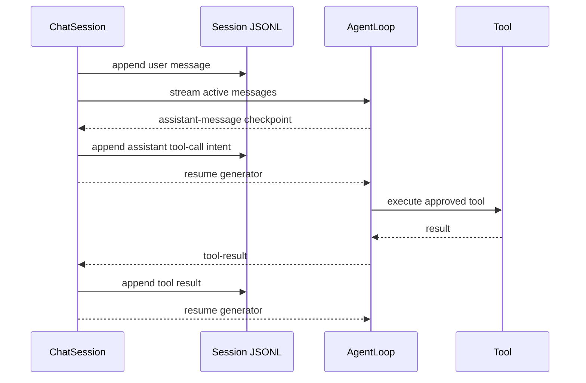

# Runtime Consistency Hardening Design

## 배경

병합된 `main`은 모델, 도구, 세션, compaction을 하나의 실행 흐름으로 연결하지만
세 가지 런타임 일관성 경계가 충분하지 않다.

1. `ChatSession`은 Agent가 `done`을 낸 뒤에만 전체 턴을 저장한다. write/edit/bash가
   실제 부작용을 만든 후 후속 모델 호출이 실패하면 JSONL에는 실행 의도와 결과가 모두
   사라진다.
2. Codex `store:false` 후속 요청에 필요한 encrypted reasoning과 function item ID는
   `OpenAICodexProvider` 인스턴스 배열에만 있고 메시지 인덱스로 연결된다. 프로세스 재시작
   또는 compaction으로 인덱스가 바뀌면 replay가 유실된다.
3. `BashTool`의 timeout과 abort는 직접 생성한 bash 프로세스만 종료한다. 하위 프로세스가
   남으면 CLI는 종료됐는데 작업은 계속될 수 있다.

## 목표

- 사용자 입력과 모델의 도구 실행 의도를 부작용 전에 append-only JSONL에 저장한다.
- 도구 결과를 각 실행 직후 저장하고, 결과 저장 전에 중단된 호출은 다음 재개 시
  `outcome unknown` 오류 결과로 닫는다.
- Provider 전용 replay 상태를 안정적인 assistant message와 함께 영속화한다.
- Codex 세션이 CLI 재시작과 compaction 이후에도 필요한 replay item을 전송한다.
- timeout, 출력 한도 초과, AbortSignal에서 Bash 프로세스 트리를 종료한다.
- 기존 llama.cpp, OpenAI-compatible, approval, session branching, compaction 계약을 보존한다.

## 비목표

- 실행 중인 외부 프로세스를 재시작 후 다시 연결하지 않는다.
- 도구 부작용의 트랜잭션 rollback을 제공하지 않는다.
- Provider 상태를 사람이 읽을 수 있는 공통 reasoning 모델로 정규화하지 않는다.
- OS sandbox나 컨테이너 격리를 추가하지 않는다.

## 설계 1: 증분 Turn Journal

### 메시지 저장 시점

`ChatSession.streamTurn()`은 새 사용자 메시지를 모델 호출 전에 저장한다. Agent는 모델의
terminal event를 받은 뒤 완성된 assistant message를 만들고, 도구가 필요한 경우 그
assistant message를 어떤 도구도 실행하기 전에 checkpoint event로 내보낸다.



AgentLoop에 공개되는 새 event는 다음 두 형태다.

```ts
type AgentMessageCheckpointEvent = {
  readonly type: "message-checkpoint";
  readonly message: AssistantMessage;
};

type AgentToolResultEvent = {
  readonly type: "tool-result";
  readonly result: ToolResult;
  readonly message: ToolResultMessage;
};
```

`ChatSession`은 `message-checkpoint`를 JSONL에 저장한 뒤에만 Agent generator를 재개한다.
따라서 assistant tool-call intent의 저장 실패 시 도구는 실행되지 않는다. `tool-result`는
도구 실행 뒤 도착하므로 JSONL 저장 실패 가능성이 남지만, 이미 저장된 intent가 다음
재개에서 불확실 실행을 탐지하는 근거가 된다.

최종 assistant message도 `message-checkpoint`로 먼저 저장한 뒤 `done`을 전달한다.
기존 `done.newMessages`는 AgentLoop 직접 사용자의 호환성을 위해 유지하되 ChatSession은
이를 다시 일괄 저장하지 않는다.

### 중단된 도구 호출 복구

`Session.recoverInterruptedToolCalls()`는 현재 branch path를 순서대로 읽어 assistant의
tool call ID를 pending 집합에 넣고 대응하는 tool result에서 제거한다. 남아 있는 ID마다
다음 오류 결과를 JSONL에 append한다.

```text
Tool execution was interrupted before its result was recorded. The outcome is
unknown. Inspect workspace state before retrying this operation.
```

복구 결과는 `isError: true`이며 도구를 자동 재실행하지 않는다. `ChatSession`은 새 사용자
메시지를 저장하기 전에 이 복구를 수행하고 `session-recovery` event로 복구된 call ID를
CLI에 알린다. 복구 기록 저장이 실패하면 새 턴을 시작하지 않는다.

모델 호출 자체가 실패해 사용자 메시지만 남은 경우는 기록을 유지한다. 다음 입력은 연속된
user message로 추가될 수 있으며, 이는 실패했던 요청을 숨기지 않는 의도적인 동작이다.

## 설계 2: Provider Message State

### 공통 타입

Provider wire metadata를 특정 Provider 타입으로 core에 노출하지 않고 JSON-compatible
opaque state로 assistant message에 결합한다.

```ts
type JsonValue =
  | null
  | boolean
  | number
  | string
  | readonly JsonValue[]
  | { readonly [key: string]: JsonValue };

interface ProviderMessageState {
  readonly provider: ProviderId;
  readonly value: JsonValue;
}

interface AssistantMessage {
  readonly role: "assistant";
  readonly content: string;
  readonly toolCalls: readonly ToolCall[];
  readonly providerState?: ProviderMessageState;
}
```

Provider `done` event는 선택적 `providerState`를 전달하고 AgentLoop가 이를 해당
assistant message에 붙인다. JSONL parser는 provider ID와 재귀적 JSON value를 검증하며
NaN, Infinity, function, symbol 같은 비직렬화 값을 거부한다.

### Codex 상태

Codex state value는 다음 Provider 전용 구조를 사용한다.

```ts
interface CodexAssistantState {
  readonly reasoningItems: readonly JsonObject[];
  readonly functionItemIds: Readonly<Record<string, string>>;
}
```

`OpenAICodexProvider`는 terminal event에서 이 값을 `done.providerState`로 내보낸다.
다음 요청을 직렬화할 때 각 assistant message의 state를 직접 읽으므로 Provider 인스턴스
배열과 `messageIndex` 검색은 제거한다. CLI 재시작 시 JSONL에서 복원된 message state를
사용하고, compaction은 보존하는 최근 message 객체와 state를 함께 이동한다. 요약 텍스트에는
opaque state를 포함하지 않는다.

Provider가 일치하지 않거나 구조가 잘못된 state는 wire request에 넣지 않고 명시적인
provider serialization 오류로 종료한다.

## 설계 3: Bash Process Tree Lifecycle

`BashTool`은 AbortSignal을 `spawn`에 직접 넘기지 않고 하나의 종료 coordinator가 timeout,
출력 한도, abort를 직렬화한다. 중복 종료 요청은 같은 Promise를 재사용한다.

- POSIX: bash를 별도 process group으로 생성하고 group에 `SIGTERM`을 보낸다. 짧은 grace
  period 뒤 살아 있으면 `SIGKILL`을 보낸다.
- Windows: 생성한 child PID를 정확히 지정해 `taskkill.exe /PID <pid> /T /F`를 숨김 창으로
  실행하고 완료를 기다린다.
- 이미 종료된 프로세스의 `ESRCH` 또는 taskkill의 not-found 결과는 성공적인 정리로 본다.
- 종료 후 stdout/stderr listener와 AbortSignal listener를 제거한다.

`process-tree.ts`가 플랫폼별 종료만 담당하고 `BashTool`은 실행 결과와 종료 사유를 담당한다.
테스트는 제어 가능한 child process와 terminator를 사용한 단위 계약, 실제 장시간 하위
프로세스를 종료하는 현재 플랫폼 integration 계약을 분리한다.

## 오류 처리와 호환성

- 모든 session write는 Agent의 다음 상태 전이 전에 완료돼야 한다.
- checkpoint 저장 실패는 terminal error이며 이후 도구를 실행하지 않는다.
- pending tool recovery는 자동 재실행보다 보수적인 `outcome unknown`을 선택한다.
- providerState가 없는 기존 v2 JSONL은 그대로 읽힌다.
- v2 header를 유지하며 assistant message의 선택 필드만 확장한다.
- llama.cpp와 OpenAI-compatible provider는 providerState를 만들거나 해석하지 않는다.

## 테스트 전략

1. 후속 모델 실패 전에 도구 intent가 저장되고 결과가 없으면 재개 시 unknown 결과가
   추가되는 integration test.
2. checkpoint 저장 실패 시 mutating tool 실행 횟수가 0인 test.
3. 정상 tool turn이 user, assistant, tool result, final assistant 순서로 한 번씩 저장되는 test.
4. Codex provider를 새 인스턴스로 교체하고 JSONL replay 후 reasoning item이 request에
   포함되는 test.
5. compaction으로 message index가 바뀐 뒤에도 kept assistant state가 포함되는 test.
6. malformed providerState JSONL을 line number와 함께 거부하는 test.
7. timeout, output limit, AbortSignal에서 child tree가 종료되는 test.
8. 기존 전체 `npm run check` 회귀 검사.

## 완료 기준

- 위 테스트가 구현 전 정확한 이유로 실패하고 구현 후 통과한다.
- 도구 실행 후 후속 모델 실패 재현에서 JSONL에 user, assistant intent, 결과 또는 unknown
  recovery가 남는다.
- Codex 재시작 재현에서 reasoning item 수가 0보다 크다.
- Bash 종료 뒤 생성된 하위 프로세스가 남지 않는다.
- 기존 64개 테스트와 새 테스트, typecheck, build, CLI EOF smoke가 모두 통과한다.
